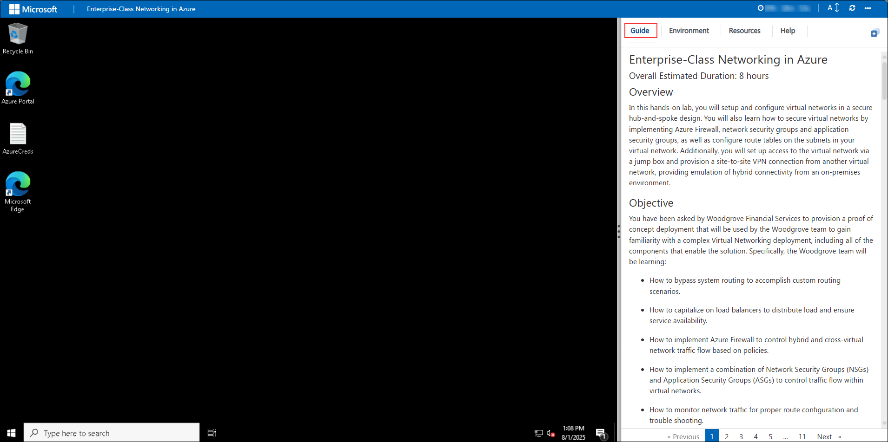
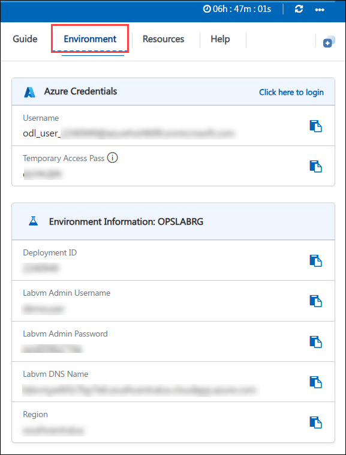
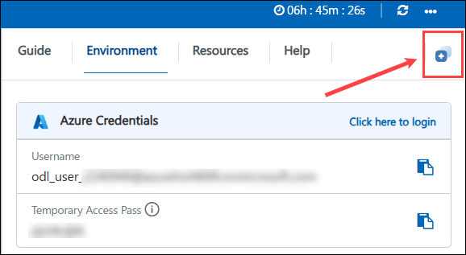
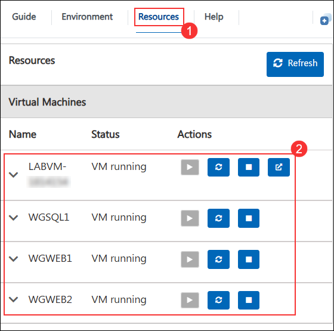
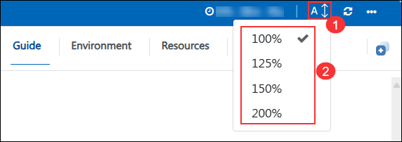
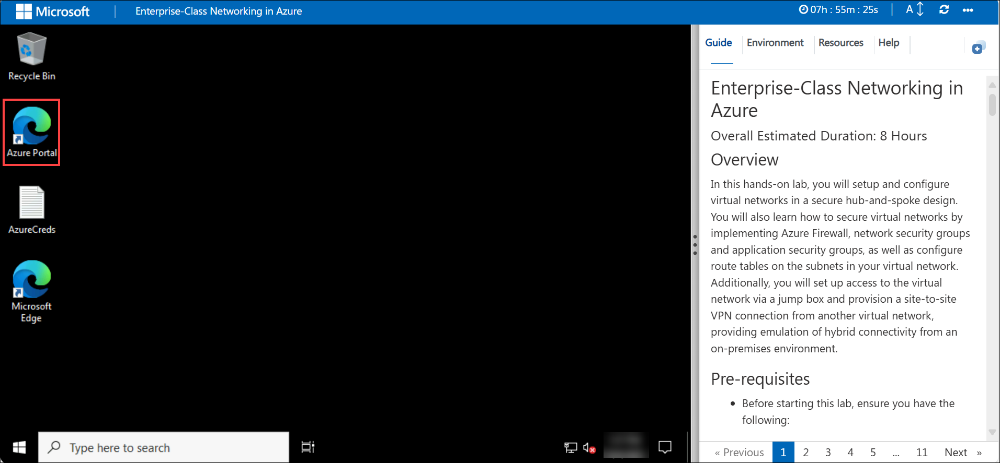
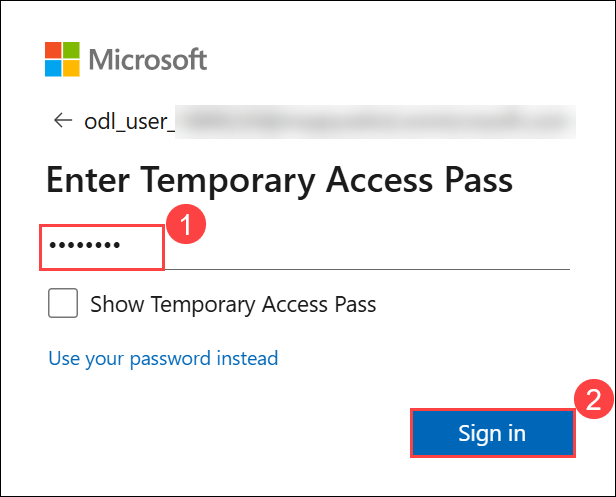

# Enterprise-Class Networking in Azure

### Overall Estimated Duration: 8 Hours

## 📘 Lab Scenario   

Woodgrove Financial Services is building a **secure and scalable enterprise networking environment** in **Microsoft Azure** to support its internal business applications and hybrid connectivity requirements. The organization wants to implement a **hub-and-spoke network architecture** that enables secure communication between application workloads, centralized network security, controlled routing, and connectivity with its on-premises environment.

The networking team must **design and configure** Azure Virtual Networks, VPN gateways, Azure Firewall, route tables, network security groups, application security groups, load balancers, and monitoring solutions to support secure and highly available application communication across the enterprise network.

To support **administration and operational visibility**, the environment must also provide secure remote access, centralized logging, traffic analytics, and network troubleshooting capabilities.

By the end of this lab, you will have implemented a complete **Enterprise-class Azure networking solution** that demonstrates hybrid connectivity, workload isolation, centralized security, traffic management, high availability, and network monitoring.

## 📖 Overview

In this lab, you will learn how to design and implement an enterprise-class networking solution in Azure that includes a hub-and-spoke architecture, secure connectivity, centralized security controls, traffic management, and monitoring. You will configure Azure Virtual Networks, VPN gateways, Azure Firewall, route tables, network security groups, application security groups, load balancers, and monitoring solutions to support secure and highly available application communication across the enterprise network.

## ⚙️ Pre-requisites

- Before starting this lab, ensure you have the following:

- Azure Knowledge – Basic understanding of Azure networking concepts (VNets, subnets, peering, and routing).

- Networking Fundamentals – Familiarity with IP addressing, CIDR notation, and routing principles.

- Permissions – Ability to create and configure network resources (VNets, VPN Gateway, NSGs, ASGs, Firewall, Bastion, Route Tables).

- Client Machine Access – A local machine with internet access to connect to the Azure Portal and configure VPN connections.

## 🎯 Objective

You have been asked by  Woodgrove Financial Services to provision a proof of concept deployment that will be used by the team to gain familiarity with a complex Virtual Networking deployment, including all of the components that enable the solution. Specifically, the team will be learning:

- How to bypass system routing to accomplish custom routing scenarios.

- How to capitalize on load balancers to distribute load and ensure service availability.

- How to implement Azure Firewall to control hybrid and cross-virtual network traffic flow based on policies.

- How to implement a combination of Network Security Groups (NSGs) and Application Security Groups (ASGs) to control traffic flow within virtual networks.

- How to monitor network traffic for proper route configuration and trouble shooting.

## 🏗️ Architecture

The architecture involves the implementation of a hub-and-spoke network topology in Azure to facilitate secure, scalable, and efficient enterprise-class networking. The hub serves as a central point for connectivity and management, hosting shared services such as Azure Firewall, VPN gateways, and Azure Bastion for secure remote access. The spokes are individual VNets that isolate workloads, applications, or business units while connecting to the hub via VNet peering. Traffic flow is controlled through Azure Route Tables, ensuring optimized communication between resources. Azure Firewall or Network Virtual Appliances (NVAs) provide perimeter security, while hybrid connectivity with on-premises environments is achieved using Azure ExpressRoute or VPN Gateway, creating a robust and manageable cloud network infrastructure.

## 🖼️ Architecture Diagram

   

## 🔍 Explanation of Components

The architecture for this lab involves several key components:  

- **Networking Components:** Virtual Networks (OnPremVNet, WGVNet1, WGVNet2), Azure BastionSubnet, and secure connectivity between on-premises and Azure.  
- **Security and Access:** Azure Firewall for traffic filtering and Azure Bastion for secure VM access.  
- **Compute Resources:** OnPremVM, WGWEB1, WGWEB2 for application workloads, and WGSQL1 for database services.  
- **Load Balancer:** Distributes incoming traffic across application servers for high availability.  
- **Subnets:** AppSubnet for application workloads and DataSubnet for database operations.  
- **Monitoring and Management:** MonitoringRG for centralized performance monitoring and logging.  
- **Hybrid Connectivity:** Integration of on-premises infrastructure with Azure cloud via secure connectivity.

## 🚀 Getting Started with you Lab

### Accessing Your Lab Environment
 
Once you're ready to dive in, your virtual machine and **lab guide** will be right at your fingertips within your web browser.
 

### Virtual Machine & Lab Guide
 
Your virtual machine is your workhorse throughout the workshop. The lab guide is your roadmap to success.
 
### Exploring Your Lab Resources
 
To get a better understanding of your lab resources and credentials, navigate to the **Environment** tab.
 

 
## Utilizing the Split Window Feature
 
For convenience, you can open the lab guide in a separate window by selecting the **Split Window** button from the Top right corner.
 
   
 
## Managing Your Virtual Machine

Feel free to **start, stop, or restart (2)** your virtual machine as needed from the **Resources (1)** tab. Your experience is in your hands!
 
   

### Lab Guide Zoom In/Zoom Out
 
To adjust the **zoom level (2)** for the environment page, click the **A↕ (1)** icon located next to the timer in the lab environment.

 
## Login to the Azure Portal

1. On your **virtual machine**, click on the **Azure Portal** icon as shown below:

   

1. On the **Sign in to Microsoft Azure** tab, you will see the login screen. Enter the following email or username, and click on **Next**. 

   * **Email/Username**: **<inject key="AzureAdUserEmail"></inject>**

     
     
1. Now enter the following password and click on **Sign in**.
   
   * **Password**: **<inject key="AzureAdUserPassword"></inject>**

     
   
1. If you see the pop-up **Stay Signed in?**, select **No**.

   

1. If a **Welcome to Microsoft Azure** popup window appears, select **Cancel** to skip the tour.

    

   > **`Tip:`** For a smoother experience during the hands-on lab, it's important to thoroughly review both the instructions and the accompanying notes. This will help you navigate through the tasks with ease and confidence.

## 📞 Support Contact

The **CloudLabs support team** is available 24/7, 365 days a year, via email and live chat to ensure seamless assistance at any time. We offer dedicated support channels tailored specifically for both learners and instructors, ensuring that all your needs are promptly and efficiently addressed.

Learner Support Contacts:

- Email Support: cloudlabs-support@spektrasystems.com.
- Live Chat Support: https://cloudlabs.ai/labs-support

Now, click on **Next** from the lower right corner to move on to the next page.

## Happy Learning!!

