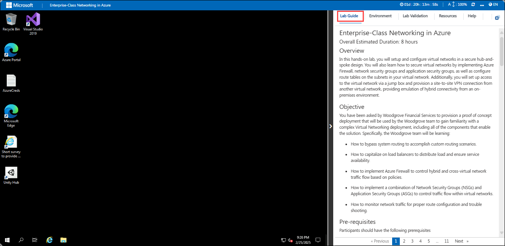
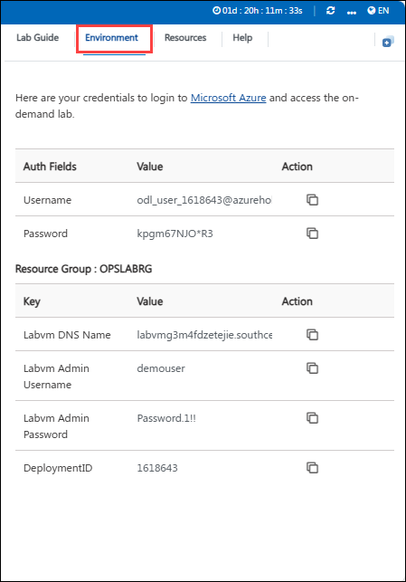
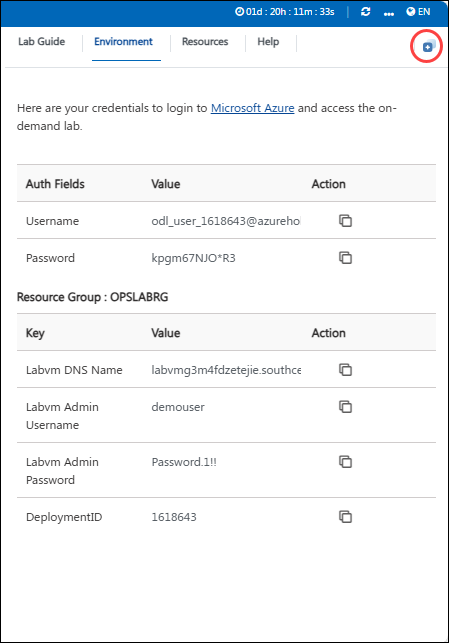
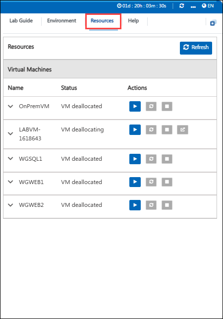
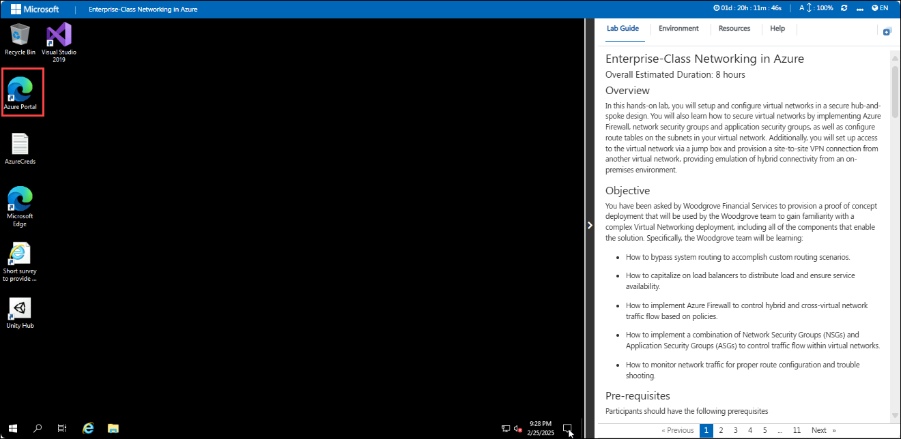
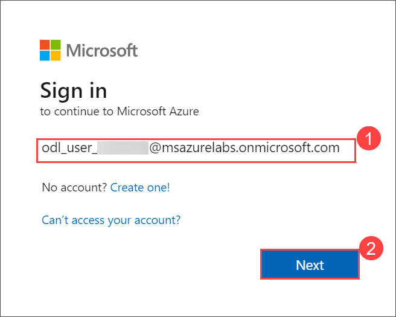
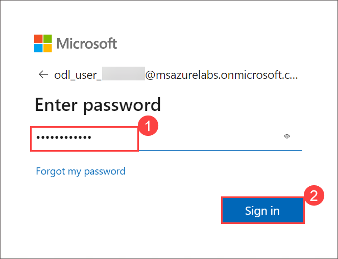
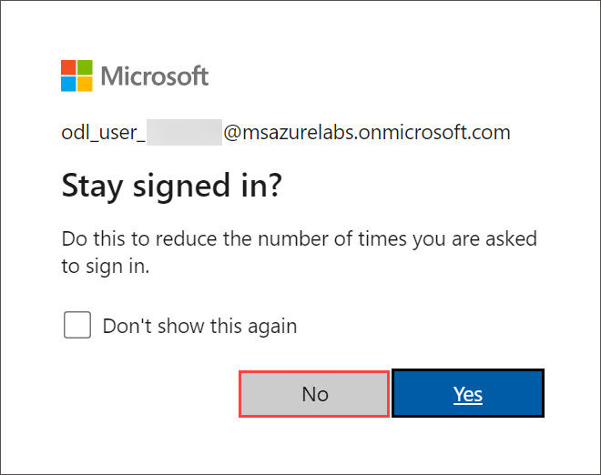
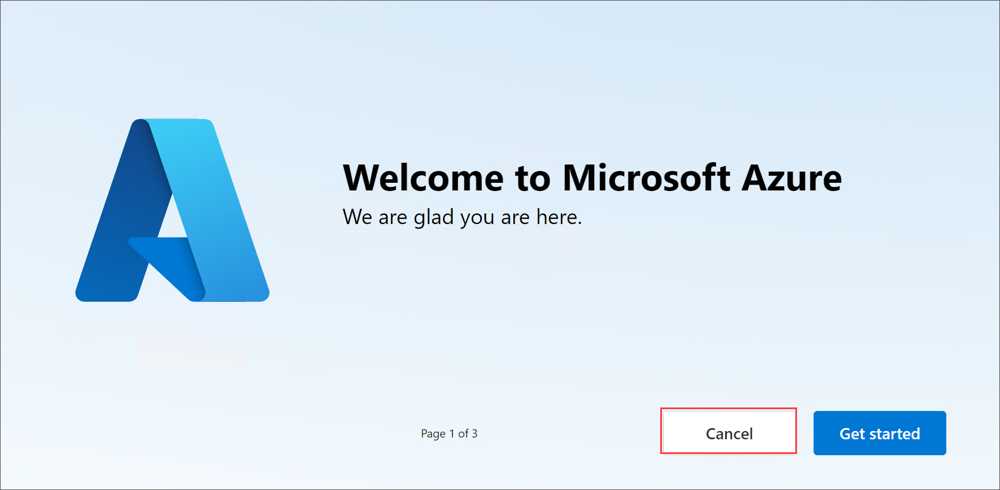

# Enterprise-Class Networking in Azure

### Overall Estimated Duration: 8 hours

## Overview

In this hands-on lab, you will setup and configure virtual networks in a secure hub-and-spoke design. You will also learn how to secure virtual networks by implementing Azure Firewall, network security groups and application security groups, as well as configure route tables on the subnets in your virtual network. Additionally, you will set up access to the virtual network via a jump box and provision a site-to-site VPN connection from another virtual network, providing emulation of hybrid connectivity from an on-premises environment.

## Objective

You have been asked by Woodgrove Financial Services to provision a proof of concept deployment that will be used by the Woodgrove team to gain familiarity with a complex Virtual Networking deployment, including all of the components that enable the solution. Specifically, the Woodgrove team will be learning:

- How to bypass system routing to accomplish custom routing scenarios.

- How to capitalize on load balancers to distribute load and ensure service availability.

- How to implement Azure Firewall to control hybrid and cross-virtual network traffic flow based on policies.

- How to implement a combination of Network Security Groups (NSGs) and Application Security Groups (ASGs) to control traffic flow within virtual networks.

- How to monitor network traffic for proper route configuration and trouble shooting.

## Architecture

The architecture involves the implementation of a hub-and-spoke network topology in Azure to facilitate secure, scalable, and efficient enterprise-class networking. The hub serves as a central point for connectivity and management, hosting shared services such as Azure Firewall, VPN gateways, and Azure Bastion for secure remote access. The spokes are individual VNets that isolate workloads, applications, or business units while connecting to the hub via VNet peering. Traffic flow is controlled through Azure Route Tables, ensuring optimized communication between resources. Azure Firewall or Network Virtual Appliances (NVAs) provide perimeter security, while hybrid connectivity with on-premises environments is achieved using Azure ExpressRoute or VPN Gateway, creating a robust and manageable cloud network infrastructure.

## Architecture Diagram

   

## Explanation of Components

The architecture for this lab involves several key components:  

- **Networking Components:** Virtual Networks (OnPremVNet, WGVNet1, WGVNet2), Azure BastionSubnet, and secure connectivity between on-premises and Azure.  
- **Security and Access:** Azure Firewall for traffic filtering and Azure Bastion for secure VM access.  
- **Compute Resources:** OnPremVM, WGWEB1, WGWEB2 for application workloads, and WGSQL1 for database services.  
- **Load Balancer:** Distributes incoming traffic across application servers for high availability.  
- **Subnets:** AppSubnet for application workloads and DataSubnet for database operations.  
- **Monitoring and Management:** MonitoringRG for centralized performance monitoring and logging.  
- **Hybrid Connectivity:** Integration of on-premises infrastructure with Azure cloud via secure connectivity.

## Accessing Your Lab Environment
 
Once you're ready to dive in, your virtual machine and lab guide will be right at your fingertips within your web browser.
 

### Virtual Machine & Lab Guide
 
Your virtual machine is your workhorse throughout the workshop. The lab guide is your roadmap to success.
 
## Exploring Your Lab Resources
 
To get a better understanding of your lab resources and credentials, navigate to the **Environment** tab.
 

 
## Utilizing the Split Window Feature
 
For convenience, you can open the lab guide in a separate window by selecting the **Split Window** button from the Top right corner.
 
   
 
## Managing Your Virtual Machine
 
1. Feel free to start, stop, or restart your virtual machine as needed from the **Resources** tab. Your experience is in your hands!
 
   

## Lab Guide Zoom In/Zoom Out
 
To adjust the zoom level for the environment page, click the **A↕ : 100%** icon located next to the timer in the lab environment.

 
## Login to the Azure Portal

1. In the JumpVM, click on the Azure portal shortcut of the Microsoft Edge browser, which is created on the desktop.

   

1. On the **Sign in to Microsoft Azure** tab, you will see the login screen. Enter the following email or username, and click on **Next**. 

   * **Email/Username**: **<inject key="AzureAdUserEmail"></inject>**

     
     
1. Now enter the following password and click on **Sign in**.
   
   * **Password**: **<inject key="AzureAdUserPassword"></inject>**

     
   
1. If you see the pop-up **Stay Signed in?**, select **No**.

   

1. If a **Welcome to Microsoft Azure** popup window appears, select **Cancel** to skip the tour.

    

   > **For a smoother experience during the hands-on lab, it's important to thoroughly review both the instructions and the accompanying notes. This will help you navigate through the tasks with ease and confidence.**

## Support Contact

The CloudLabs support team is available 24/7, 365 days a year, via email and live chat to ensure seamless assistance at any time. We offer dedicated support channels tailored specifically for both learners and instructors, ensuring that all your needs are promptly and efficiently addressed.

Learner Support Contacts:

- Email Support: cloudlabs-support@spektrasystems.com.
- Live Chat Support: https://cloudlabs.ai/labs-support

Now, click on Next from the lower right corner to move on to the next page.

## Happy Learning!!