## Exercise 1: Create a Virtual Network and provision subnets

### Estimated Duration: 40 Minutes

## Lab Overview

In this exercise, we are setting up a Virtual Network and configuring its subnets, including a dedicated gateway subnet. This enables secure connectivity between the on-premise network and the cloud.

## Lab objectives

In this lab, you will perform the following tasks:

- Task 1: Create a Virtual Network
- Task 2: Configure subnets
- Task 3: Configure gateway subnets for on premise Virtual Network

### Task 1: Create a Virtual Network

In this task, you will create a Virtual Network (VNet) in Azure, configure its address space and subnets, and enable Azure Bastion for secure remote access

1. In the search bar of the Azure portal, type **Virtual network (1)**. From the search results, select **Virtual networks (2)**.

    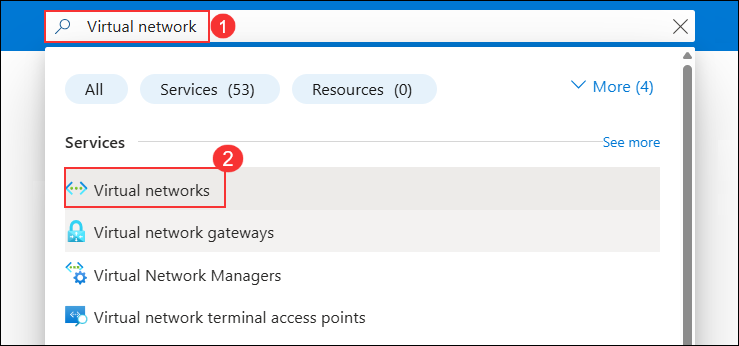

1. On the **Virtual network** page, select **Virtual networks (1)** from the left navigation menu. Click the **+ Create (2)** button at the top.

    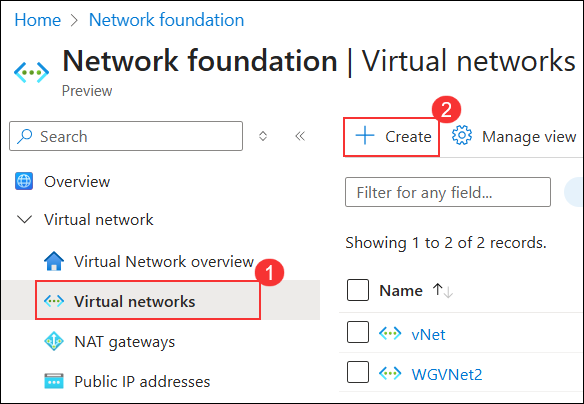

1. On the **Create Virtual Network** blade, navigate to the **Basic** tab and enter the following information. Then, click **Next (5)** to proceed.

    | Setting | Action |
    | -- | -- |
    | **Subscription** | Keep it as default **(1)**  |
    | **Resource Group** | **WGVNetRG1** **(2)** |
    | **Name** | **WGVNet1 (3)** |
    | **Location** | **South Central US (4)** |

    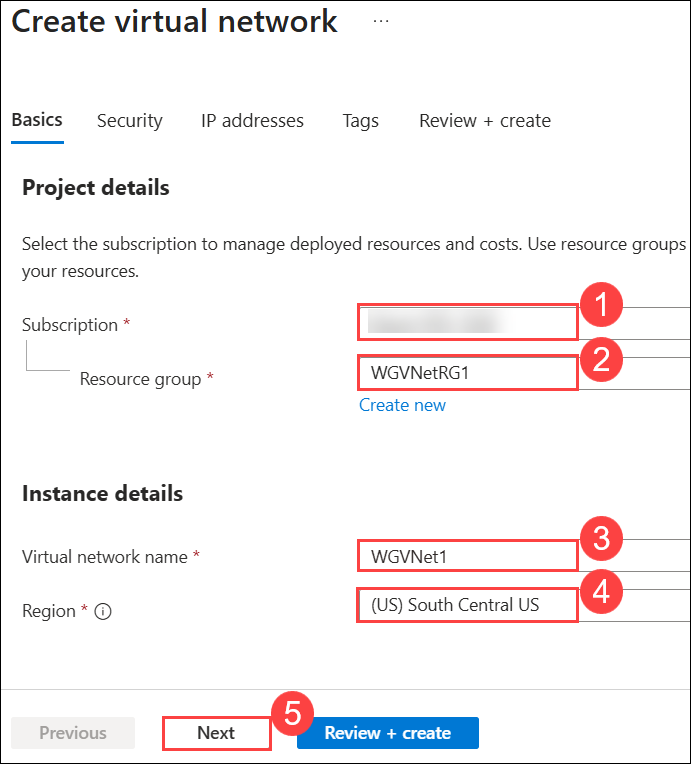

1. On the **Security** tab, check the box for **Enable Azure Bastion (1)** to enable it.

    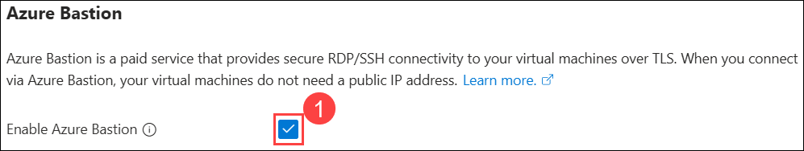

1. Provide the **Azure Bastion host name** as **WGBastion (1)**, then click on **Create a public IP address (2)**. Enter the name as **BastionPublicIP (3)** then select the sku **Standard (4)** click **OK (5)** to proceed.

    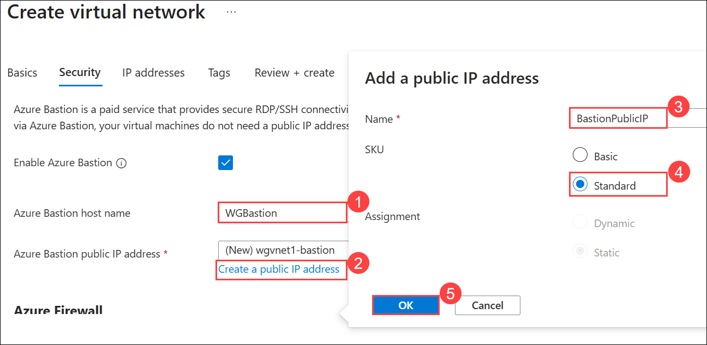
    

1. Now click on **Next** from the bottom

    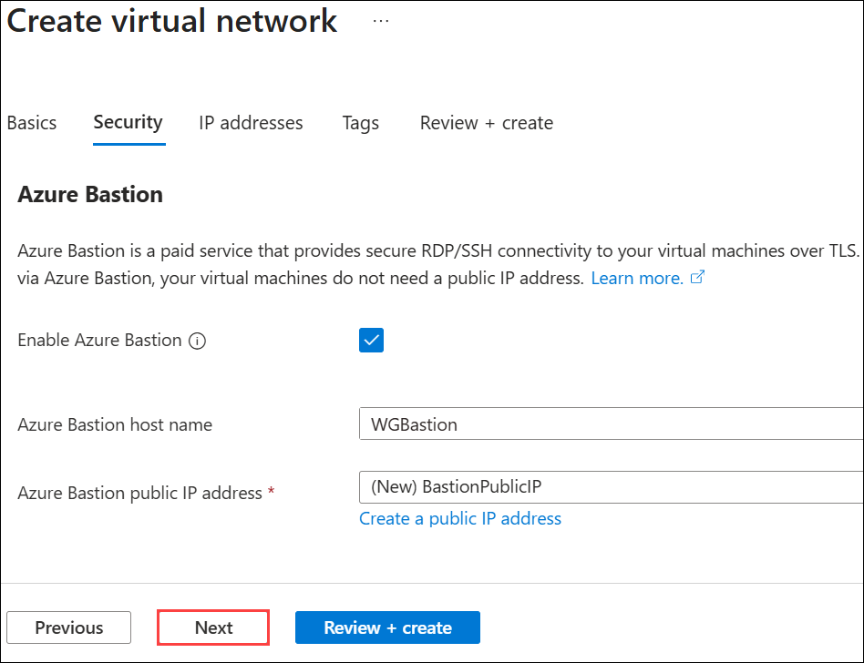

1. On the **IP Addresses** tab, change the **Address space** to **10.7.0.0 (1)** with a **/20 (2)** subnet mask.

    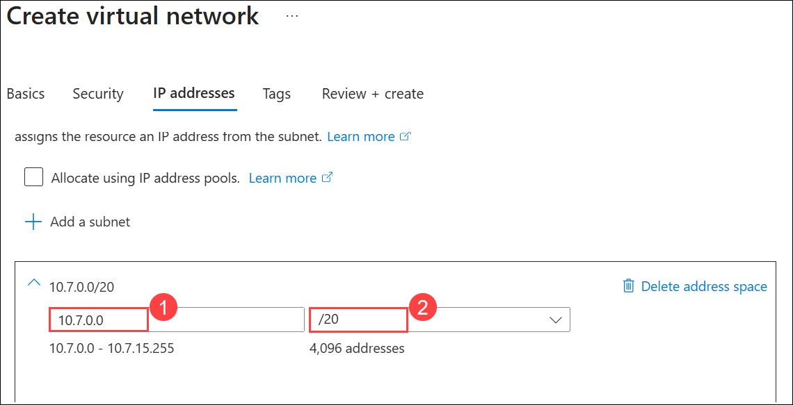

1. Click on the **default subnet**.

    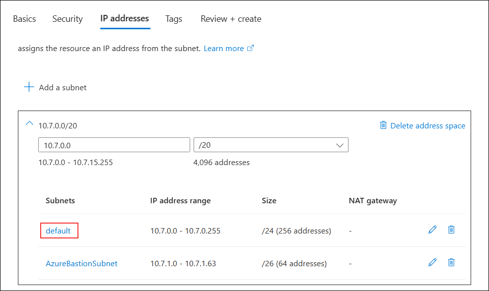

1. Enter the following information, then click **Save (4)** to apply the changes.

    | Setting | Action |
    | -- | -- |
    | **Subnet purpose** | **Virtual Network Gateway** **(1)** |
    | **Size** | **/27 (32 addresses) (2)** |
    | **Starting address** | **10.7.15.0** **(3)** |

    
    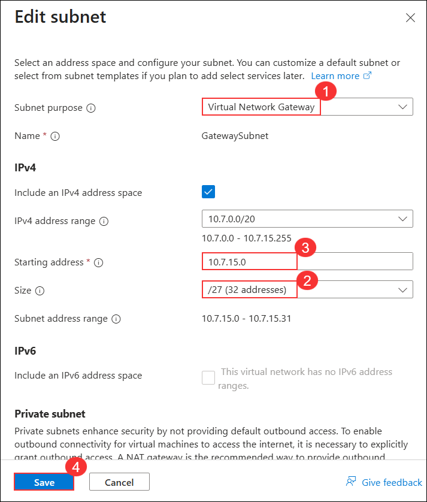

1. Click on the **AzureBastionSubnet**.

    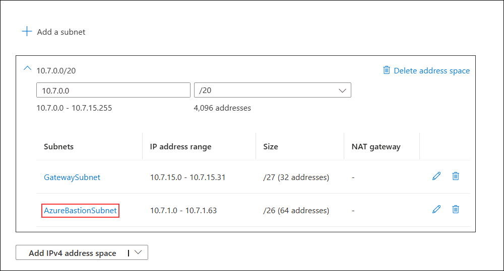

1. Enter the following information, then click **Save (4)** to apply the changes.

    | Setting | Action |
    | -- | -- |
    | **Subnet purpose** | **Azure Bastion** **(1)** |
    | **Size** | **/24 (256 addresses) (2)** |
    | **Starting address** | **10.7.5.0** **(3)** |
    

    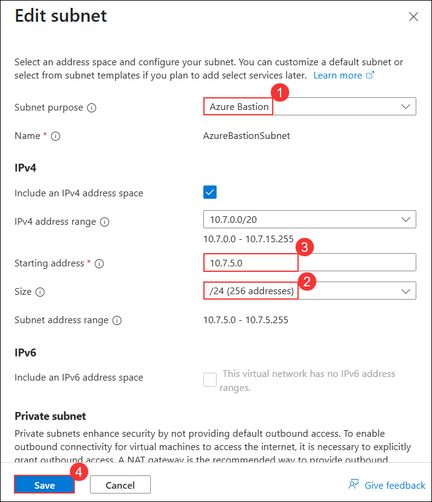

    

1. Select **Review + Create**.

1. Review the configuration and select **Create**.

    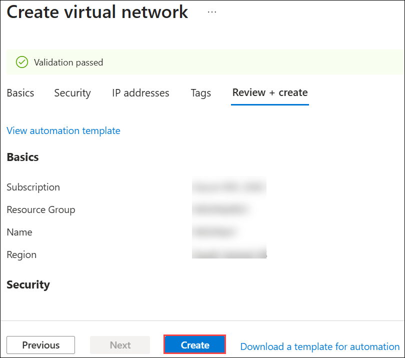

1. Monitor the deployment status by selecting **Notifications** at the top of the portal. When the deployment is complete, select **Go to Resource**.

    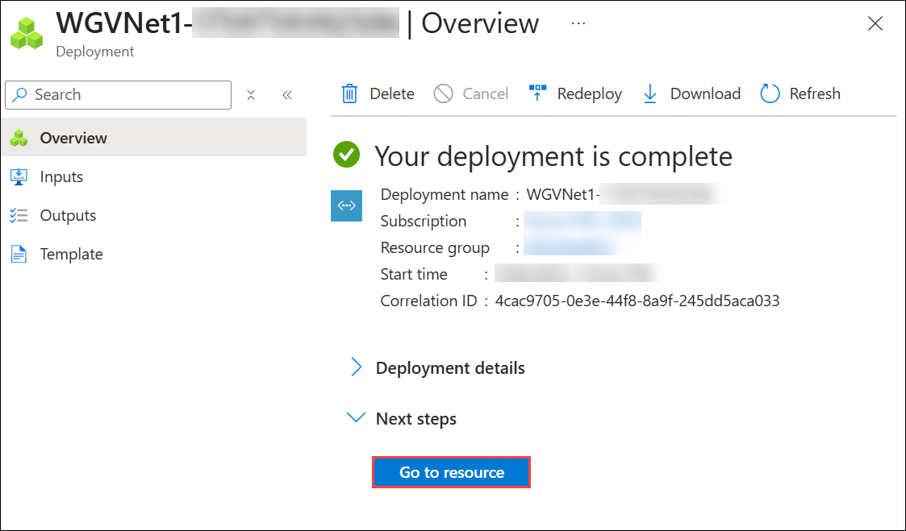
   
> **Congratulations** on completing the task! Now, it's time to validate it. Here are the steps:
      
   - Hit the Validate button for the corresponding task. If you receive a success message, you can proceed to the next task.
   - If not, carefully read the error message and retry the step, following the instructions in the lab guide.
   - If you need any assistance, please contact us at cloudlabs-support@spektrasystems.com. We are available 24/7 to help you out.

<validation step="42aa1983-8b0e-4efd-b991-4528db097404" />

### Task 2: Configure subnets

In this task, you are configuring subnets within an existing virtual network (WGVNet1) and then creating another virtual network (OnPremVNet) to simulate an on-premises environment.

1. On the **WGVNet1** virtual network page, select **Subnets** under **Settings** in the left-hand navigation pane.

    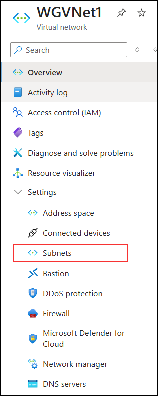

1. In the **WGVNet1 | Subnets** blade, select **+ Subnet**.

    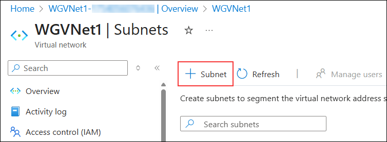

1. On the **Add subnet** blade, enter the following information, then select **Add (3)**.

    | Setting | Action |
    | -- | -- |
    | **Subnet Purpose** | **Azure Firewall** **(1)** |
    | **Starting address** | **10.7.1.0** **(2)** |

    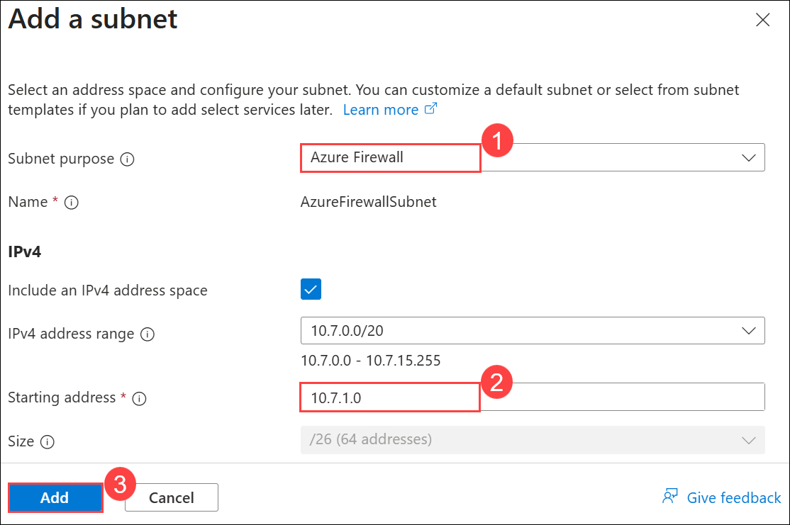

    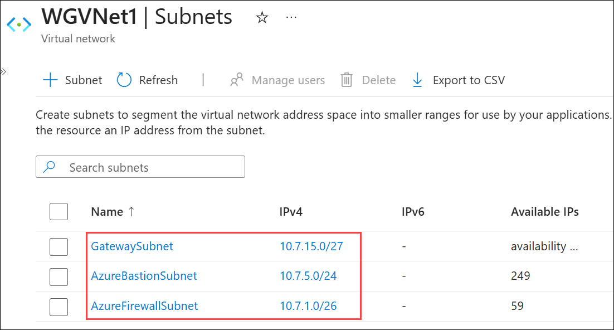

1. Now that you've successfully created the WGVNet1 virtual network and configured its subnets, let’s move on to creating an on-premises network by creating another virtual network named OnPremVNet.

1. In the search bar of the Azure portal, type **Virtual network (1)**. From the search results, select **Virtual networks (2)**.

    

1. Click on **+ Create**.

1. On the **Create virtual network** blade, enter the following information and then click on **IP addresses (5)** tab.

    | Setting | Action |
    | -- | -- |
    | Subscription | Keep the default subscription **(1)** |
    | Resource group | Select **OnPremVNetRG (2)** |
    | Name | **OnPremVNet (3)** |
    | Region | **East US (4)** (Make sure this is **NOT** the same location you have specified in the previous exercises.) |

    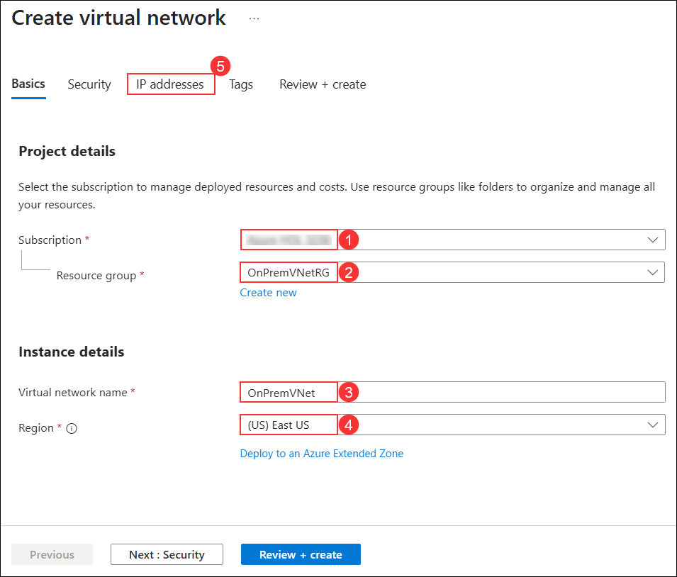

1. Now click on the **IP addresses** tab of the **Create virtual network blade**, enter the following information.

1. Edit the IP address space as **192.168.0.0  (1)** and the subnetting with **/16  (2)**. Then select **Review + create (3)**

    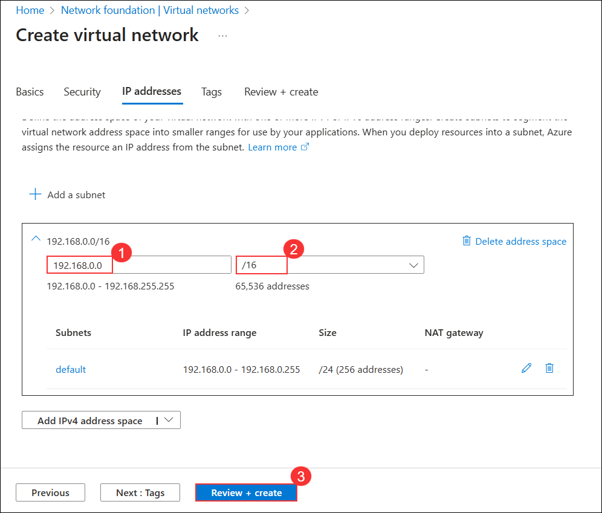

1. Click on **Create**.

    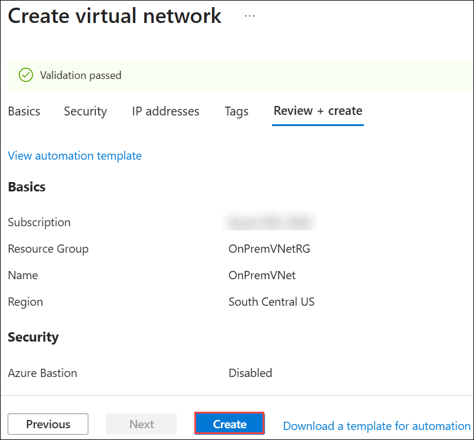
   
1. Click on **Go to resource.**
   
    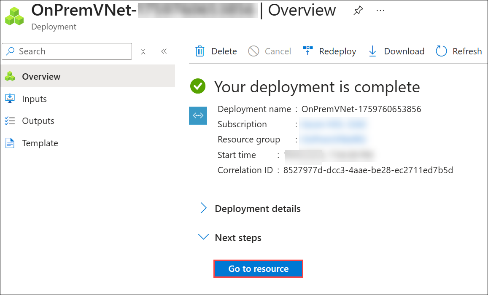
   
### Task 3: Configure gateway subnets for on premise Virtual Network

In this task you will, configuring gateway subnets for an on-premise virtual network involves creating a dedicated subnet that hosts the VPN gateway resources, enabling secure connectivity between on-premise and cloud networks.

1. On the **OnPremVNet** blade, under **Settings** select **Subnets (1)** and then choose **+ Subnet (2)**.

    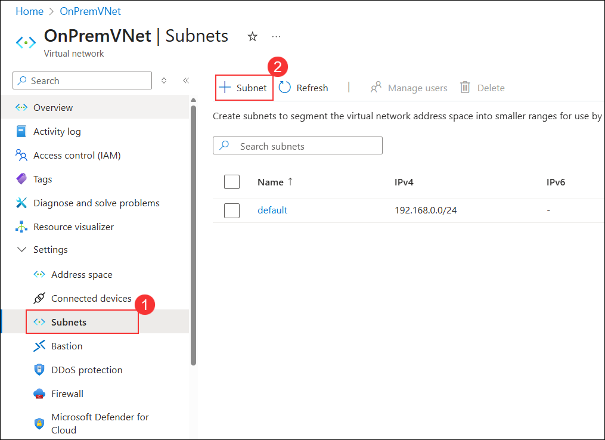

1. Specify the following configuration for the subnet, and select **Add (4)**:

    | Setting | Action |
    | -- | -- |
    | Subnet Purpose | **Virtual Network Gateway (1)** |
    | Size | **/27 (32 addresses) (2)** |
    | Starting address | **192.168.1.0 (3)** |
    

    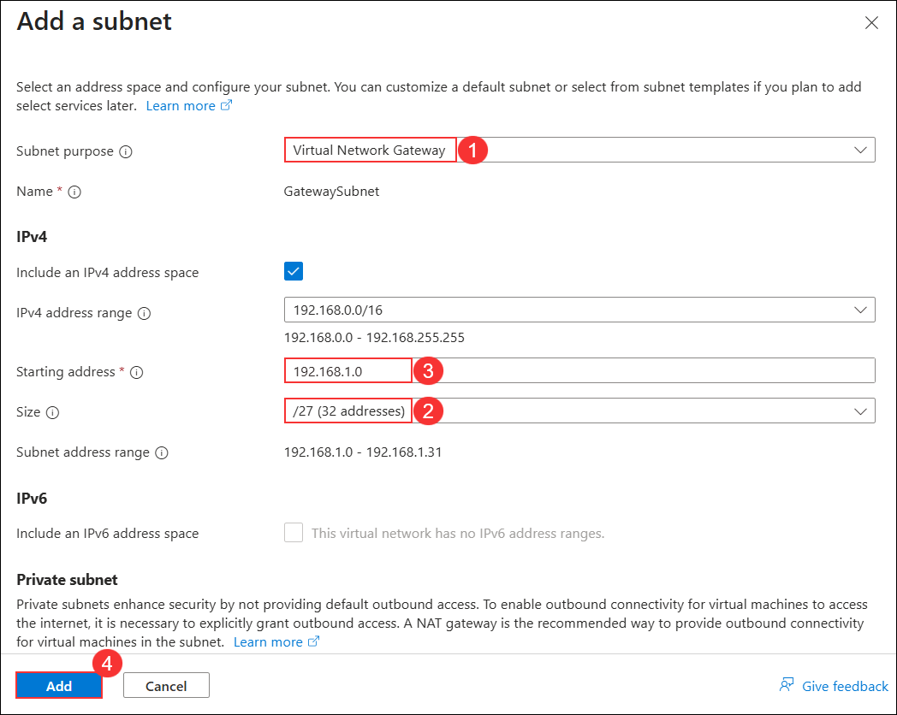

1. Next, select **+ Subnet** and add the **OnPremManagementSubnet** subnet to the **OnPremVNet**, as shown below in the screenshot:

    | Setting | Action |
    | -- | -- |
    | Subnet Purpose | **Default** |
    | Name | **OnPremManagementSubnet (1)** |
    | Size | **/27 (32 addresses) (2)** |
    | Starting address | **192.168.2.0 (3)** |

    - Leave the rest of the values as their defaults. Select **Add (4)**.

        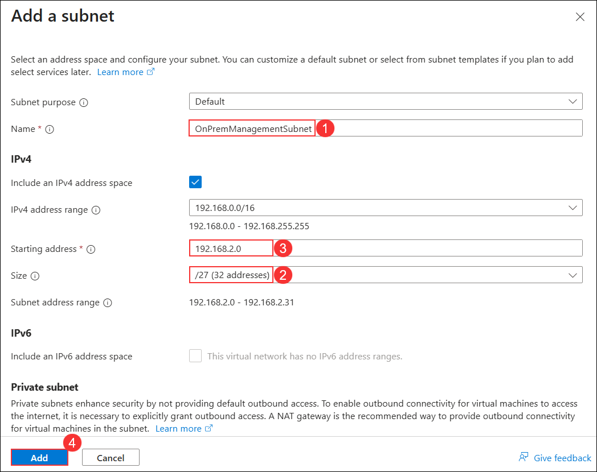

### Review
In this lab, you have completed:
- Created a Virtual Network
- Configured subnets

## **Congratulations! You have successfully completed this exercise. Please click on next**

#### Happy Learning!!
