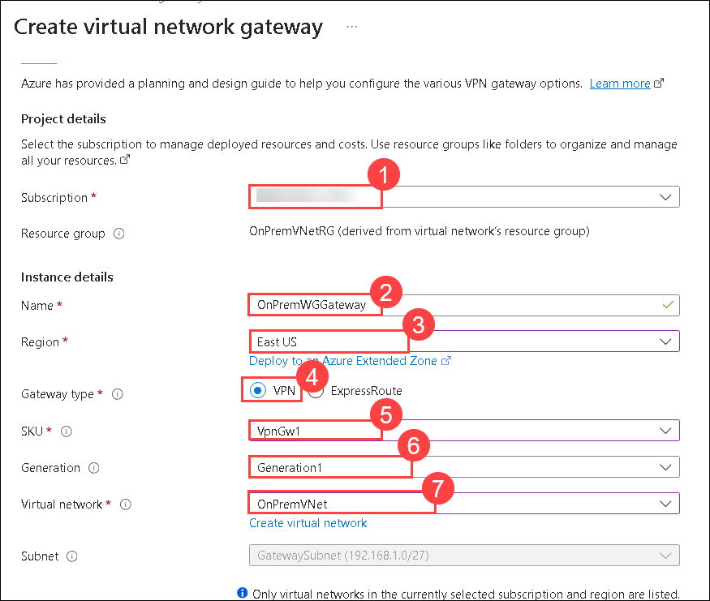
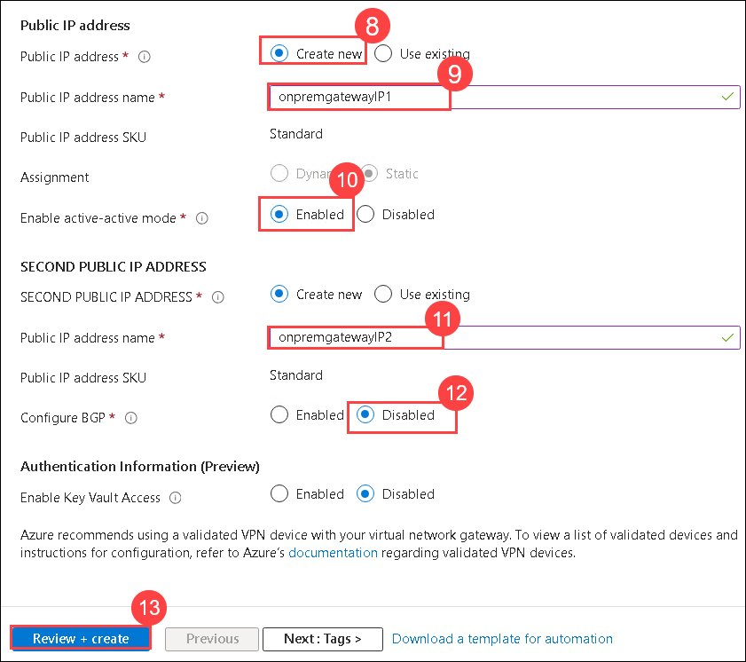
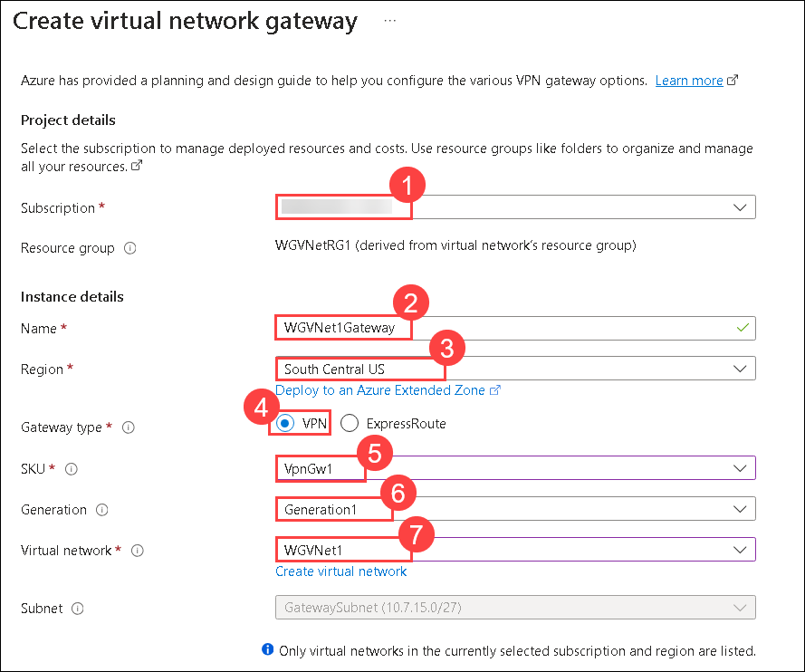
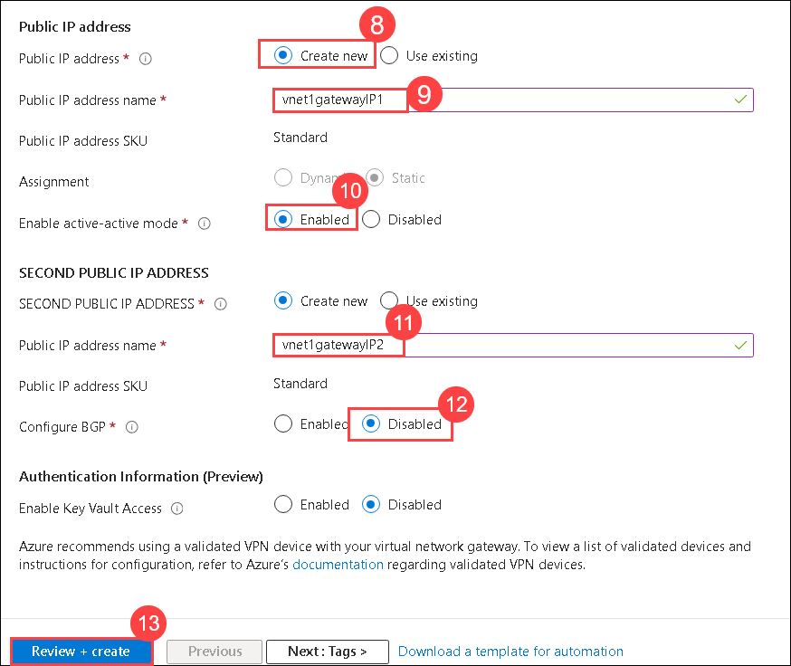

## Exercise 2: Configure Site-to-Site connectivity

In this exercise, we will simulate an on-premises connection to the internal web application. To do this, we will first set up another Virtual Network in a separate Azure region followed by the Site-to-Site connection of the two Virtual Networks.

## Lab objectives

In this lab, you will perform following tasks:

- Create the first gateway
- Create the second gateway
  
## Estimated timing: 60 minutes

### Task 1: Create the first gateway

1. In the search bar of the Azure portal, type **Virtual network gateway (1)**. From the search results, select **Virtual network gateway (2)**.

    

1. Click on **+Create**.    

1. On the **Create virtual network gateway** blade,  enter the following information and select **Review + create (13)**:

    | Setting | Action |
    | -- | -- |
    | Subscription | **Select your subscription (1)** |
    | Name | **OnPremWGGateway (2)** |
    | Region | **East US (3)** (This must match the location in which you created the **OnPremVNet** virtual network.) |
    | Gateway type | **VPN (4)** |
    | SKU | **VpnGw1 (5)** |
    | Generation | **Generation1 (6)** |
    | Virtual network | **OnPremVNet (7)** |
    | Public IP address | **Create new (8)** |
    | Public IP address name | **onpremgatewayIP1 (9)** |
    | Enable active-active mode | **Enabled (10)** |
    | Second Public IP address name | **onpremgatewayIP2 (11)** |
    | Configure BGP | **Disabled (12)** |

    
    

1. Validate your settings then select **Create**.

    >**Note:** The gateway will take 30-45 minutes to provision. Rather than waiting, continue to the next task.

### Task 2: Create the second gateway

1. In the search bar of the Azure portal, type **Virtual network gateway (1)**. From the search results, select **Virtual network gateway (2)**.

    

1. Click on **+ Create**.    

1. On the **Create virtual network gateway** blade,  enter the following information and select **Review + create (13)**:

    | Setting | Action |
    | -- | -- |
    | Subscription | **Select your subscription (1)** |
    | Name | **WGVNet1Gateway (2)** |
    | Region | **South Central US (3)** (This must match the location in which you created the **WGVNet1** virtual network.) |
    | Gateway type | **VPN (4)** |
    | SKU | **VpnGw1 (5)** |
    | Generation | **Generation1 (6)** |
    | Virtual network | **WGVNet1 (7)** |
    | Public IP address | **Create new (8)** |
    | Public IP address name | **vnet1gatewayIP1 (9)** |
    | Enable active-active mode | **Enabled (10)** |
    | Second Public IP address name | **vnet1gatewayIP2 (11)** |
    | Configure BGP | **Disabled (12)** |

    
    

1. Validate your settings and then **Create**.

    >**Note:** The gateway will take 30-45 minutes to provision. You will need to wait until both gateways are provisioned before proceeding to the next section.

1. The Azure portal will display a notification when the deployments have completed.

> **Congratulations** on completing the task! Now, it's time to validate it. Here are the steps:
      
   - Hit the Validate button for the corresponding task. If you receive a success message, you can proceed to the next task.
   - If not, carefully read the error message and retry the step, following the instructions in the lab guide.
   - If you need any assistance, please contact us at cloudlabs-support@spektrasystems.com. We are available 24/7 to help you out.

<validation step="f6220584-0bee-4752-9cde-a4f42292dc10" />

### Review

In this lab, you have completed:

- Created the first gateway
- Created the second gateway

## Great job on completing this exercise! You can now proceed to the next one.
