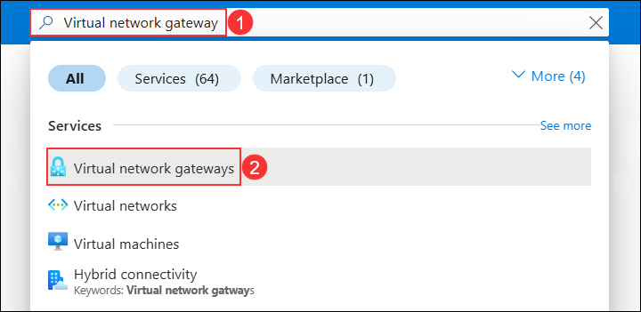
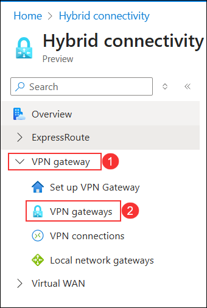
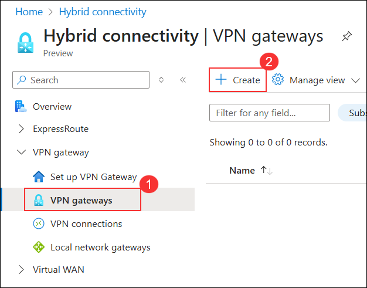
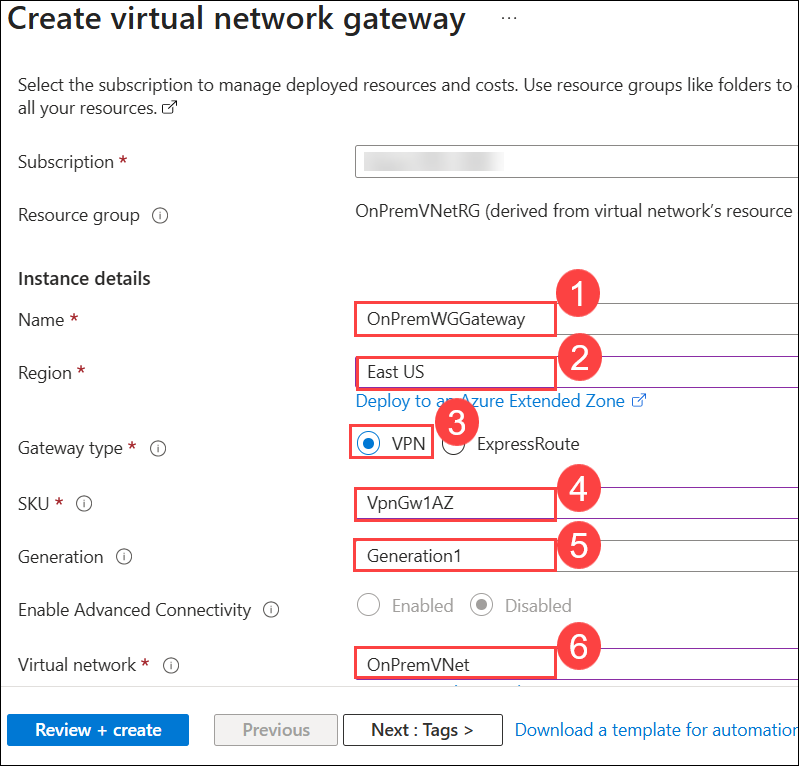
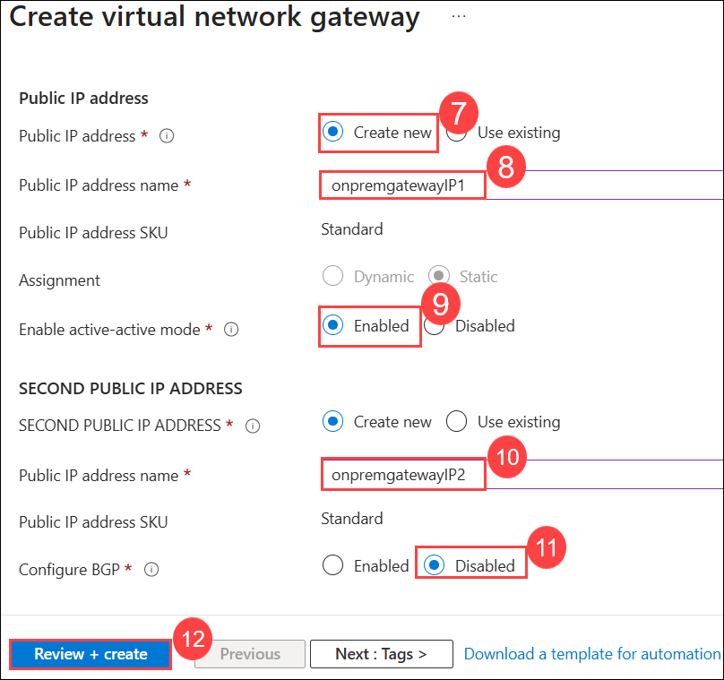
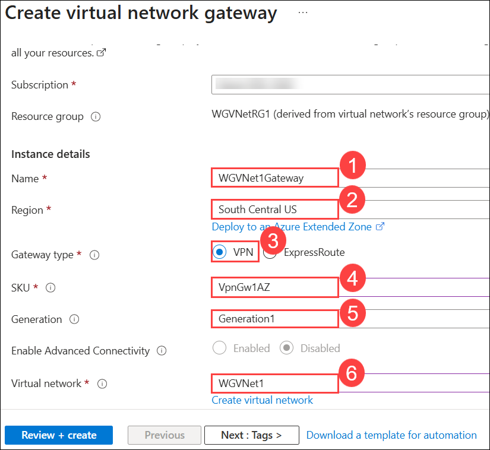
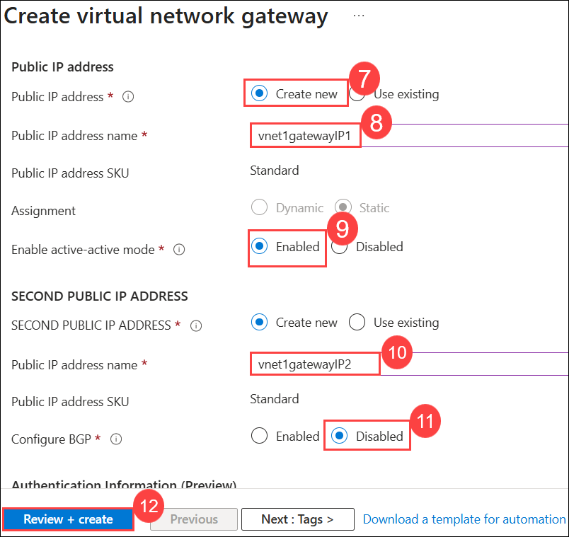
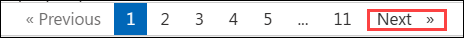

## Exercise 2: Configure Site-to-Site connectivity

### Estimated Duration: 60 Minutes

## Lab Overview
In this exercise, we will simulate an on-premises connection to the internal web application. To do this, we will first set up another Virtual Network in a separate Azure region followed by the Site-to-Site connection of the two Virtual Networks.

## Lab objectives

In this lab, you will perform the following tasks:

- Task 1: Create the first gateway
- Task 2: Create the second gateway
  
### Task 1: Create the first gateway

In this task, you will create a Virtual Network Gateway enable secure cross-premises and site-to-site connectivity by routing encrypted traffic between your on-premise network and Azure virtual networks.

1. In the search bar of the Azure portal, type **Virtual network gateway (1)**. From the search results, select **Virtual network gateway (2)**.

    

1. On the **Hybrid Connectivity** page, In the left pane expand **VPN gateway (1)** and then choose **VPN gateways (2)** from the drop down.

    

1. On the **VPN gateways** pane, click on **+ Create (2)** button at the top.

    

1. On the **Create virtual network gateway** blade,  enter the following information and select **Review + create (12)**:

    | Setting | Action |
    | -- | -- |
    | Subscription | **Keep the default subscription** |
    | Name | **OnPremWGGateway (1)** |
    | Region | **East US (2)** (This must match the location in which you created the **OnPremVNet** virtual network.) |
    | Gateway type | **VPN (3)** |
    | SKU | **VpnGw1AZ (4)** |
    | Generation | **Generation1 (5)** |
    | Virtual network | **OnPremVNet (6)** |
    | Public IP address | **Create new (7)** |
    | Public IP address name | **onpremgatewayIP1 (8)** |
    | Enable active-active mode | **Enabled (9)** |
    | Second Public IP address name | **onpremgatewayIP2 (10)** |
    | Configure BGP | **Disabled (11)** |

    
    

1. Validate your settings then select **Create**.

    >**Note:** The gateway will take 30-45 minutes to provision. Rather than waiting, continue to the next task.

### Task 2: Create the second gateway

In this task, you will create a second Virtual Network Gateway to establish redundancy or enable connectivity between multiple virtual networks/sites for high availability and secure communication.

1. In the search bar of the Azure portal, type **Virtual network gateway (1)**. From the search results, select **Virtual network gateway (2)**.

    

1. From the left navigation pane, expand **VPN gateways** then, select **VPN gateways (1)**. Click the **+ Create (2)** button at the top.

    

1. On the **Create virtual network gateway** blade,  enter the following information and select **Review + create (12)**:

    | Setting | Action |
    | -- | -- |
    | Subscription | **Keep the default subscription** |
    | Name | **WGVNet1Gateway (1)** |
    | Region | **South Central US (2)** (This must match the location in which you created the **WGVNet1** virtual network.) |
    | Gateway type | **VPN (3)** |
    | SKU | **VpnGw1AZ (4)** |
    | Generation | **Generation1 (5)** |
    | Virtual network | **WGVNet1 (6)** |
    | Public IP address | **Create new (7)** |
    | Public IP address name | **vnet1gatewayIP1 (8)** |
    | Enable active-active mode | **Enabled (9)** |
    | Second Public IP address name | **vnet1gatewayIP2 (10)** |
    | Configure BGP | **Disabled (11)** |

    
    

1. Validate your settings and then **Create**.

    >**Note:** The gateway will take approximately 30–45 minutes to provision. You don’t need to wait for the provisioning to complete; you can proceed with the next exercise and return later for validation.
    
1. The Azure portal will display a notification when the deployments have completed.

> **Congratulations** on completing the task! Now, it's time to validate it. Here are the steps:
      
   - Hit the Validate button for the corresponding task. If you receive a success message, you can proceed to the next task.
   - If not, carefully read the error message and retry the step, following the instructions in the lab guide.
   - If you need any assistance, please contact us at cloudlabs-support@spektrasystems.com. We are available 24/7 to help you out.

<validation step="130a5f26-8ddf-425e-9ec0-aa6e7913fb4d" />

### Review

In this lab, you have completed:

- Created the first gateway
- Created the second gateway

## **Congratulations! You have successfully completed this exercise. Please click on next**

#### Happy Learning!!
