## Exercise 5: Virtual Network Peering and Gateway connections

## Lab objectives

In this lab, you will perform following tasks:

- Configure VNet peering WGVNet1 to WGVNet2 and Vice Versa
- Connect the Gateways
  
## Estimated timing: 30 minutes

### Task 1: Configure VNet peering WGVNet1 to WGVNet2 and Vice Versa

1. Select the resource group **WGVNetRG1** and select **WGVNet1**.

    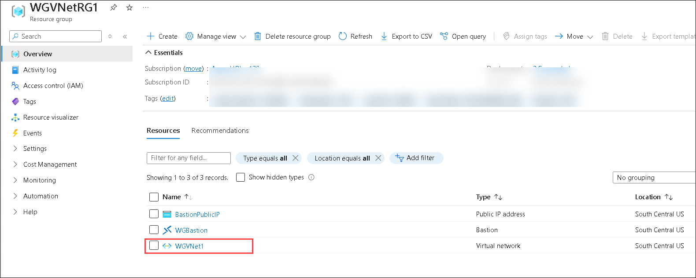

1. On the configuration blade for **WGVNet1**. Select **Peerings (1)** under **Settings** on the left then select **+ Add (2)**.

    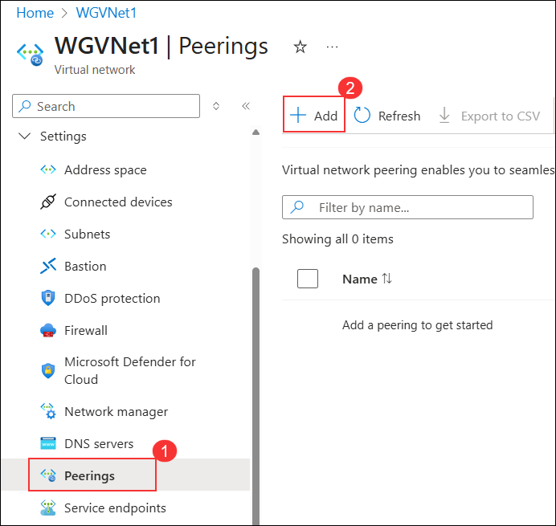

1. Set the following configuration for the new peering. Select **Add** to create the peering.

    **Remote virtual network summary**

    | Setting | Action |
    | -- | -- |
    | **Peering link name** | **VNETPeering_WGVNet2-WGVNet1** **(1)** |
    | **Virtual network deployment model** | **Resource Manager** **(2)** |
    | **Subscription** | **Defualt Subscription (3)** |
    | **Virtual Network** | **WGVNet2 (WGVNetRG2) (4)** |

    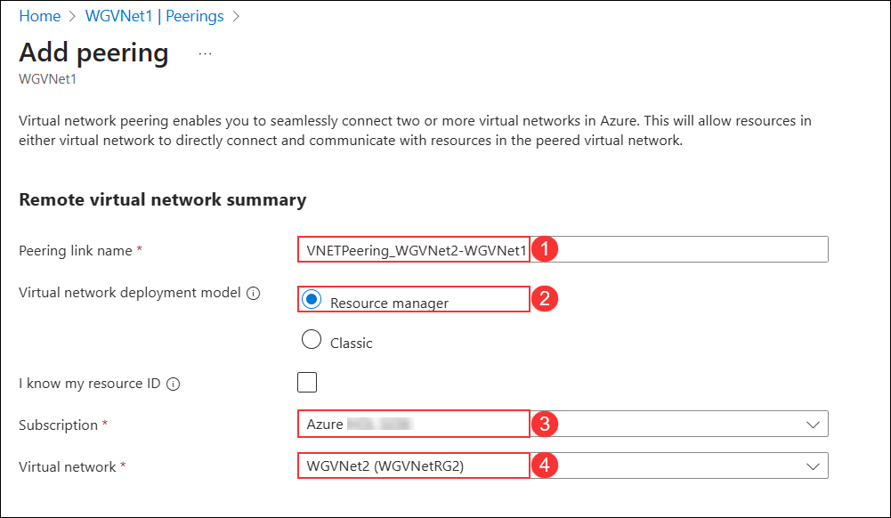

1. Enable the following checkboxes for **Remote virtual network peering settings**

    - Allow the peered virtual network to access 'WGVNet1'
    - Allow the peered virtual network to receive forwarded traffic from 'WGVNet1'
    - Enable 'WGVNet2' to use 'WGVNet1's' remote gateway or route server

      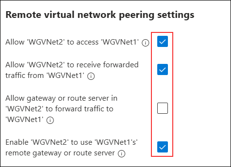

1. On the **Local virtual network peering** settings pane, enter the peering link name as **VNETPeering_WGVNet1-WGVNet2 (1)**. Enable the following checkboxes under **Local virtual network peering settings (2)**:

    - Allow 'WGVNet1' to access the peered virtual network
    - Allow 'WGVNet1' to receive forwarded traffic from the peered virtual network
    - Allow gateway or route server in 'WGVNet1' to forward traffic to the peered virtual network
    - Click the **Add (3)** button at the bottom to create the peering.

      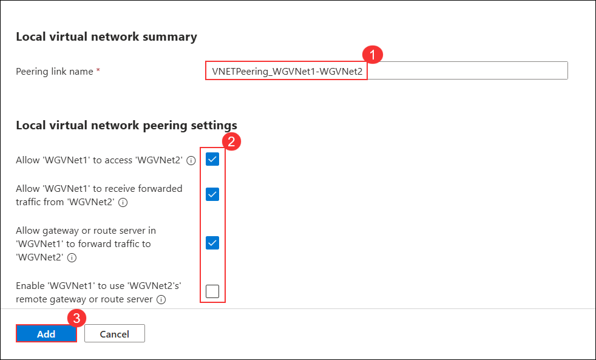
 
1. Once the **VNet Peering** is completed, it will appear as shown in the screenshot below.

   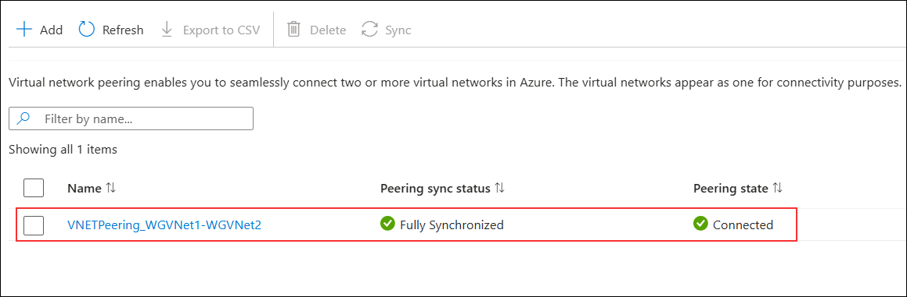

> **Congratulations** on completing the task! Now, it's time to validate it. Here are the steps:
      
   - Hit the Validate button for the corresponding task. If you receive a success message, you can proceed to the next task.
   - If not, carefully read the error message and retry the step, following the instructions in the lab guide.
   - If you need any assistance, please contact us at cloudlabs-support@spektrasystems.com. We are available 24/7 to help you out.

<validation step="d4bfa543-2369-4f18-9f71-d5c83f8bd982" />

### Task 2: Connect the gateways

1. In the Azure portal, in the 'Search resources, services, and docs' search box, type **Connections (1)** in the search text box. Select **Connections (2)**.

    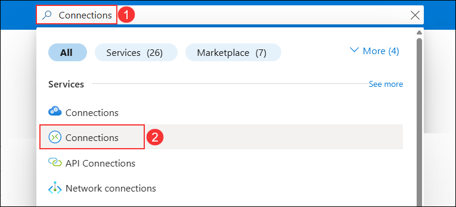

     >**Note**: Make sure to refer the above screenshot while selecting the **Connections.**

1. On the **Hybrid Connectivity** blade, select **VPN Gateway (1)** and then choose the **VPN Connections** from drop down and click on **Create Connection (3)**.

    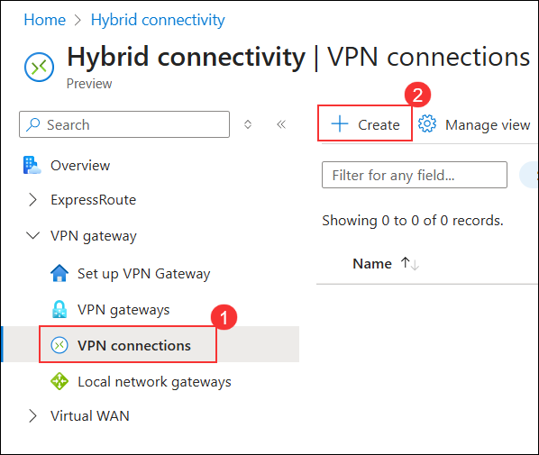

1. On the **Basics** blade, enter the following information and select **Next: Settings (8)**:

    - Subscription: Leave default **(1)**
    - Resource group: Select the existing **WGVNetRG1 (2)**
    - **Connection type** set to **VNet-to-VNet (3)**
    - Establish bidirectional connectivity - checked **(4)**
    - First connection name - **WGVNet1-to-OnPremWGGateway (5)**
    - Second connection name - **WGGateway-to-WGVNet1 (6)**
    - Region - **South Central US (7)**

        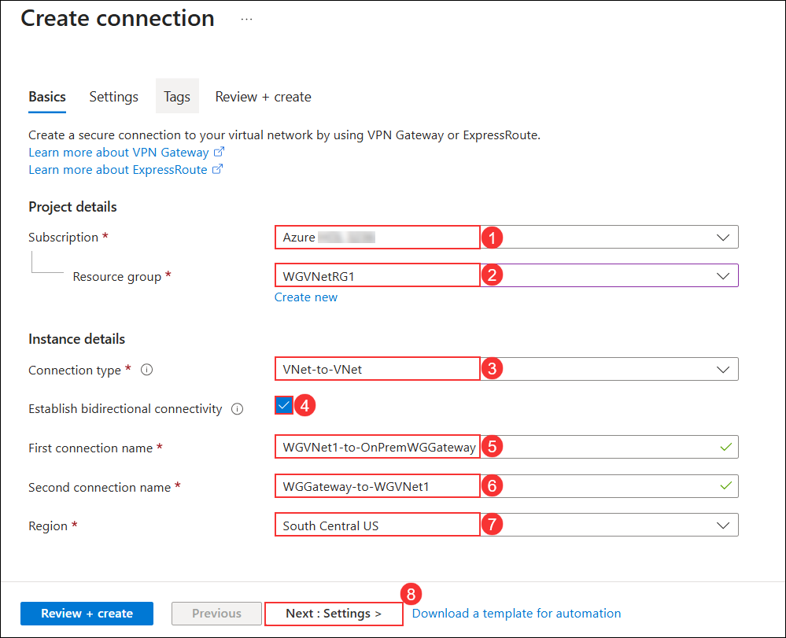

1. On the Settings step, 

    - Select **WGVNet1Gateway (1)** as the first virtual network gateway 
    - **OnPremWGGateway (2)** as the second virtual network gateway
    - Enter a shared key, such as **A1B2C3D4 (3)**.
    - Ensure **IKEv2 (4)** is selected
    - Select **Review + create (5)**.

      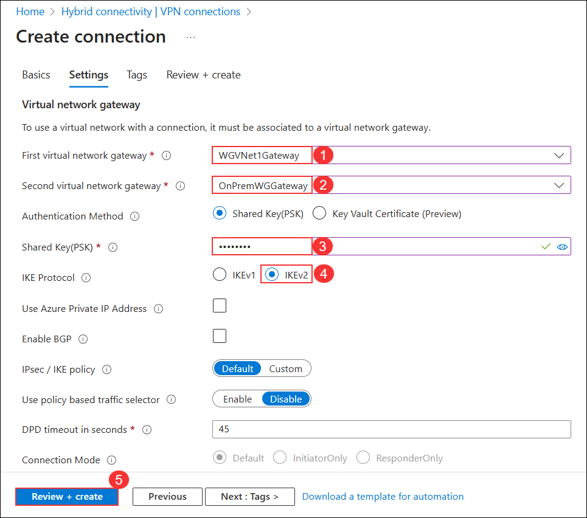

1. Select **Create** on the **Summary** page to create the connection.

1. In the Azure portal, in the 'Search resources, services, and docs' search box, type **Connections (1)** in the search text box. Select **Connections (2)**.

    

1. On the **Hybrid Connectivity** page, Select the **VPN Gateway (1)** and then choose the **VPN Connections (2)** from the drop down.

1. Watch the progress of the connection status, and use the **Refresh** icon until the status changes for both connections from **Unknown** to **Connected**. This may take 5-10 minutes or more. You might need to refresh the page to see the change in status.

    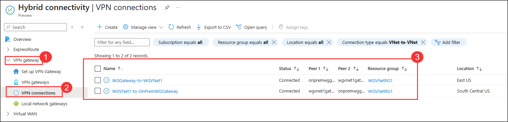

### Review
In this lab, you have completed:
- Configured VNet peering WGVNet1 to WGVNet2 and Vice Versa
- Connected the Gateways

## Great job on completing this exercise! You can now proceed to the next one.
