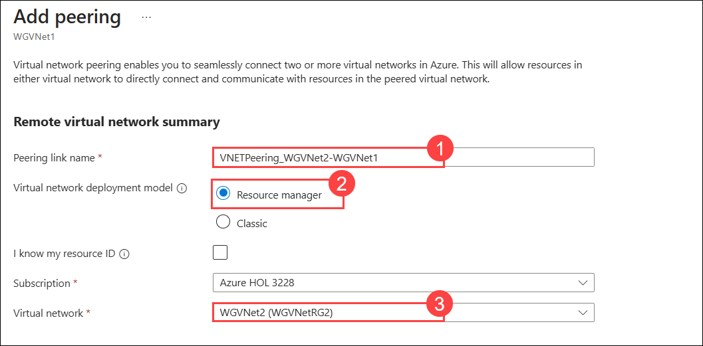
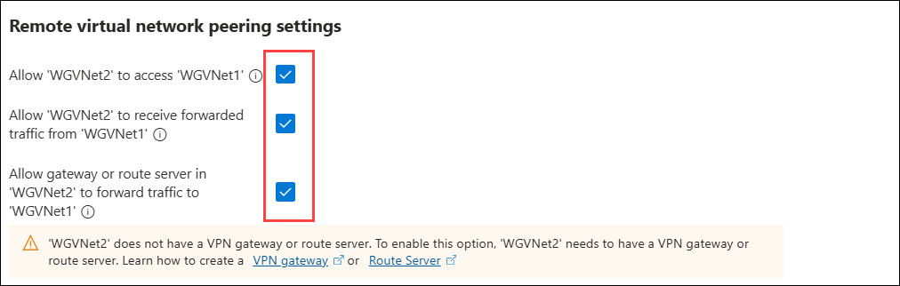
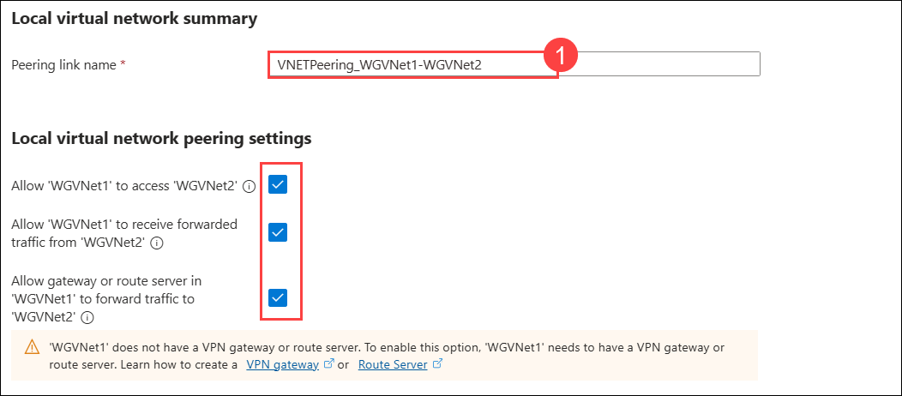
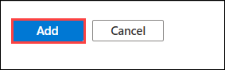
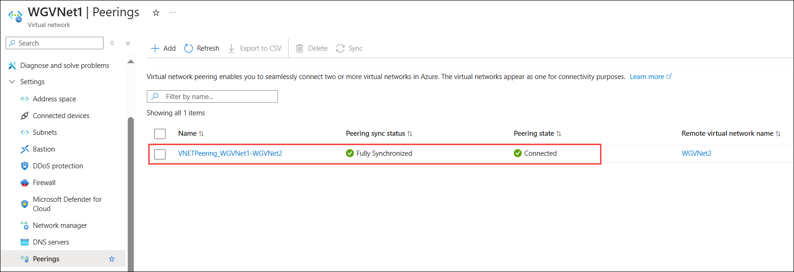

## Exercise 3: Virtual Network Peering

## Lab objectives

In this lab, you will perform following tasks:

- Configure VNet peering WGVNet1 to WGVNet2 and Vice Versa
  
## Estimated timing: 20 minutes

### Task 1: Configure VNet peering WGVNet1 to WGVNet2 and Vice Versa

1. Select the resource group **WGVNetRG1** and select **WGVNet1**.

    

1. On the configuration blade for **WGVNet1**. Select **Peerings** under **Settings** on the left then select **+ Add**.

    

1. Set the following configuration for the new peering. Select **Add** to create the peering.

    **Remote virtual network summary**

    | Setting | Action |
    | -- | -- |
    | **Peering link name** | **VNETPeering_WGVNet2-WGVNet1** **(1)** |
    | **Virtual network deployment model** | **Resource Manager** **(2)** |
    | **Virtual Network** | **WGVNet2 (WGVNetRG2) (3)** |

    

1. Enable the following checkboxes for **Remote virtual network peering settings**

    - Allow the peered virtual network to access 'WGVNet1'
    - Allow the peered virtual network to receive forwarded traffic from 'WGVNet1'
    - Enable 'WGVNet2' to use 'WGVNet1's' remote gateway or route server

      

1. For **Local virtual network summary** provide the Peering link name as **VNETPeering_WGVNet1-WGVNet2** **(1)**

1. Enable the following checkboxes for **Local virtual network peering settings**

    - Allow 'WGVNet1' to access the peered virtual network
    - Allow 'WGVNet1' to receive forwarded traffic from the peered virtual network
    - Allow gateway or route server in 'WGVNet1' to forward traffic to the peered virtual network

      

1. Click on **Add** to create the **VNet Peering**.

   

1. Once the **VNet Peering** is completed, it will appear as shown in the screenshot below.

   

> **Congratulations** on completing the task! Now, it's time to validate it. Here are the steps:
      
   - Hit the Validate button for the corresponding task. If you receive a success message, you can proceed to the next task.
   - If not, carefully read the error message and retry the step, following the instructions in the lab guide.
   - If you need any assistance, please contact us at cloudlabs-support@spektrasystems.com. We are available 24/7 to help you out.

<validation step="7117aa53-3f41-4bf9-b67b-294aaeecbec8" />

### Review
In this lab, you have completed:
- Configured VNet peering WGVNet1 to WGVNet2 and Vice Versa

## Great job on completing this exercise! You can now proceed to the next one.
