## Exercise 4: Configure Network Security Groups and Application Security Groups

In this exercise, you will restrict traffic between tiers of an n-tier application by using network security groups and application security groups.

## Lab objectives

In this lab, you will perform following tasks:

- Create application security groups
- Configure application security groups
- Create network security group
  
## Estimated timing: 60 minutes

### Task 1: Create application security groups

1. In the search bar of the Azure portal, type **Application security group (1)**. From the search results, select **Application security group (2)**.

    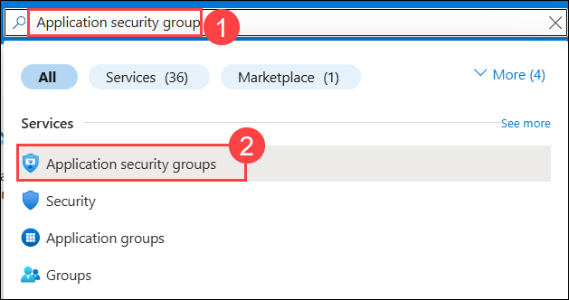

1. Click on **+ Create**.    

1. On the **Create an application security group** blade, on the **Basics** tab, enter the following information, and select **Review + create (5)**:

    | Setting | Action |
    | -- | -- |
    | **Subscription** | Select your subscription **(1)** |
    | **Resource group** | **WGVNetRG2** **(2)** |
    | **Name** | **WebTier** **(3)** |
    | **Region** | **South Central US (4)** |

    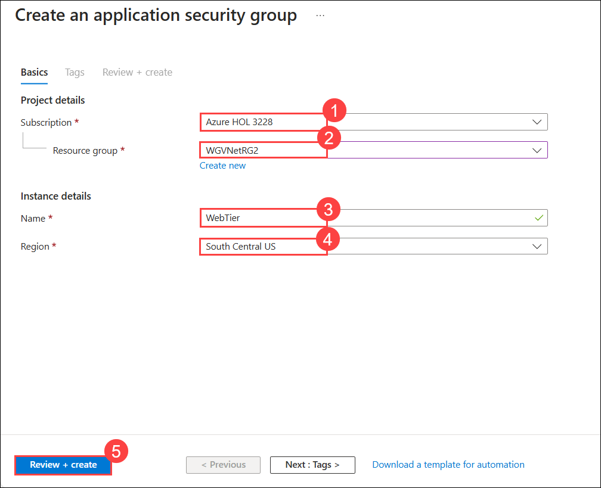

1. Click on **Create**.

1. Repeat the previous two steps to create an application security group named **DataTier** with the following settings and select **Review + create (5)**:

    | Setting | Action |
    | -- | -- |
    | **Subscription** | Select your subscription **(1)** |
    | **Resource group** | **WGVNetRG2** **(2)** |
    | **Name** | **DataTier** **(3)** |
    | **Region** | **South Central US (4)** |

    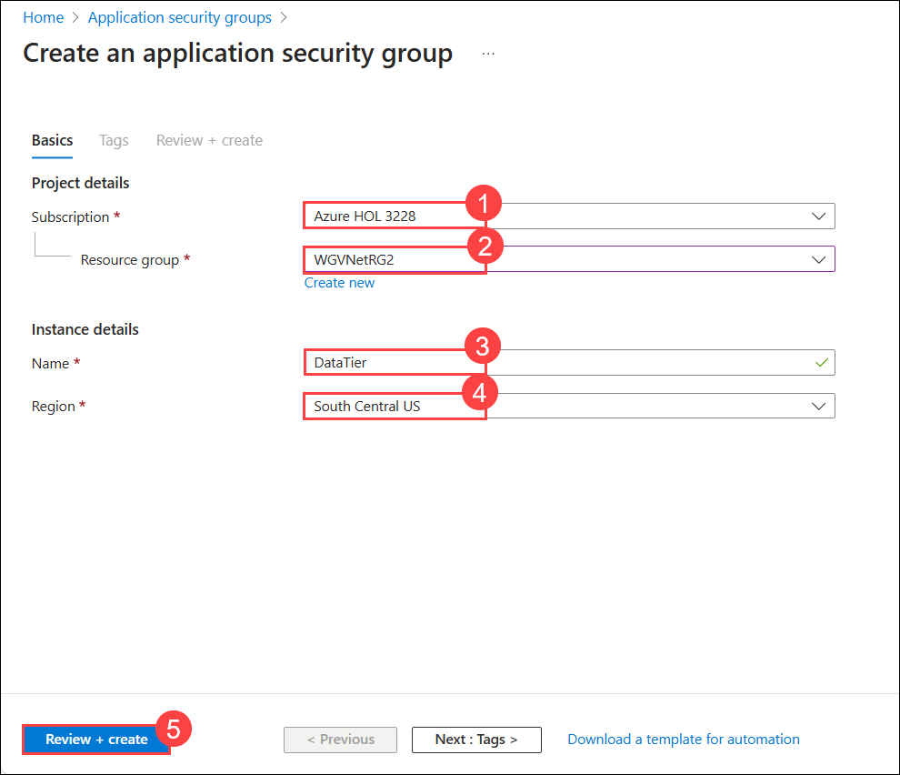

1. Click on **Create**.

> **Congratulations** on completing the task! Now, it's time to validate it. Here are the steps:
      
   - Hit the Validate button for the corresponding task. If you receive a success message, you can proceed to the next task.
   - If not, carefully read the error message and retry the step, following the instructions in the lab guide.
   - If you need any assistance, please contact us at cloudlabs-support@spektrasystems.com. We are available 24/7 to help you out.

<validation step="72966bfa-c0b7-4812-bb35-9ac256bf617c" />

### Task 2: Configure application security groups

1. In the Azure portal, search for **Virtual machines (1)** and select **Virtual machines (2)** from the services.

    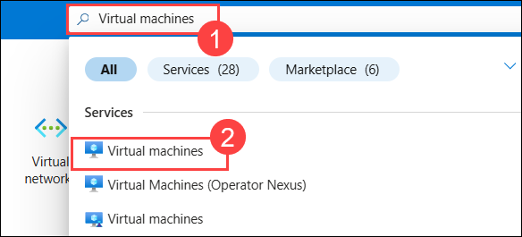

1. Select **WGWEB1**.

    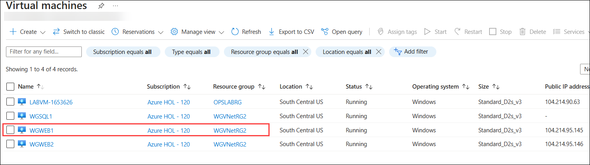

1. On the **WGWEB1** blade, go to **Networking** > **Application security groups (1)**, select **+ Application security groups (2)**, choose **WebTier (3)**, and click **Add (4)**.

    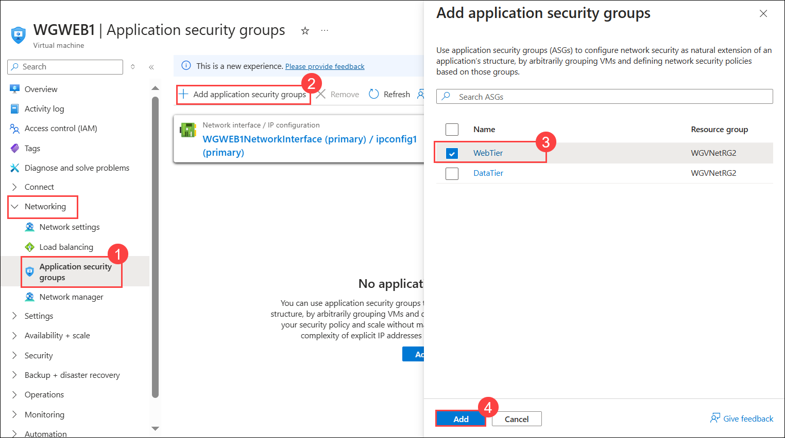

1. Repeat steps 1 and 2, but this time select **WGSQL1** Virtual machine and assign **DataTier** application security group.

> **Congratulations** on completing the task! Now, it's time to validate it. Here are the steps:
      
   - Hit the Validate button for the corresponding task. If you receive a success message, you can proceed to the next task.
   - If not, carefully read the error message and retry the step, following the instructions in the lab guide.
   - If you need any assistance, please contact us at cloudlabs-support@spektrasystems.com. We are available 24/7 to help you out.

<validation step="e53f334e-4c3e-47c1-adbe-725ce183da93" />

### Task 3: Create network security group

This task will create a network security group with the following rules:

- Allow SQL traffic (port 1433) from the WebTier application security group to the DataTier application security group.
- Allow HTTP web traffic (port 80) from anywhere to the WebTier application security group.
- Allow RDP traffic (port 3389) from the Azure Bastion range to anywhere.
- Allow RDP traffic (port 3389) from the OnPremManagementSubnet range to anywhere.
- Deny all other traffic from the virtual machines to the data tier.
- Deny all other traffic from the virtual machines to the web tier.

1. In the search bar of the Azure portal, type **Network security group (1)**. From the search results, select **Network security group (2)**, Click on **Create**.

   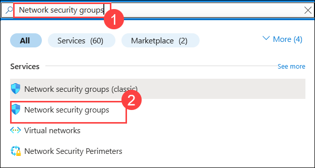

2. On the **Create network security group** blade, enter the following information, and select **Review + Create (5)** then **Create**:

    | Setting | Action |
    | -- | -- |
    | **Subscription** | Select your subscription **(1)** |
    | **Resource group** | **WGVNetRG2** **(2)** |
    | **Name** | **WGAppNSG1** **(3)** |
    | **Region** | **South Central US (4)** |

   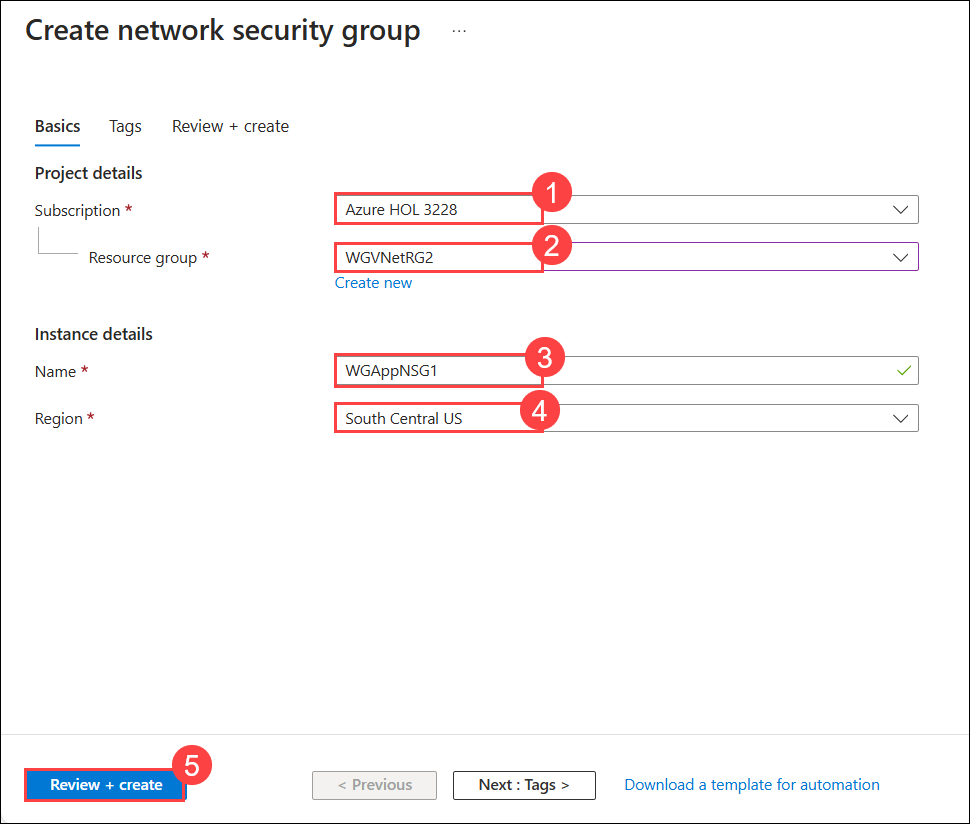

3. Once the deployment is completed, then click on **Go to resource**.

4. On the **WGAppNSG1** blade, select **Inbound security rules (2)** under **Settings (1)** on the left and select **Add (3)**.

    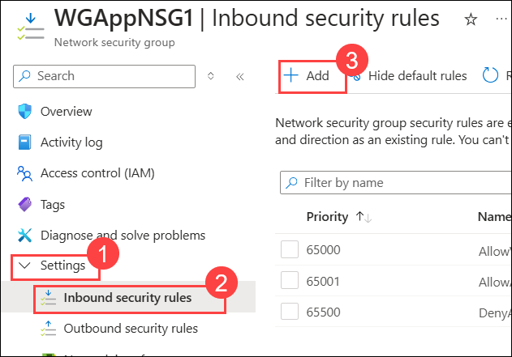

5. On the **Add inbound security rule** blade, enter the following information, and select **Add (11)**:

    | Setting | Action |
    | -- | -- |
    | Source | **Application security group** **(1)** |
    | Source application security group | **WebTier** **(2)** |
    | Source port ranges | **\*** **(3)** |
    | Destination | **Application security group (4)** |
    | Destination application security group | **DataTier** **(5)** |
    | Destination port ranges | **1433** **(6)** |
    | Protocol | **TCP** **(7)** |
    | Action | **Allow** **(8)** |
    | Priority | **100** **(9)** |
    | **Name** | **AllowDataTierInboundTCP1433** **(10)**|

    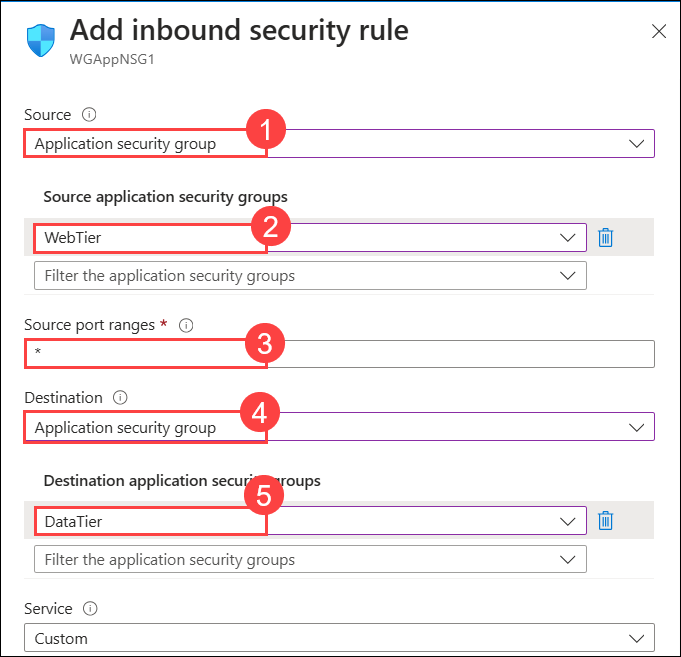
   
    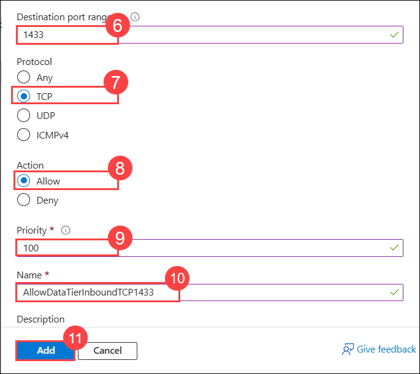

7. On the **WGAppNSG1 - Inbound security rules** blade, select **Add**.

8. On the **Add inbound security rule** blade, enter the following information, and select **Add (10)**:

    | Setting | Action |
    | -- | -- |
    | Source | **Any** **(1)** |
    | Source port ranges | **\*** **(2)** |
    | Destination | **Application security group** **(3)** |
    | Destination application security group | **WebTier** **(4)** |
    | Destination port ranges | **80** **(5)** |
    | Protocol | **TCP** **(6)** |
    | Action | **Allow** **(7)** |
    | Priority | **150** **(8)** |
    | **Name** | **AllowAnyWebTierInboundTCP80** **(9)**|

    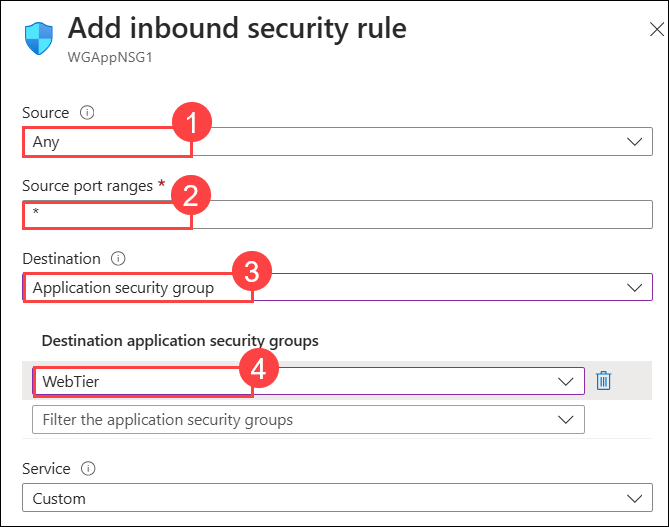
   
    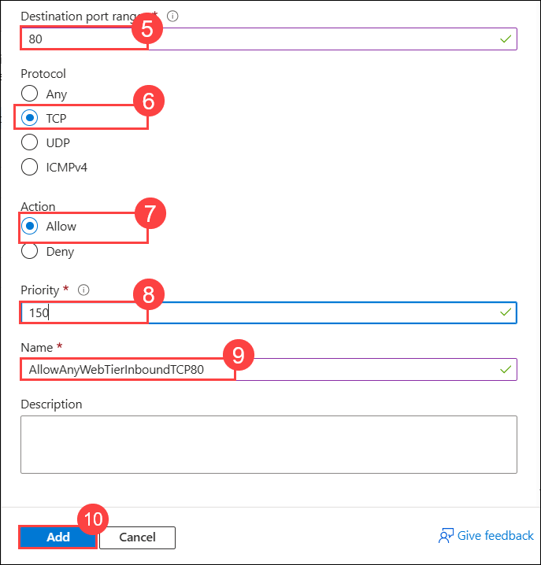

10. On the **WGAppNSG1 - Inbound security rules** blade, select **Add**.

11. On the **Add inbound security rule** blade, enter the following information, and select **Add (10)**:

    | Setting | Action |
    | -- | -- |
    | Source | **IP Addresses** **(1)** |
    | Source IP addresses/CIDR ranges | **10.7.5.0/24** **(2)** |
    | Source port ranges | **\*** **(3)** |
    | Destination | **Any** **(4)** |
    | Destination port ranges | **3389** **(5)** |
    | Protocol | **Any** **(6)** |
    | Action | **Allow** **(7)** |
    | Priority | **200** **(8)** |
    | **Name** | **AllowMgmtInboundAny3389** **(9)**|

    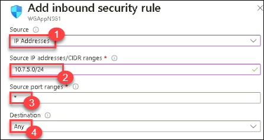
   
    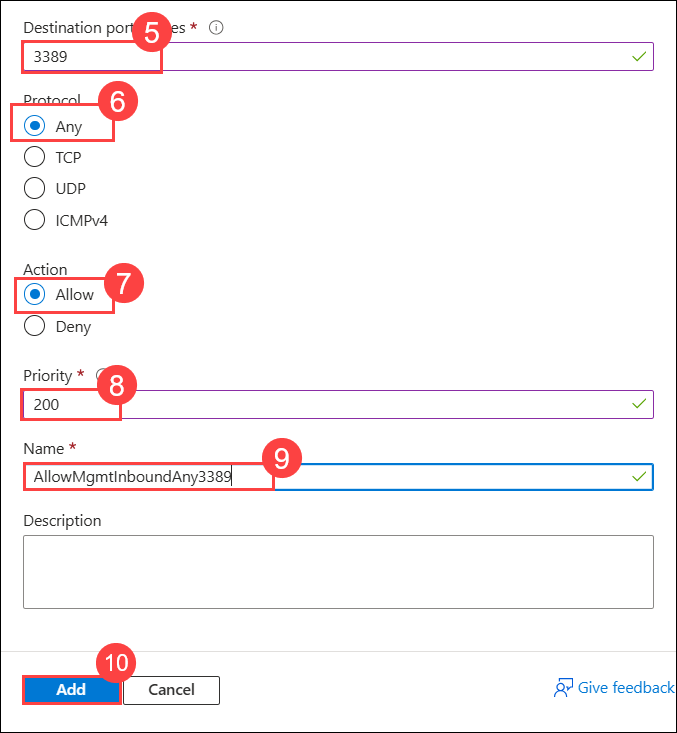

9. On the **WGAppNSG1 - Inbound security rules** blade, select **Add**.

10. On the **Add inbound security rule** blade, enter the following information, and select **Add (10)**:

    | Setting | Action |
    | -- | -- |
    | Source | **IP Addresses** **(1)** |
    | Source IP addresses/CIDR ranges | **192.168.2.0/27** **(2)** |
    | Source port ranges | **\*** **(3)** |
    | Destination | **Any** **(4)** |
    | Destination port ranges | **3389** **(5)** |
    | Protocol | **Any** **(6)** |
    | Action | **Allow** **(7)** |
    | Priority | **250** **(8)** |
    | **Name** | **AllowOnPremInboundAny3389** **(9)**|

    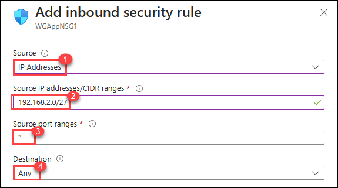
   
    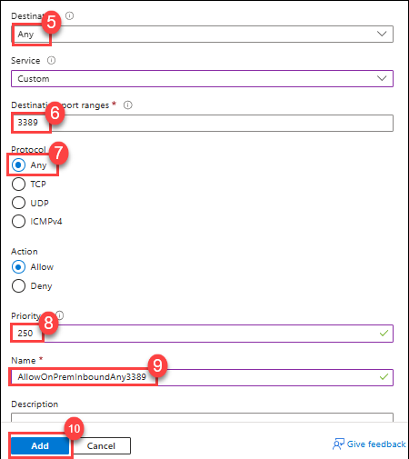

12. On the **WGAppNSG1 - Inbound security rules** blade, select **Add**.

13. On the **Add inbound security rule** blade, enter the following information, and select **Add (11)**:

    | Setting | Action |
    | -- | -- |
    | Source | **Service Tag** **(1)** |
    | Source service tag | **VirtualNetwork** **(2)** |
    | Source port ranges | **\*** **(3)** |
    | Destination | **Application security group** **(4)** |
    | Destination application security group | **DataTier** **(5)** |
    | Destination port ranges | **\*** **(6)** |
    | Protocol | **Any** **(7)** |
    | Action | **Deny** **(8)** |
    | Priority | **1000** **(9)** |
    | **Name** | **DenyVNetDataTierInbound** **(10)**|

    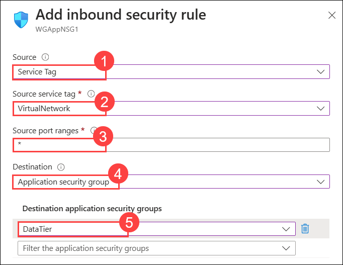
    
    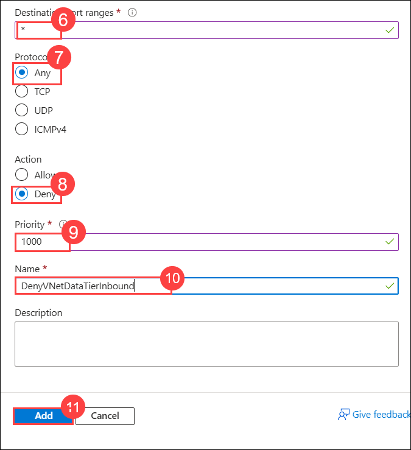

15. On the **WGAppNSG1 - Inbound security rules** blade, select **Add**.

16. On the **Add inbound security rule** blade, enter the following information, and select **Add (11)**:

    | Setting | Action |
    | -- | -- |
    | Source | **Service Tag** **(1)** |
    | Source service tag | **VirtualNetwork** **(2)** |
    | Source port ranges | **\*** **(3)** |
    | Destination | **Application security group** **(4)** |
    | Destination application security group | **WebTier** **(5)** |
    | Destination port ranges | **\*** **(6)** |
    | Protocol | **Any** **(7)** |
    | Action | **Deny** **(8)** |
    | Priority | **1050** **(9)** |
    | **Name** | **DenyVNetWebTierInbound** **(10)**|

    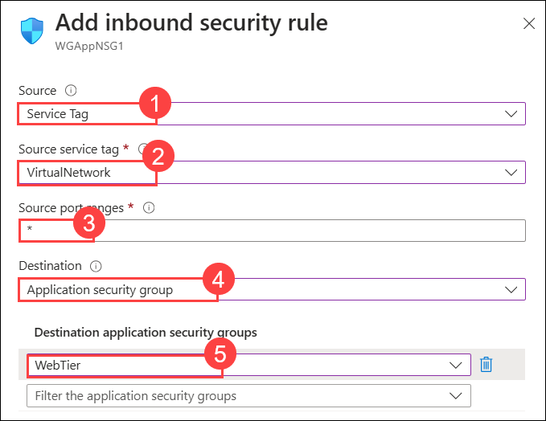
    
    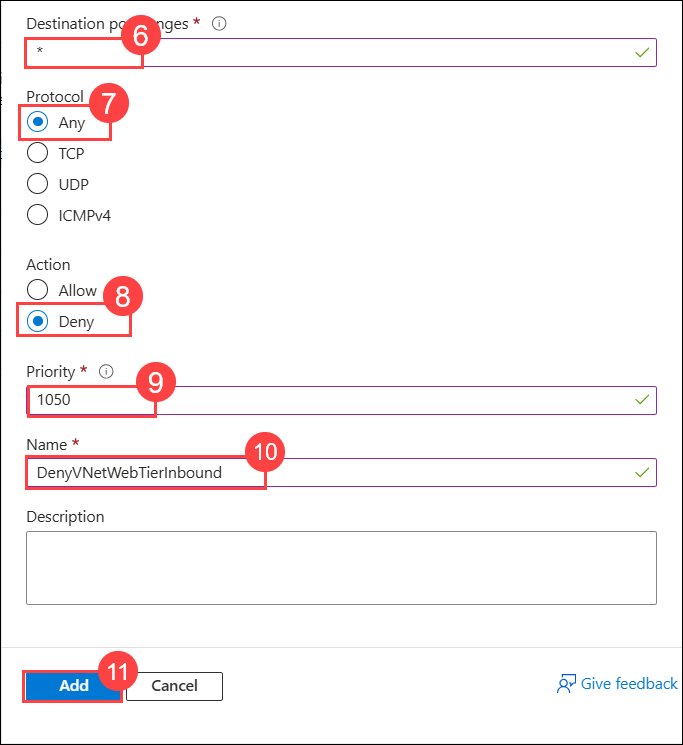

18. On the **WGAppNSG1 - Inbound security rules** blade, go to **Settings** > **Subnets (1)**, click **+ Associate (2)**, select **WGVNet2 (3)** in the **Virtual network** dropdown, choose **AppSubnet (4)** in the **Subnet** dropdown, and click **OK (5)**.

    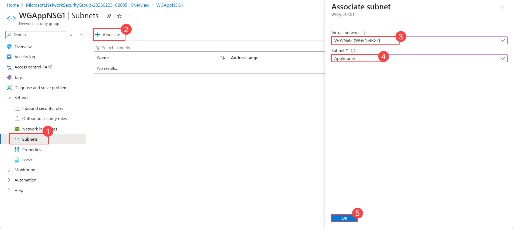

> **Congratulations** on completing the task! Now, it's time to validate it. Here are the steps:
      
   - Hit the Validate button for the corresponding task. If you receive a success message, you can proceed to the next task.
   - If not, carefully read the error message and retry the step, following the instructions in the lab guide.
   - If you need any assistance, please contact us at cloudlabs-support@spektrasystems.com. We are available 24/7 to help you out.

<validation step="ba197d70-afb9-4962-a5c9-3a71fbe4deb1" />

### Review
In this lab, you have completed:
- Created application security groups
- Configured application security groups
- Created network security group

## Great job on completing this exercise! You can now proceed to the next one.
