## Exercise 4: Create route tables with required routes

### Estimated Duration: 40 minutes

Route Tables are containers for User Defined Routes (UDRs). The route table is created and associated with a subnet. UDRs allow you to direct traffic in ways other than normal system routes would. In this case, UDRs will direct outbound traffic via the Azure firewall.

## Lab objectives

In this lab, you will perform the following tasks:

- Task 1: Create route tables
- Task 2: Add routes to each route table
- Task 3: Associate route tables to subnets
  
### Task 1: Create route tables

1. In the search bar of the Azure portal, type **Route tables (1)**. From the search results, select **Route tables (2)**.

    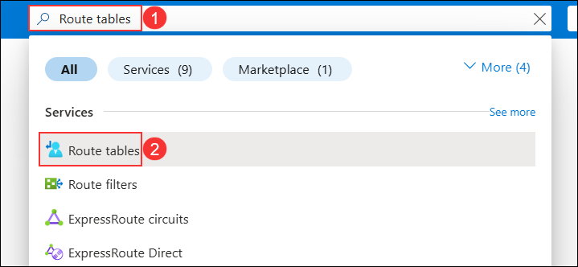

1. Click on **Create**.

    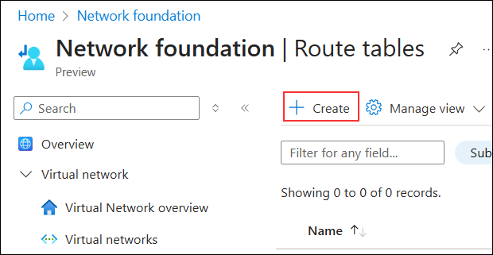

1. On the **Create a Route table** blade, enter the following information:

    | Setting | Action |
    | -- | -- |
    | **Resource group** | **WGVNetRG2** **(1)** |
    | **Region** | **South Central US (2)** |
    | **Name** | **AppRT** **(3)** |
    | **Propagate gateway routes** | **No** **(5)** |

    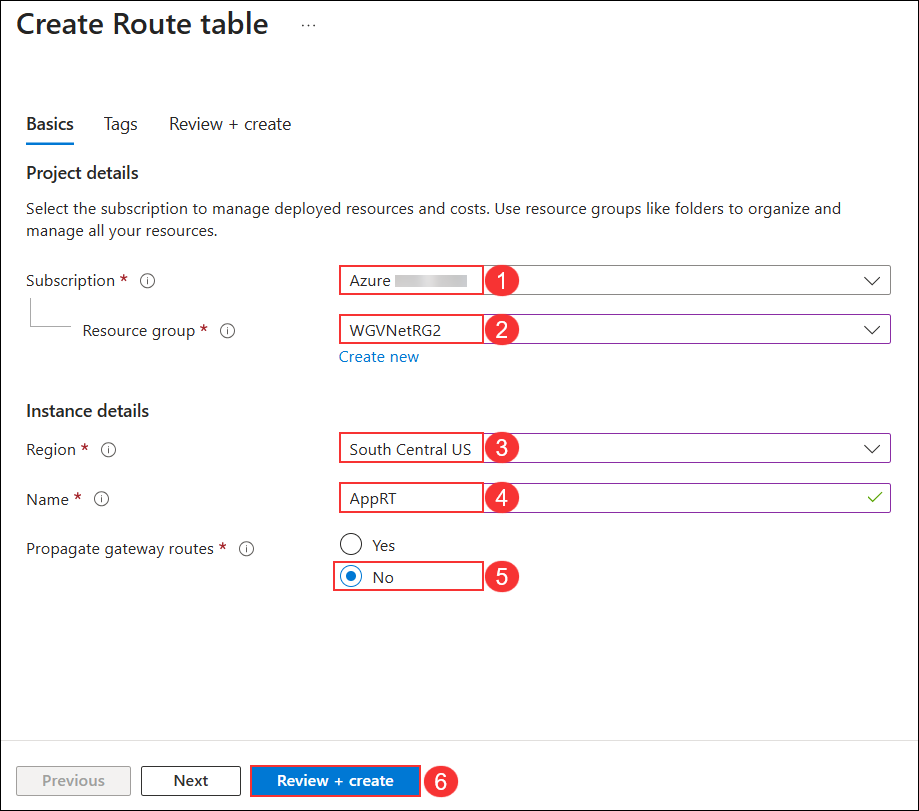

1. Select **Review + Create (5)** then **Create**.

Now that you've created the AppRT route table, let's continue by creating a second route table.

1. In the search bar of the Azure portal, type **Route tables (1)**. From the search results, select **Route tables (2)**.

   

1. Click on **Create**.

    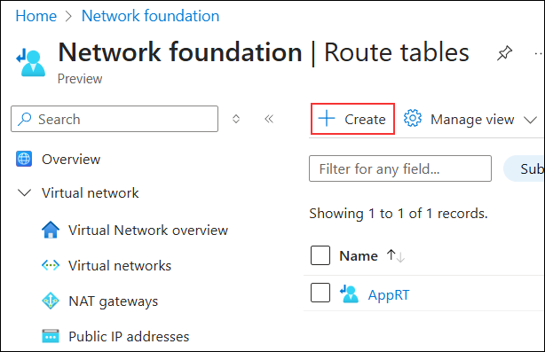

1. On the **Create a Route table** blade, enter the following information:

    | Setting | Action |
    | -- | -- |
    | **Resource group** | **WGVNetRG1** **(1)** |
    | **Region** | **South Central US (2)** |
    | **Name** | **vpnGWRT** **(3)** |
    | **Propagate gateway routes** | **Yes** **(5)** |

    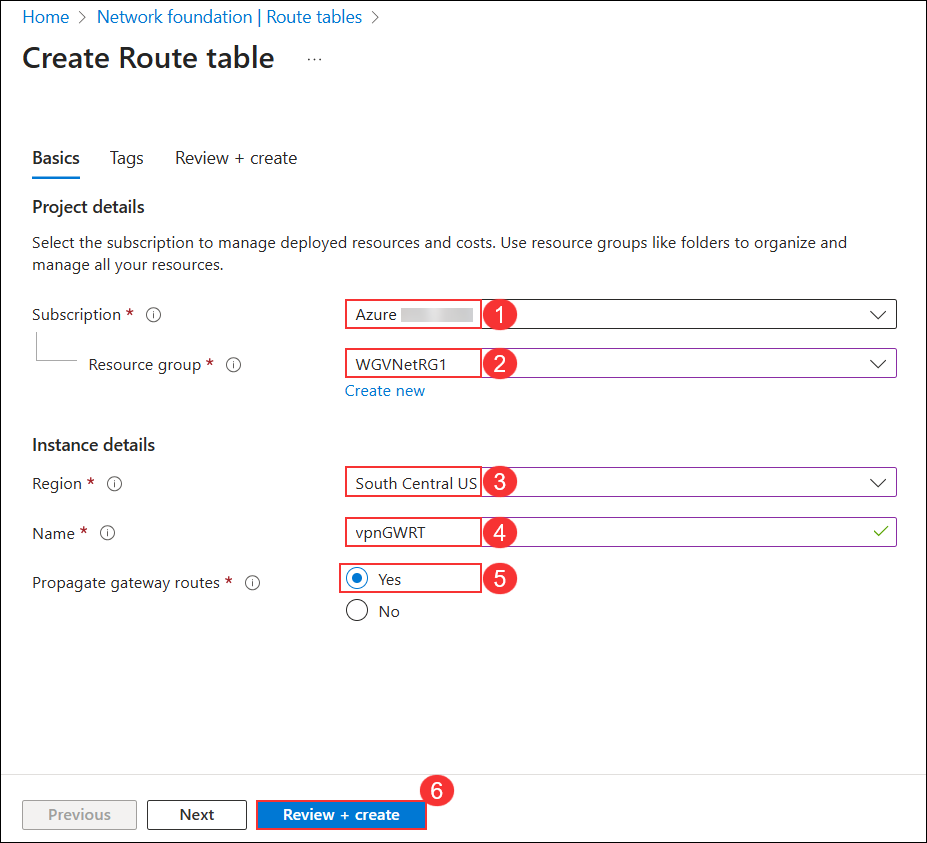
   
1. Select **Review + Create (5)** then **Create**.

1. Once route tables are created, your **Route tables** blade should look like the following screenshot:

    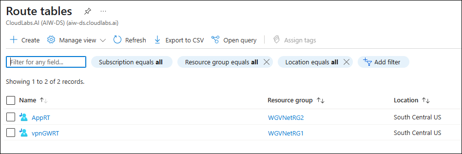

> **Congratulations** on completing the task! Now, it's time to validate it. Here are the steps:
      
   - Hit the Validate button for the corresponding task. If you receive a success message, you can proceed to the next task.
   - If not, carefully read the error message and retry the step, following the instructions in the lab guide.
   - If you need any assistance, please contact us at cloudlabs-support@spektrasystems.com. We are available 24/7 to help you out.

<validation step="7dac4a5a-d04f-4aec-b554-80dabc6dcc11" />

### Task 2: Add routes to each route table

1. On the **route tables** pane, click **AppRT (1)** from the list to open the route table details.

    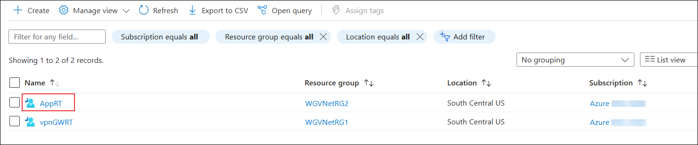

1. On the **Routes (1)** pane, select **Routes** from the left navigation menu. Click the **Add (2)** button at the top to create a new route..

    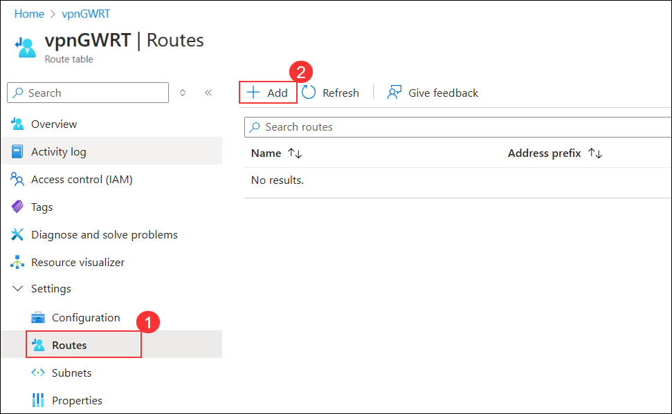

1. On the **Routes** blade, select **+ Add**. Enter the following information, and select **Add (6)**:

    | Setting | Action |
    | -- | -- |
    | Route name | **AppToInternet** **(1)** |
    | Destination type | **IP Addresses** **(2)** |
    | Destination IP addresses/CIDR ranges | **0.0.0.0/0** **(3)** |
    | Next hop type | **Virtual appliance** **(4)** |
    | Next hop address | **10.7.1.4** **(5)** (This is the private IP of Azure Firewall.) |

    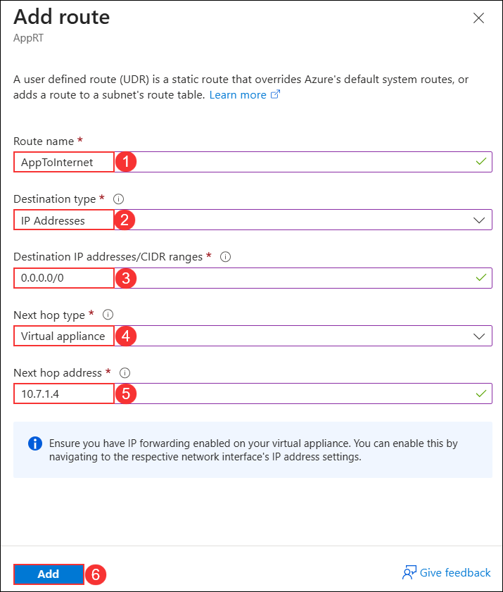

1. Upon completion, your routes in the **AppRT** route table should look like the following screenshot:

    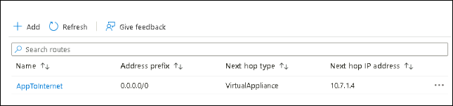

Now that you've created the routes for the **AppRT** route table, let's continue by creating routes for the **vpnGWRT** route table.

1. On the **route tables** pane, click **vpnGWRT (1)** from the list to open the route table details.

   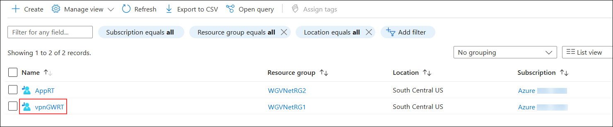

1. On the **vpnGWRT** route table, select **Routes (1)** from the left navigation menu. Click the **Add (2)** button at the top to create a new route.

   

1. On the **Routes** blade, enter the following information, and select **Add (6)**:

    | Setting | Action |
    | -- | -- |
    | Route name | **ToTheApp** **(1)** |
    | Destination type | **IP Addresses** **(2)** |
    | Destination IP addresses/CIDR ranges | **10.8.0.0/25** **(3)** |
    | Next hop type | **Virtual appliance** **(4)** |
    | Next hop address | **10.7.1.4** **(5)** (This is the private IP of Azure Firewall.) |

    

1. Upon completion, your routes in the **vpnGWRT** route table should look like the following screenshot:

   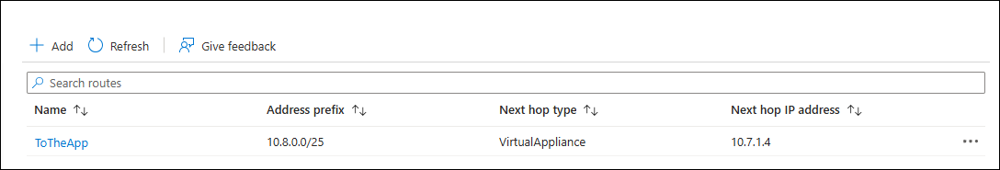
   
    >**Note:** The route tables and routes you have just created are not associated with any subnets yet, so they are not impacting any traffic flow yet. This will be accomplished later in the lab.

> **Congratulations** on completing the task! Now, it's time to validate it. Here are the steps:
      
   - Hit the Validate button for the corresponding task. If you receive a success message, you can proceed to the next task.
   - If not, carefully read the error message and retry the step, following the instructions in the lab guide.
   - If you need any assistance, please contact us at cloudlabs-support@spektrasystems.com. We are available 24/7 to help you out.

<validation step="b058aece-c0b2-4ca3-9f2a-21943e7a3088" />

### Task 3: Associate route tables to subnets

1. In the Azure portal, navigate to the blade of the **WGVNetRG2** resource group.

1. Select **AppRT**, followed by **Subnets (1)** and then select **+ Associate (2)**.

    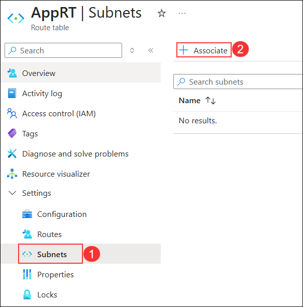

1. On the **Associate subnet** blade, select **WGVNet2 (1)** on the **Virtual network** drop down. Select **AppSubnet (2)** on the **Subnet** dropdown and then select **OK (3)** at the bottom of the **Associate subnet** blade.

    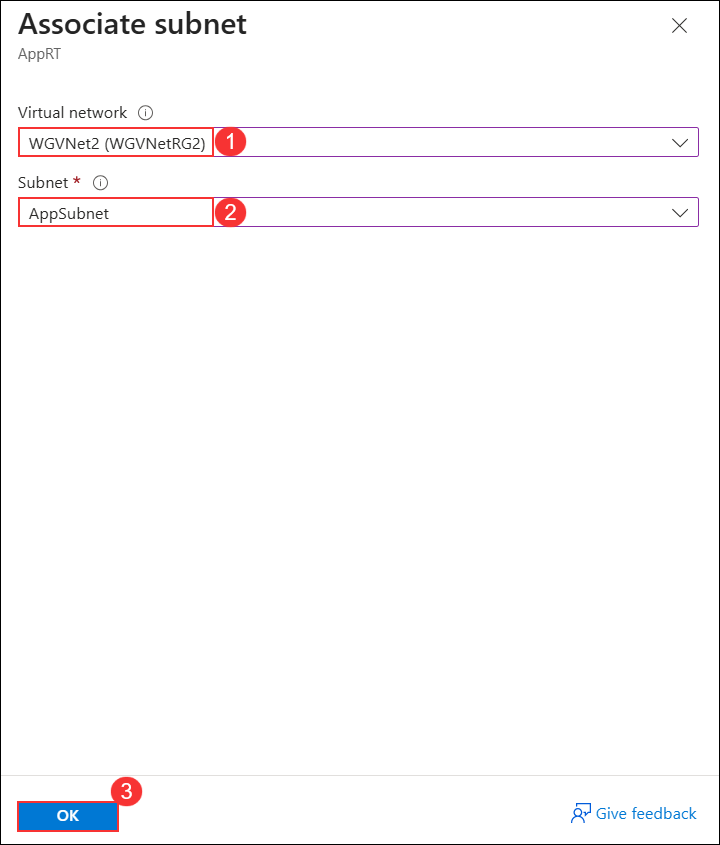

Now that you've associated the **AppRT** route table with the **App Subnet**, let's associate **vpnGWRT** route table to the **GatewaySubnet**.

1. In the Azure portal, navigate to the blade of the WGVNetRG1 resource group.

1. Select **vpnGWRT**, followed by **Subnets (1)** and then select **+ Associate (2)**.

   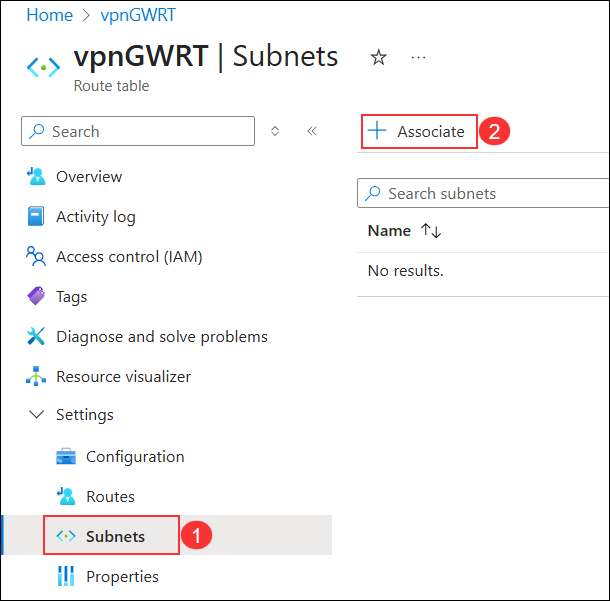
     
1. On the **Associate subnet** blade, select **WGVNet1 (1)** on the **Virtual network** drop down. Select **GatewaySubnet (2)** on the **Subnet** dropdown and then select **OK (3)** at the bottom of the **Associate subnet** blade.

   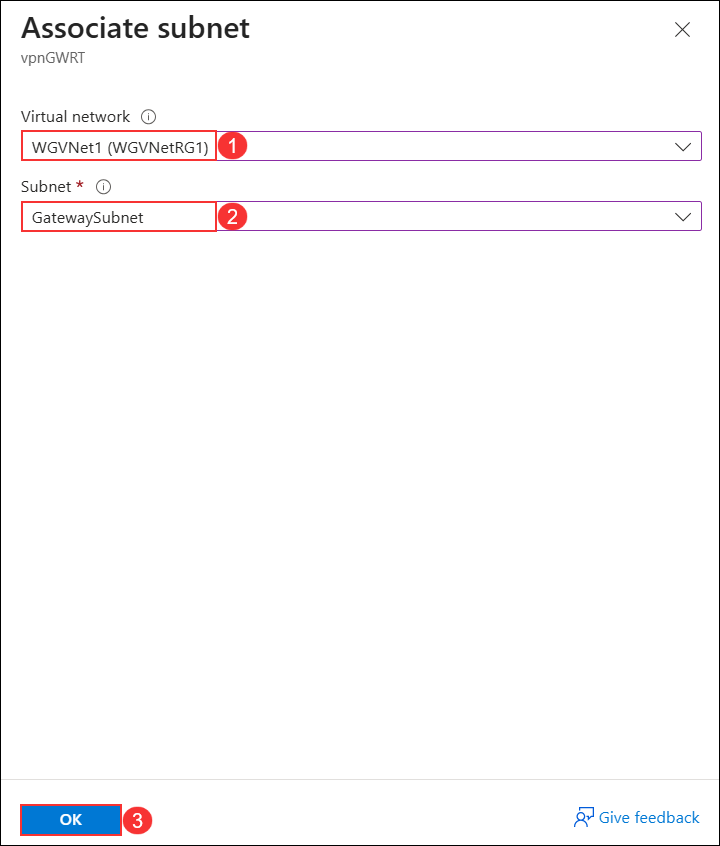

### Review
In this lab, you have completed:
- Created route tables
- Added routes to each route table
- Associated route tables to subnets

## **Congratulations! You have successfully completed this lab. Please click on next**

#### Happy Learning!!
