## Exercise 6: Configure n-tier application and validate functionality

### Estimated Duration: 60 minutes

In this exercise, you will create and configure a load balancer to distribute the load between the web servers.

## Lab objectives

In this lab, you will perform following tasks:

- Task 1: Create a load balancer to distribute the load between the web servers
- Task 2: Configure the load balancer
  
### Task 1: Create a load balancer to distribute the load between the web servers

1. In the search bar of the Azure portal, type **Load balancers (1)**. From the search results, select **Load balancers (2)**.

    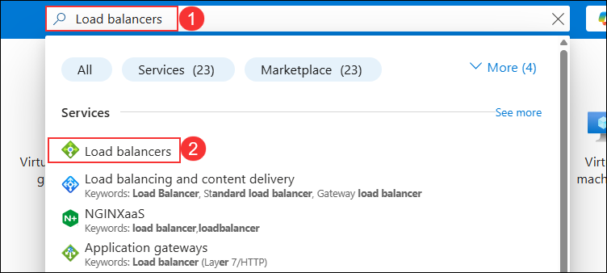

1. Select the **Load balancers (1)** from the left blade, click on **+ Create (2)** and then choose **Standard Load balancer(3)**.

    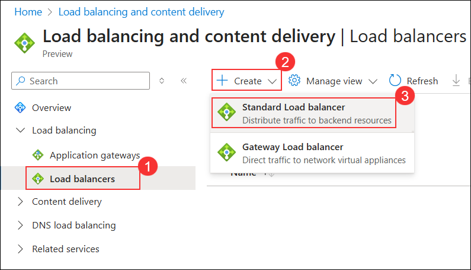

1. On the **Create load balancer** blade, on the **Basics** tab, enter the following values:

    | Setting | Action |
    | -- | -- |
    | Subscription | Keep the default subscription **(1)** |
    | Resource group | **WGVNetRG2** **(2)** |
    | Name | **WGWEBLB** **(3)** |
    | Region | **South Central US (4)** |
    | SKU | **Standard** **(5)** |
    | Type | **Internal** **(6)** |
    | Tier | **Regional** **(7)**|

    Ensure your **Create load balancer** dialog looks like the following, and select **Next: Frontend IP configuration (8)** then select **Create**.

    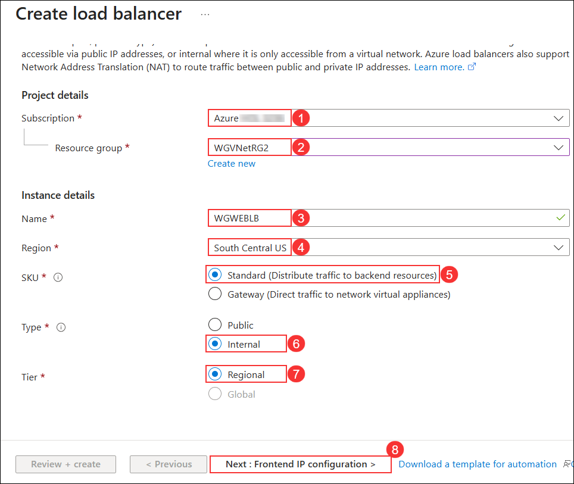

1. On the **Frontend IP configuration** tile, select **+ Add a frontend IP configuration** and enter the following values:

    | Setting | Action |
    | -- | -- |
    | Name | **WGWEBLBIP** **(1)** |
    | IP version | **IPv4** **(2)** |
    | Virtual network | **WGVNet2** **(3)** |
    | Subnet | **AppSubnet (10.8.0.0/25)** **(4)** |
    | Assignment | **Static** **(5)** |
    | IP address | **10.8.0.100** **(6)** |
    | Availability zone | **1** **(7)** |

    Ensure your **Create load balancer - Frontend IP configuration** dialog looks like the following, and select **Save (8)**.

    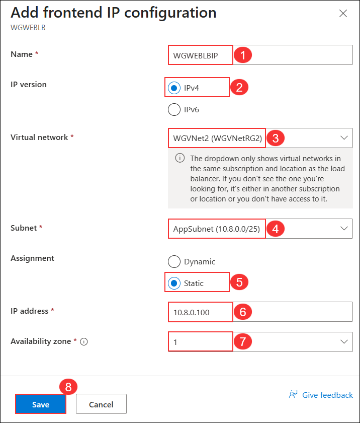

1. Select **Review + create**, and then select **Create**.

1. Once the deployement is complete, click on **Go to resource**.

    >**Note**: **Backend pools** can now be configured within the **Create Load balancer** wizard.  For this exercise, we will complete this in the next task to show where to find it on the resource.

> **Congratulations** on completing the task! Now, it's time to validate it. Here are the steps:
      
   - Hit the Validate button for the corresponding task. If you receive a success message, you can proceed to the next task.
   - If not, carefully read the error message and retry the step, following the instructions in the lab guide.
   - If you need any assistance, please contact us at cloudlabs-support@spektrasystems.com. We are available 24/7 to help you out.

<validation step="df2a021d-7d0e-4571-bfe0-314ce818ff0e" />

### Task 2: Configure the load balancer

1. Open the **WGWEBLB** load balancer in the Azure portal.

    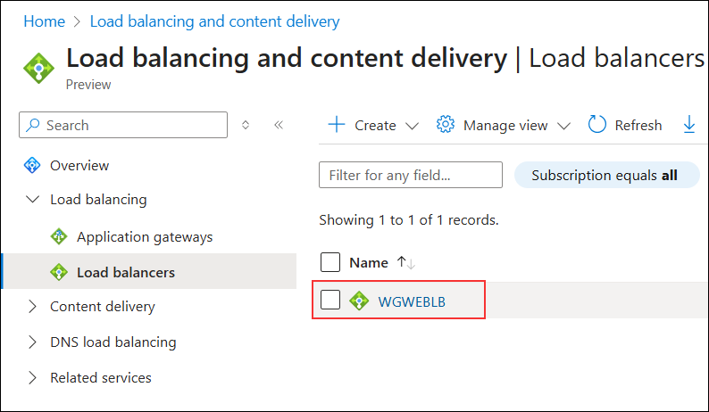

1. Select **Backend pools (1)**, and select **+Add (2)** at the beginning.

    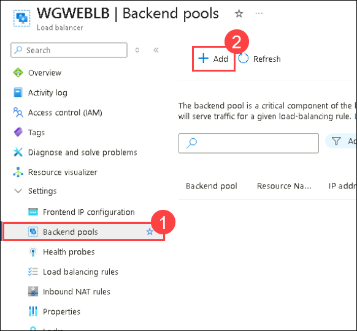

1. Enter **LBBE (1)** for the pool name. Select **NIC (2)** for **Backend Pool Configuration**. Under **IP Configurations**, select **+ Add (3)**.

    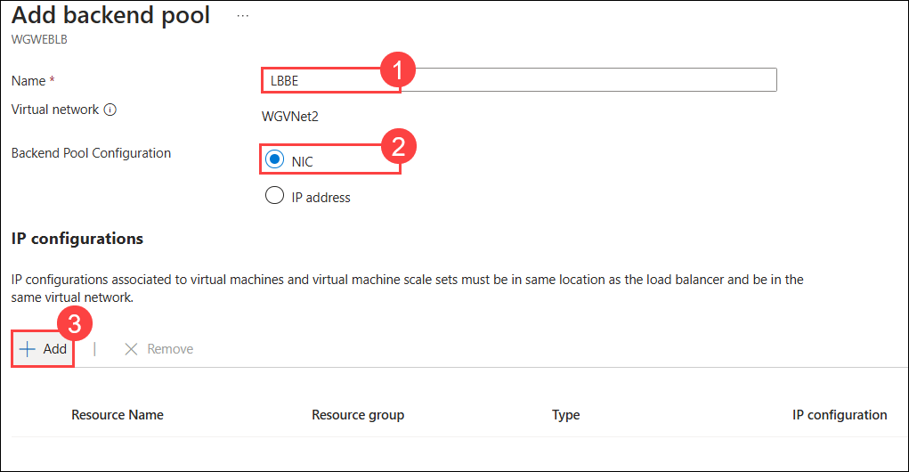

1. Under **Virtual machine**, choose the **WGWEB1** and **WGWEB2** *8(1)** virtual machines and select **Add (2)**.

    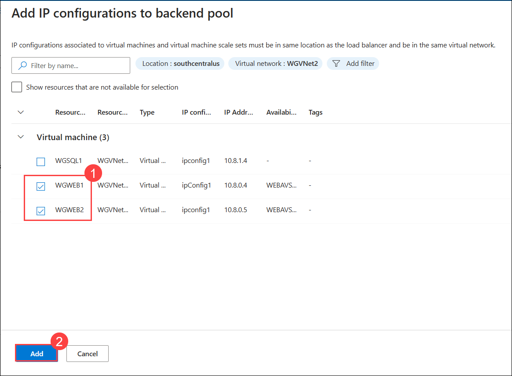

1. Select **Save** at the bottom of the **Add backend pool** blade to add the backend pool.

1. Wait to proceed until the Backend pool configuration is finished updating. When the backends are added, they should look like the following image.

    

1. Next, under **Settings** on the **WGWEBLB** Load Balancer blade, select **Health Probes (1)**. Select **+ Add (2)**:

    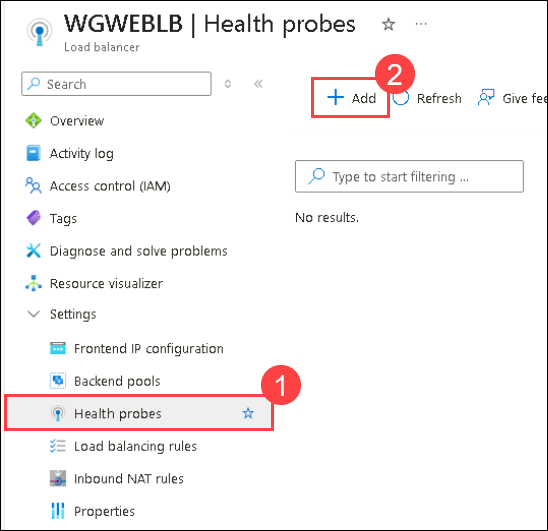

    - Use the following information to create a health probe and then click on **Save (3)**

    - Name: **HTTP (1)**

    - Protocol: **HTTP (2)**

      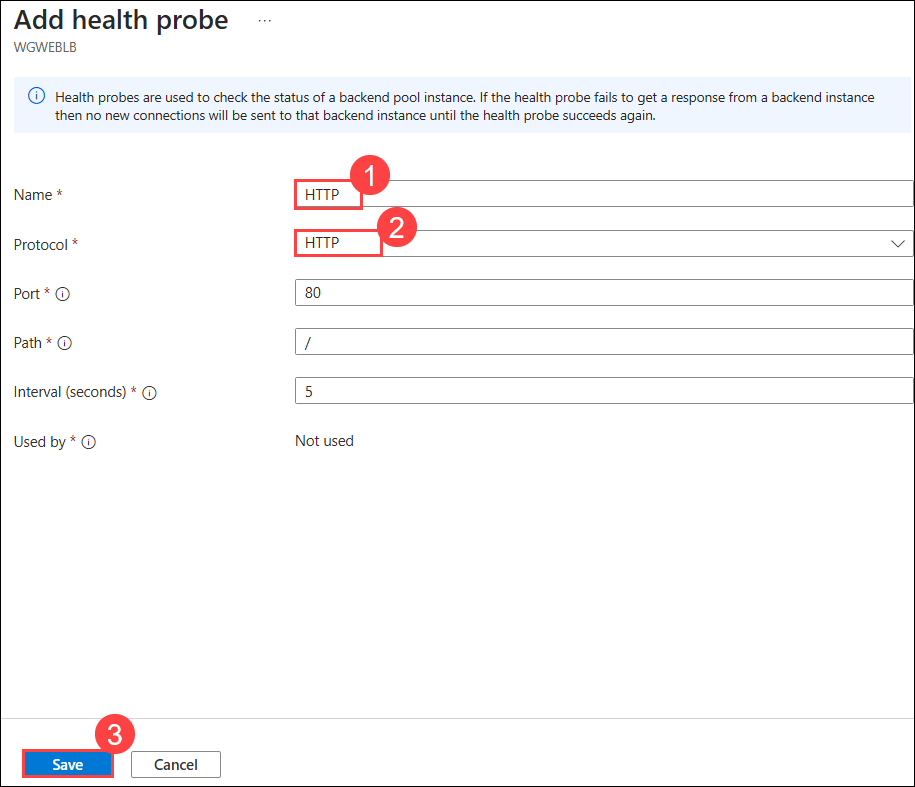

1. After the Health probe has been added, select **Load balancing rules (1)** from the left navigation. Select **+ Add (2)**. 

    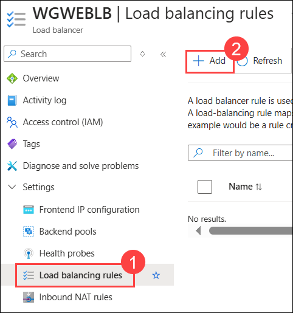

1. Complete the configuration as shown below followed by selecting **Save (7)**.    

    | Setting | Action |
    | -- | -- |
    | Name | **HTTP** **(1)** |
    | Frontend IP address | **WGWEBLBIP 10.8.0.100** **(2)** |
    | Backend pool | **LBBE** **(3)** |
    | Port | **80** **(4)** |
    | Backend port | **80** **(5)** |
    | Health probe | **HTTP** **(6)** |

    

1. In the search bar of the Azure portal, type **Virtual machines (1)**. From the search results, select **Virtual machines (2)**.

    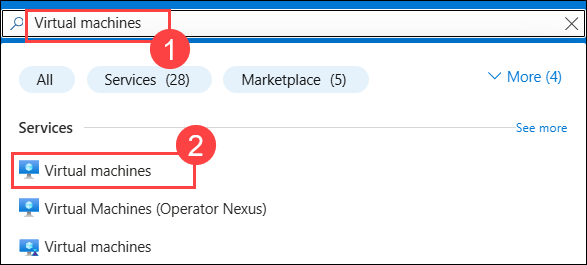

1. Select **WGWEB1** virtual machine.

    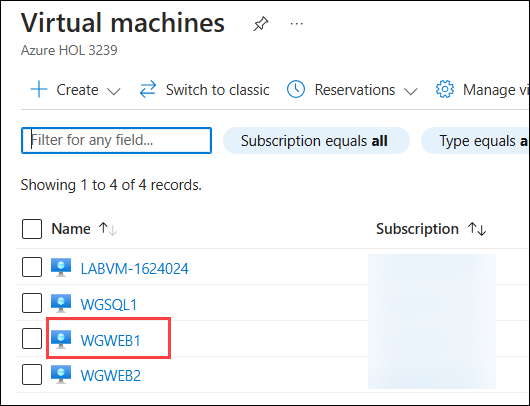

1. On **WGWEB1**, click **Connect (1)** and select **Connect via Bastion (2)**.

    

1. Enter the **Username** as **demouser (1)** and the **VM Password** as **demo@pass123 (2)**, then click **Connect (3)**.

    

1. If you receive an error message like the one shown in the screenshot, follow these steps:

    

1. Click on the **pop-up (1)** icon from the browser bar, select **Always allow pop-ups and redirects from https://portal.azure.com (2)**, and then click **Done (3)**.  

    

1. Now, click on **Connect** again.

    

1. It will open a new page, click on the **Allow**

    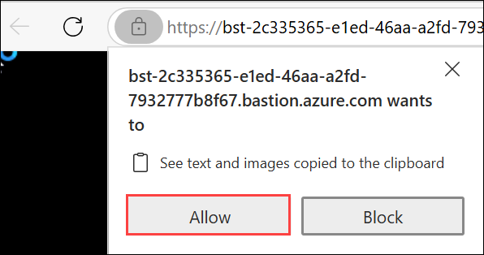

1. Within WGWEB1, open **Microsoft Edge** from the Start menu and navigate to <http://10.8.0.100>. Ensure that you successfully connect to either one of the two Web servers.

    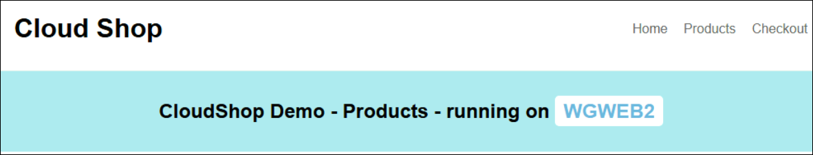

    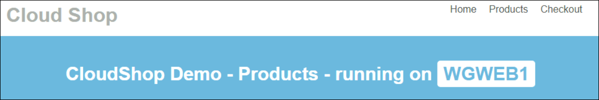

> **Congratulations** on completing the task! Now, it's time to validate it. Here are the steps:
      
   - Hit the Validate button for the corresponding task. If you receive a success message, you can proceed to the next task.
   - If not, carefully read the error message and retry the step, following the instructions in the lab guide.
   - If you need any assistance, please contact us at cloudlabs-support@spektrasystems.com. We are available 24/7 to help you out.

<validation step="1f48a237-9912-45b4-8e35-6c24e3b72076" />

### Review
In this lab, you have completed:
- Created a load balancer to distribute the load between the web servers
- Configured the load balancer

## **Congratulations! You have successfully completed this lab. Please click on next**

#### Happy Learning!!
