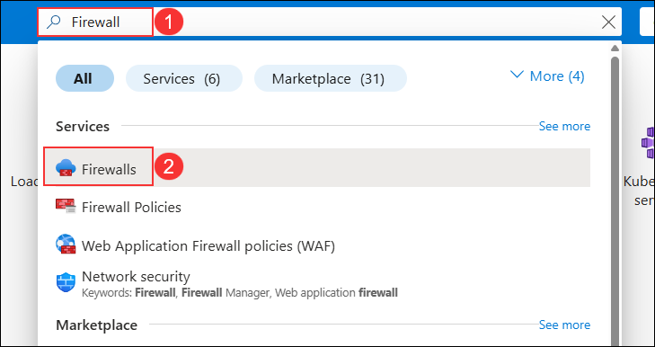
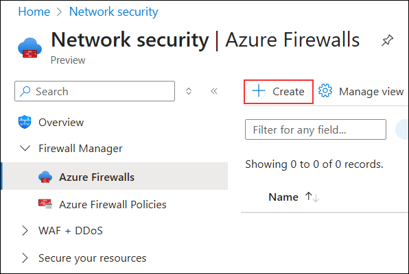
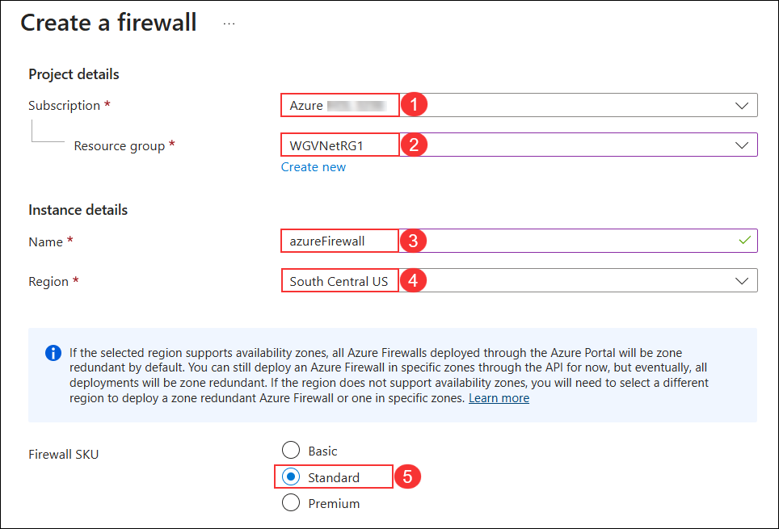
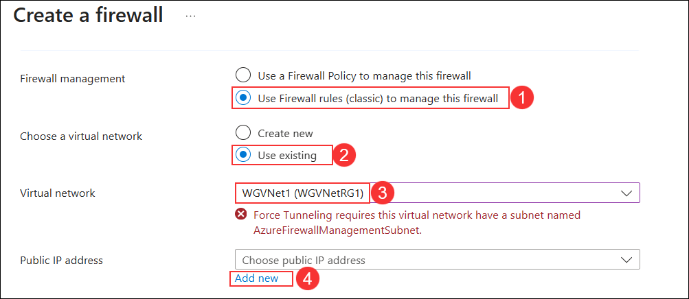
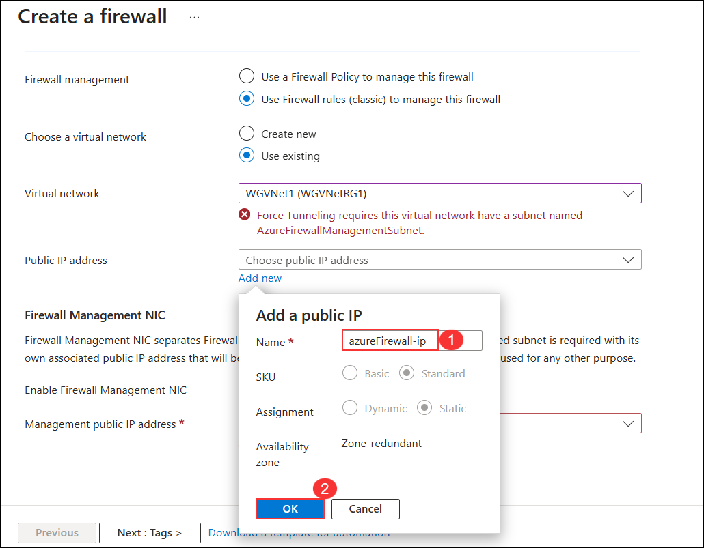
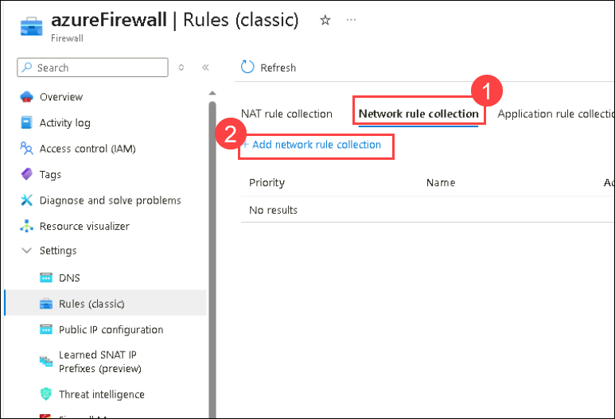
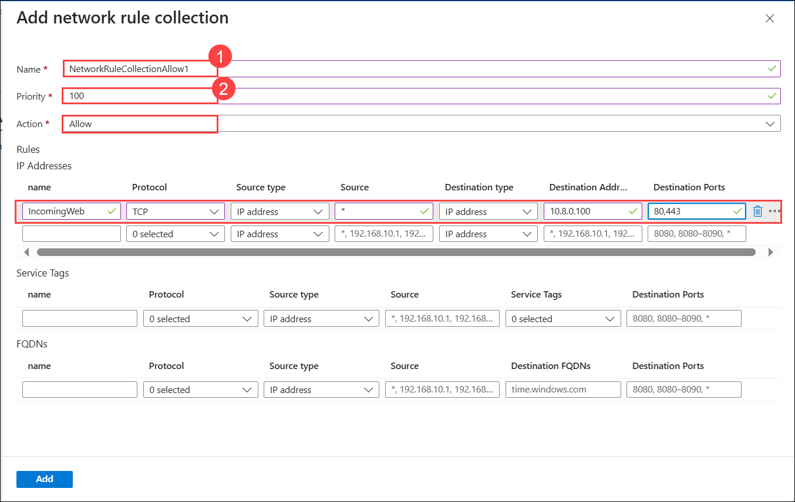
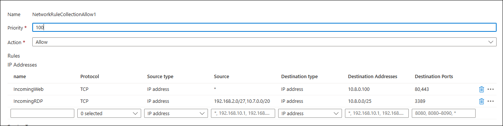

## Exercise 7: Provision and configure Azure firewall solution

### Estimated Duration: 60 Minutes

In this exercise, you will provision and configure an Azure firewall in your network.

## Lab objectives

In this lab, you will perform following tasks:

- Task 1: Provision the Azure firewall
- Task 2: Create Firewall Rules

### Task 1: Provision the Azure firewall

1. Navigate back to the Azure portal and in the search bar, type **Firewall (1)**. From the search results, select **Firewalls (2)**.

    

1. Click on **+ Create**.

    

1. On the **Create a firewall** blade, on the **Basics** tab, enter the following information:

    | Setting | Action |
    | -- | -- |
    | Subscription | Keep the default subscription **(1)** |
    | Resource group | **WGVNetRG1** **(2)** |
    | Name | **azureFirewall** **(3)** |
    | Region | **South Central US** **(4)**|
    | Firewall SKU | **Standard** **(5)** |
  
    

1. Now select **Use Firewall rules (classic) to manage this firewall (1)**. Under **Choose a virtual network**, select **Use existing (2)** and choose **WGVNet1 (WGVNetRG1) (3)** from the dropdown. Under **Public IP address**, click **Add new (4)** to create a new IP.

    

1. On the **Add a public IP** pane, enter the name as **azureFirewall-ip (1)**. Click the **OK (2)** button to create the public IP address.

    

    >**Note:** If you receive the message **"Force Tunneling requires this virtual network to have a subnet named AzureFirewallManagementSubnet"**, it will disappear once you uncheck the **Enable Firewall Management NIC**.

    

1. Uncheck the box for the **Enable Firewall Management NIC** then click on **Next:Tags>**.

    

     >**Note:** Add the **Public ip address** again, if it disappers. Please refer 4th step.

1. Select Select **Review + create** and then select **Create** to provision the Azure Firewall.

    >**Note**: It will take **5-7 minutes** to be created.

> **Congratulations** on completing the task! Now, it's time to validate it. Here are the steps:
      
   - Hit the Validate button for the corresponding task. If you receive a success message, you can proceed to the next task.
   - If not, carefully read the error message and retry the step, following the instructions in the lab guide.
   - If you need any assistance, please contact us at cloudlabs-support@spektrasystems.com. We are available 24/7 to help you out.

<validation step="86790f78-b5dc-4fe0-99e3-caf9cd431316" />

### Task 2: Create Firewall Rules

We will create firewall rules to allow the inbound and outbound traffic.

1. On the main Azure menu, select **Resource groups**.

1. Select the **WGVNetRG1 (1)** resource group. This resource group contains the **azure firewall and its public IP address** resources **(2)**.

    

1. Navigate to the **azureFirewall-ip** blade and note the value of its **public IP address**. You will need it later in this task.

    

1. Navigate to the **azureFirewall** blade, and, on the **Overview** page, select **Rules (classic) (1)** under **Settings** on the left and select **+ Add NAT Rule collection (2)**

    

1. Enter the following information to create an inbound NAT Rule (a collection is a list of rules that share the same priority and action).

    | Setting | Action |
    | -- | -- |
    | Name | **NATRuleCollection1** |
    | Priority | **250** |
    | Rules name | **IncomingHTTP** |
    | Protocol | **TCP** |
    | Source type | **IP Address** |
    | Source| **\*** |
    | Destination Address | Type the **public IP address** assigned to the firewall you identified earlier in this task step 3|
    | Destination ports | **80** (to allow HTTP traffic) |
    | Translated Address | **10.8.0.100** (Private IP of the Azure Load Balancer you deployed earlier in this lab.) |
    | Translated Port | Translated Port: **80** |

    
    

1. Add another rule for HTTPS, as illustrated in the following screenshot. The rules should look like the image below.

    | Setting | Action |
    | -- | -- |
    | Rules name | **IncomingHTTPS** |
    | Protocol | **TCP** |
    | Source type | **IP Address** |
    | Source | **\*** |
    | Destination Address | Type the public IP address assigned to the firewall you identified earlier in this task step 3. |
    | Destination ports | **443** |
    | Translated Address | **10.8.0.100** |
    | Translated Port | **443** |
  
    

1. Select **Add** and wait until the update completes.

1. Back on the Azure Firewall **Rules (classic)** page, select **Network rule collection (1)**. Then Select **+ Add Network Rule collection (2)**. 

    

1. Enter the following information to create a Network Rule for inbound traffic. This rule allows HTTP connectivity from any directly connected network targeting the frontend IP address of the load balancer.

    | Setting | Action |
    | -- | -- |
    | Name | **NetworkRuleCollectionAllow1** (1)|
    | Priority | **100** (2)|
    | Rules name | **IncomingWeb** |
    | Protocol | **TCP** |
    | Source type | **IP Address** |
    | Source | **\*** |
    | Destination Address | **10.8.0.100** |
    | Destination ports | **80,443** |

    

    Add another rule for RDP, as illustrated in the following screenshot. The rules should look like the image below.

    | Setting | Action |
    | -- | -- |
    | Rules name (IP Addresses) | **IncomingRDP** |
    | Protocol | **TCP** |
    | Source| **192.168.2.0/27, 10.7.0.0/20** |
    | Destination Address | **10.8.0.0/25** |
    | Destination ports | **3389** |

    

1. Select **Add** and wait for 5-7 minutes until the update completes.

> **Congratulations** on completing the task! Now, it's time to validate it. Here are the steps:
      
   - Hit the Validate button for the corresponding task. If you receive a success message, you can proceed to the next task.
   - If not, carefully read the error message and retry the step, following the instructions in the lab guide.
   - If you need any assistance, please contact us at cloudlabs-support@spektrasystems.com. We are available 24/7 to help you out.

<validation step="bdc78543-5cc3-453e-8c98-fec5720fcb70" />

### Review
In this lab, you have completed:
- Provisioned the Azure firewall
- Created Firewall Rules

## **Congratulations! You have successfully completed this exercise. Please click on next**

#### Happy Learning!!
