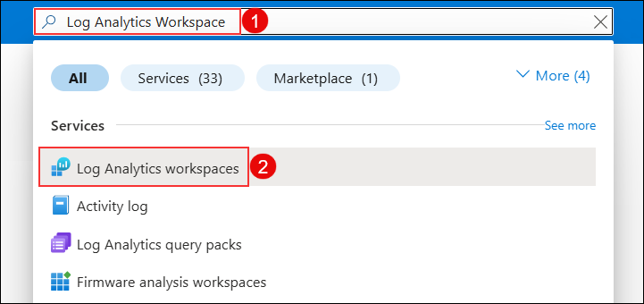
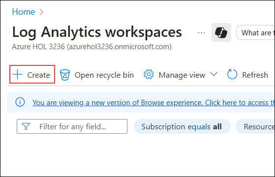
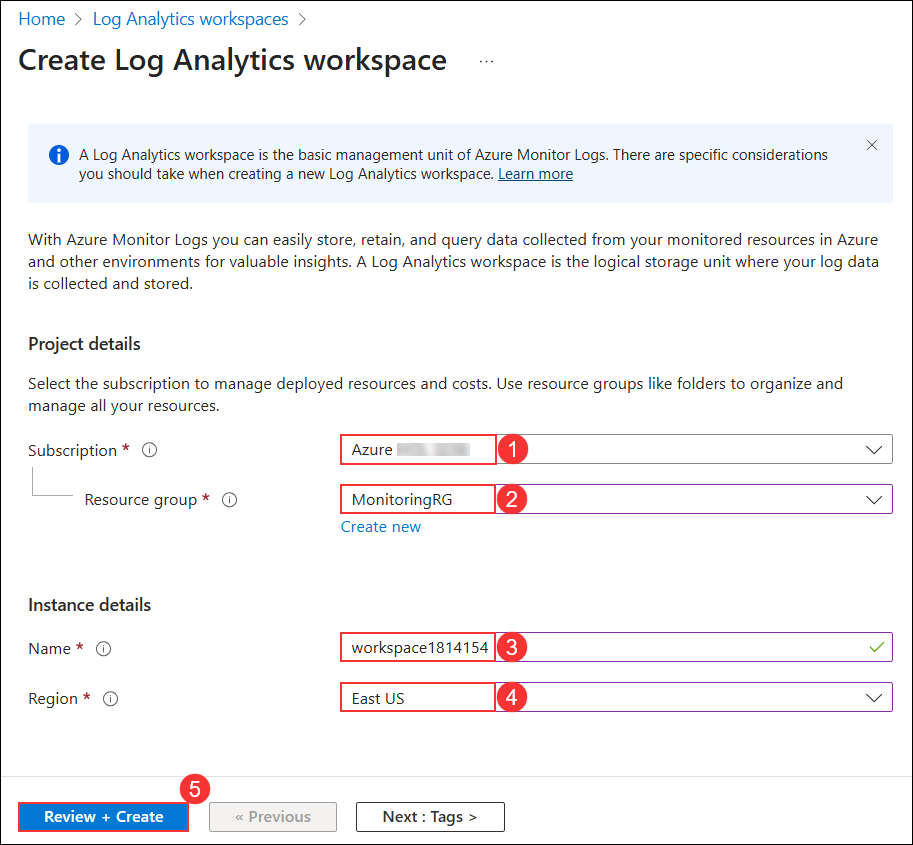
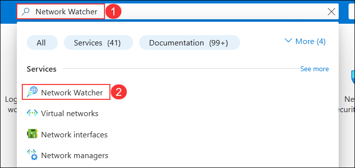
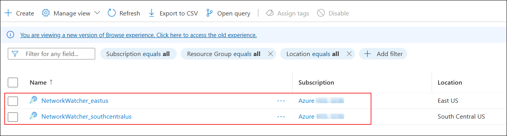

## Exercise 8: Create a Network Monitoring Solution

## Lab objectives

In this lab, you will perform the following tasks:

- Create a Log Analytics Workspace
- Configure Network Watcher
  
## Estimated timing: 20 minutes

### Task 1: Create a Log Analytics Workspace

1. In the search bar of the Azure portal, type **Log Analytics Workspace (1)**. From the search results, select **Log Analytics Workspace (2)**.

   

1. Click on **+ Create**.

   

1. On the **Create Log Analytics workspace** blade, enter the following information:

    | Setting | Action |
    | -- | -- |
    | Subscription | **Select defualt subscription** **(1)**|
    | Resource group | **MonitoringRG** **(2)** |
    | Name | **workspace<inject key="DeploymentID" />** **(3)** |
    | Location | **East US** **(4)** |

1. Upon completion, it should look like the following screenshot. Validate that the information is correct, select **Review + create** **(5)**, and then **Create**.

    

> **Congratulations** on completing the task! Now, it's time to validate it. Here are the steps:
      
   - Hit the Validate button for the corresponding task. If you receive a success message, you can proceed to the next task.
   - If not, carefully read the error message and retry the step, following the instructions in the lab guide.
   - If you need any assistance, please contact us at cloudlabs-support@spektrasystems.com. We are available 24/7 to help you out.

<validation step="cfcbcc0c-b519-40d5-a2bb-62b1b43ef4c8" />

### Task 2: List the Network Watcher

1. In the search bar of the Azure portal, type **Network Watcher (1)**. From the search results, select **Network Watcher (2)**.

   

1. In the **Overview** blade, ensure that **NetworkWatcher_southcentralus** and **NetworkWatcher_eastus** is listed.

   

### Review

In this lab, you have completed:
- Created a Log Analytics Workspace
- Configured Network Watcher

## Great job on completing this exercise! You can now proceed to the next one.
