## Exercise 10: Using Network Watcher to Test and Validate Connectivity

### Estimated Duration: 60 Minutes

## Lab Overview

In this exercise, you will use Azure Network Watcher to capture logs, review traffic, and troubleshoot connectivity between your on-premises and Azure environments. You will configure flow logs, enable diagnostics, analyze traffic patterns, and test connections to ensure everything works as expected.

## Lab objectives

In this lab, you will perform the following tasks:

- Task 1: Configuring the Storage Account for the NSG Flow Logs
- Task 2: Configuring Diagnostic Logs
- Task 3: Reviewing Network Traffic
- Task 4: Network Connection Troubleshooting
  
### Task 1: Configuring the Storage Account for the NSG Flow Logs

In this task, you will set up storage accounts and enable NSG flow logs to capture and store network traffic data. Then, enable traffic analytics to analyze the logs and generate insights.

1. Navigate back to JupmVM, in the search bar of the Azure portal, type **Storage accounts (1)**. From the search results, select **Storage accounts (2)**.

   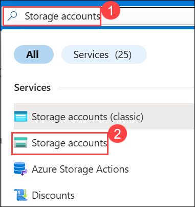

1. On the Storage account page, select **+ Create**.

1. On the **Create a storage account** blade. Enter the following information, and select **Review + Create (7)** then select the **Create** button:

    | Setting | Action |
    | -- | -- |
    | Subscription | **Select your subscription (1)** |
    | Resource group | **MonitoringRG (2)** (Use the existing resource group created earlier.) |
    | Storage Account Name | **This must be Unique and alphanumeric, lowercase, and have no special characters (3)** |
    | Region | **(US) South Central US (4)** |
    | Primary service | **Leave as Default** |
    | Performance | **Standard (5)** |
    | Replication | **Locally-redundant storage (LRS) (6)** |

    .png)

   >**Note:** Ensure the storage account is created before continuing.

1. Repeat steps 1 and 2, but select **East US** for the region and give it a different name.

   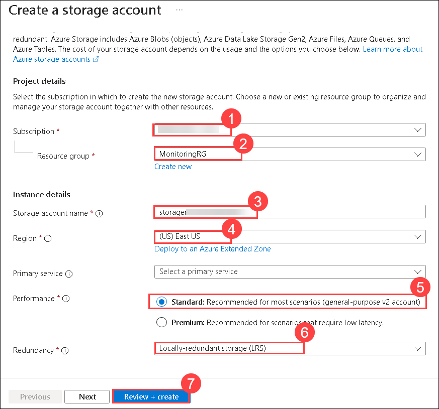

1. In the search bar of the Azure portal, type **Network Watcher (1)**. From the search results, select **Network Watcher (2)**.

   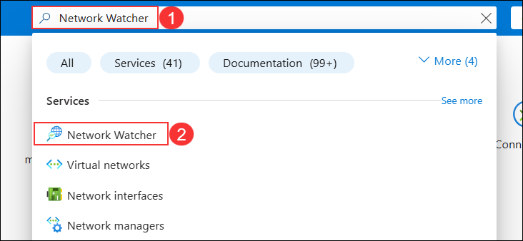

1. In the **Network Watcher** blade, select **Flow Logs (1)** under **Logs** menu and click **+ Create (2)**.

   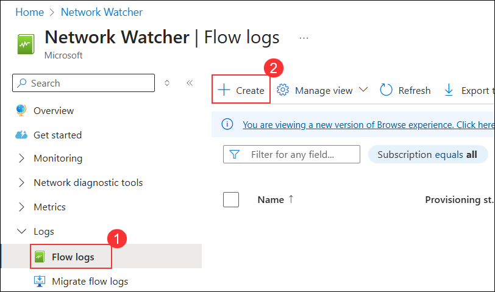

1. On the **Create a flow log** page, select the appropriate **Subscription (1)**, choose **Virtual network (2)** as the flow log type, click **Select target resource (3)**, and from the dropdown, select **Virtual network (4)** as the target.

    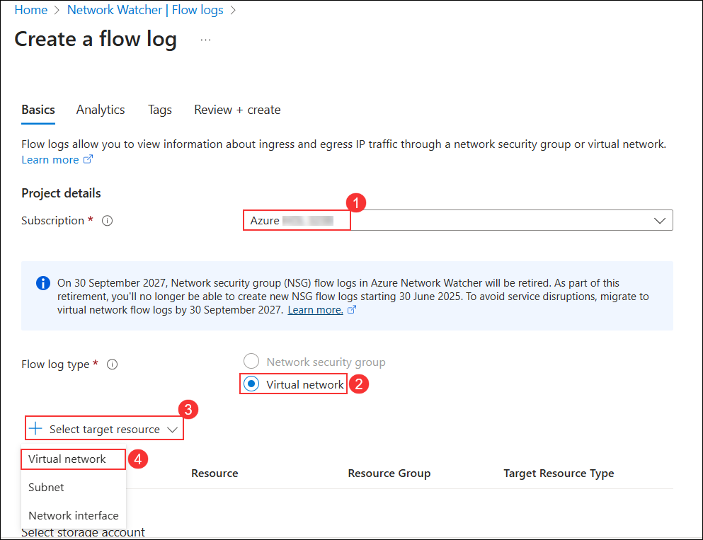

1. On the **Select virtual network** page, check the box for **OnPremVNet (1)** and click the **Confirm selection (2)** button to proceed.

    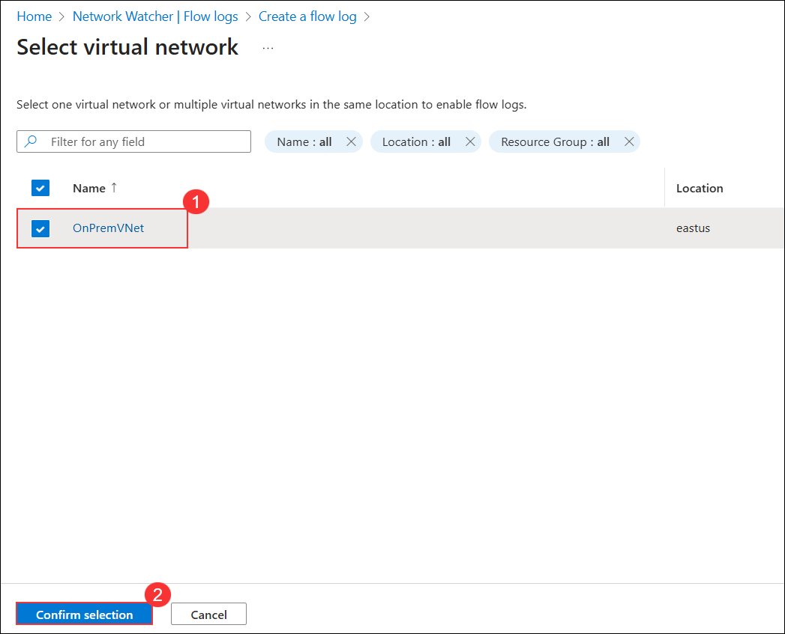

1. On the **Instance details** section, select the correct **Subscription (1)**, choose the required **Storage account (2)**, set **Retention (days) (3)** to 0, and then click **Next: Analytics (4)** to continue.

    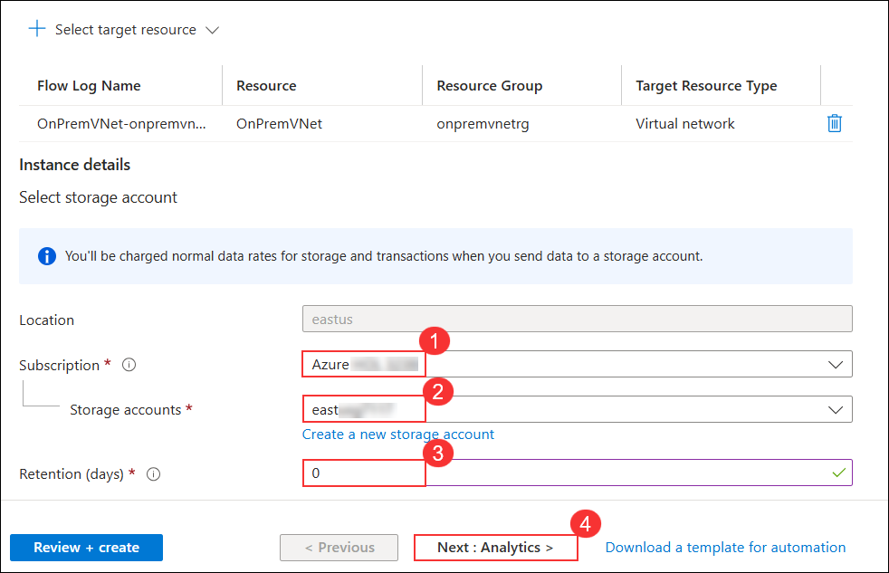

1. On the **Analytics** tab, check the box to **Enable traffic analytics (1)**, set the processing interval to **Every 10 mins (2)**, select the appropriate **Subscription (3)**, choose the **Log Analytics Workspace (4)**, and click **Review + create (5)** and click **Create**.

    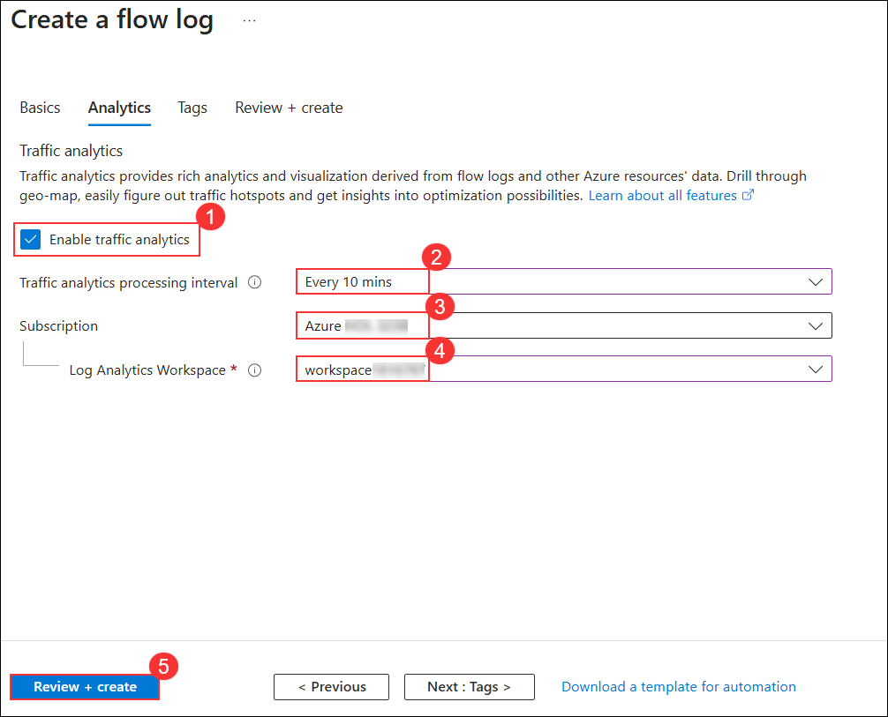

1. On the **Logs (1)** pane, select **Flow logs** from the left navigation menu and verify that the newly created flow log is listed with status as **Succeeded**. To create another flow log, click the **Create (2)** button.

    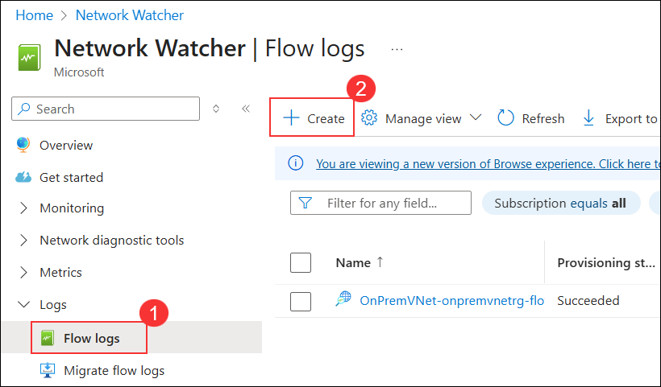

1. On the **Create a flow log** page, select the appropriate **Subscription (1)**, choose **Virtual network (2)** as the flow log type, click **Select target resource (3)**, and from the dropdown, select **Virtual network (4)** as the target.

    

1. On the **Select virtual network** page, check the boxes to select all virtual networks located in **South Central US (1)** and then click the **Confirm selection (2)** button to proceed.

    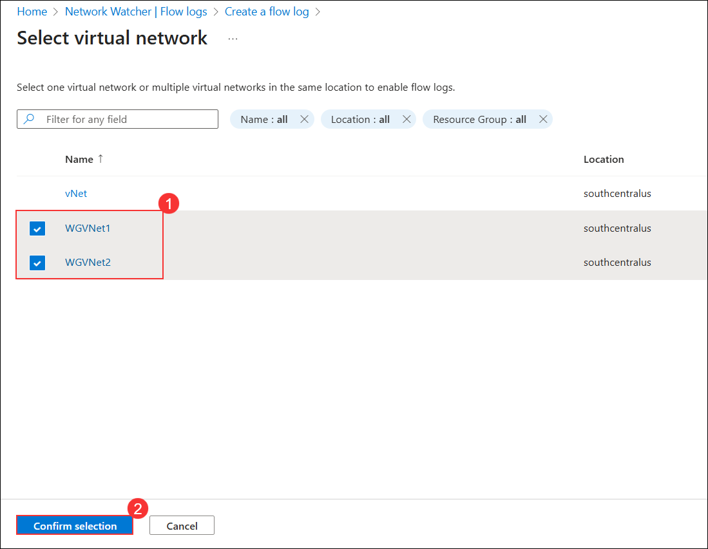

1. On the **Instance details** section, verify that all selected South Central US virtual networks are listed, choose the correct **Subscription**, select the appropriate **Storage account (1)**, set **Retention (days) (2)** to 0, and click **Next: Analytics (3)** to continue.

    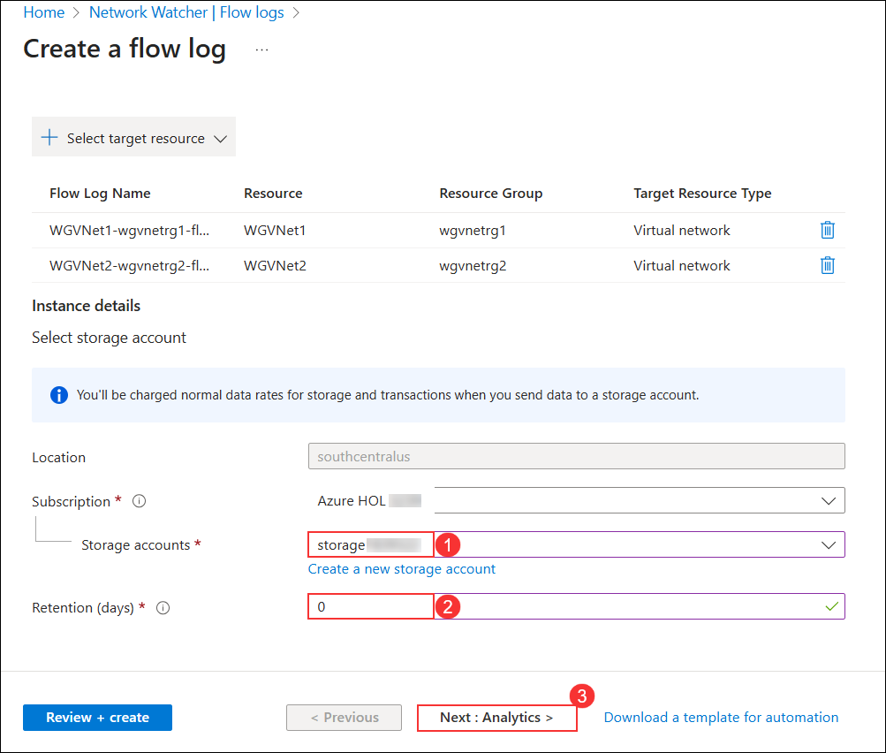

1. On the **Analytics** tab, check the box to **Enable traffic analytics (1)**, set the processing interval to **Every 10 mins (2)**, select the appropriate **Subscription (3)**, choose the **Log Analytics Workspace (4)**, and click **Review + create (5)** and click **Create**.

    

    > **Note:** The following steps are intended to generate network traffic for analysis.

1. In the search bar of the Azure portal, type **Virtual Machines (1)** in the search box and select **Virtual Machines (2)** from the results.

    .png)

1. On the **Virtual Machines** page, find and select **OnPremVM**.

    .png)

1. Click **Connect (1)** and choose **Connect (2)** as the connection method.

    .png)

1. Under the **Native RDP** option, click **Download RDP file**.

    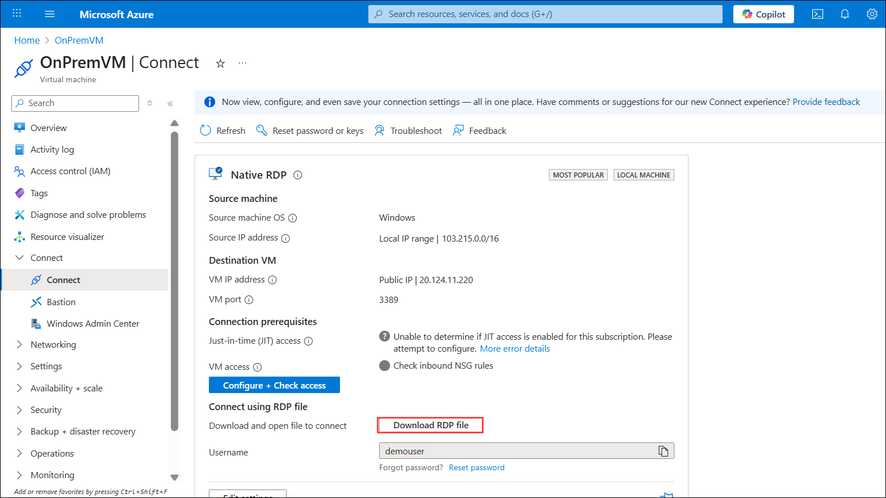

1. If you receive any pop-up, click **Keep**.

    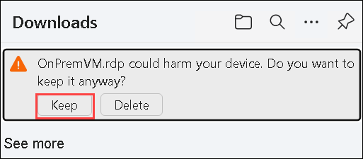

1. Select **Open file**.

    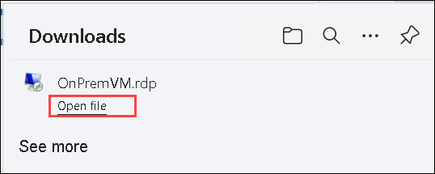

1. Open the downloaded RDP file and click **Connect**.

    .png)

1. Click on **More choices**.

    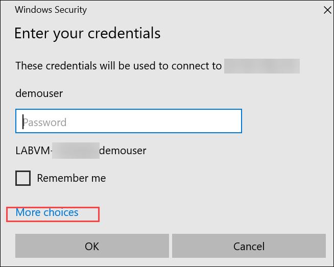

1. Click on **Use a different account**.

    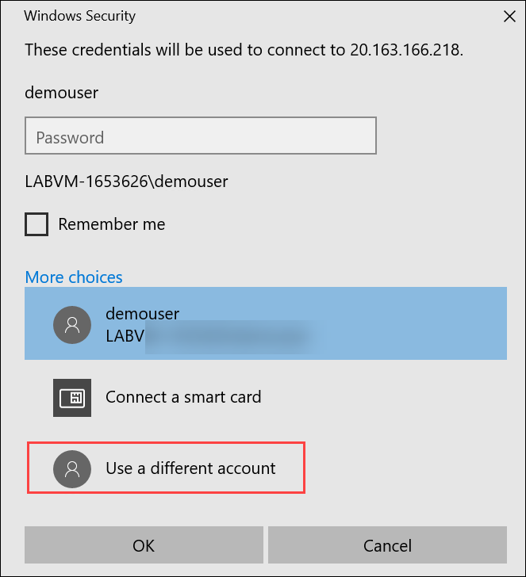    

1. When prompted, enter the following credentials and click **OK (3)**:  

    > **Note**: Please ensure to avoid spaces while copying the values from the lab guide.
   
    - **Username (1):** `.\demouser`  

    - **Password (2):** `demo@pass123`

      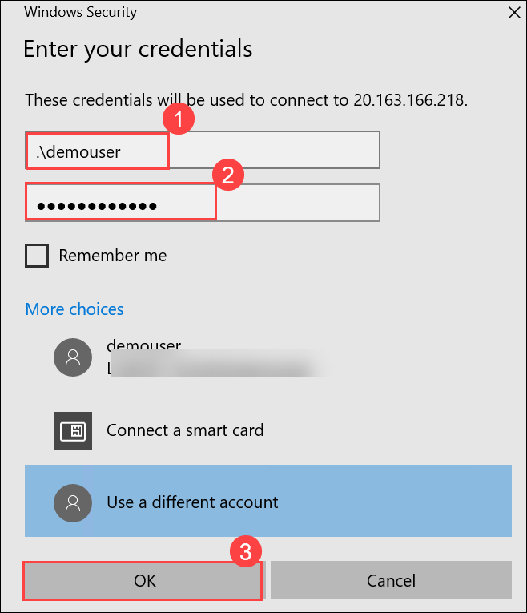

1. Click **Yes** on the security pop-up to proceed.

    .png)

1. On your desktop, click the **Microsoft Edge** icon to go to the Azure portal.

    - While navigating to **Microsoft edge**, if prompted select **Start without your data**

      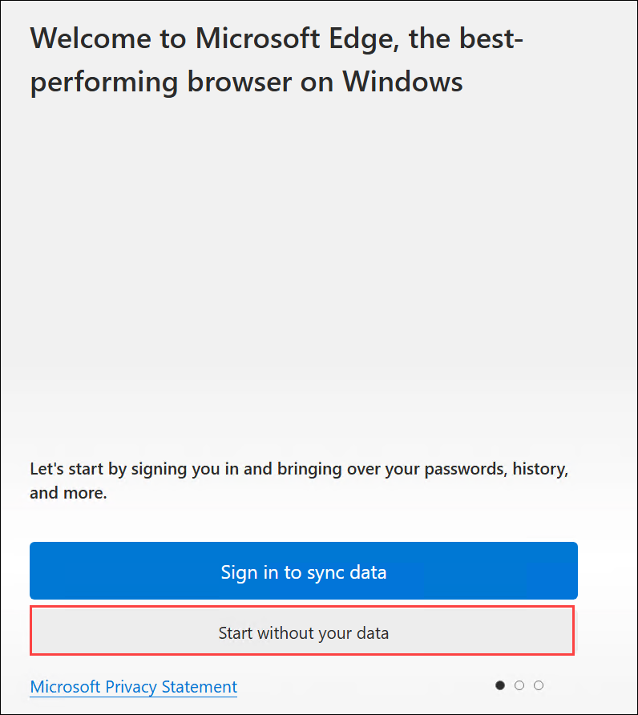

    - Click on **Confirm and continue**  

      

    - Select **Confirm and start browsing**

      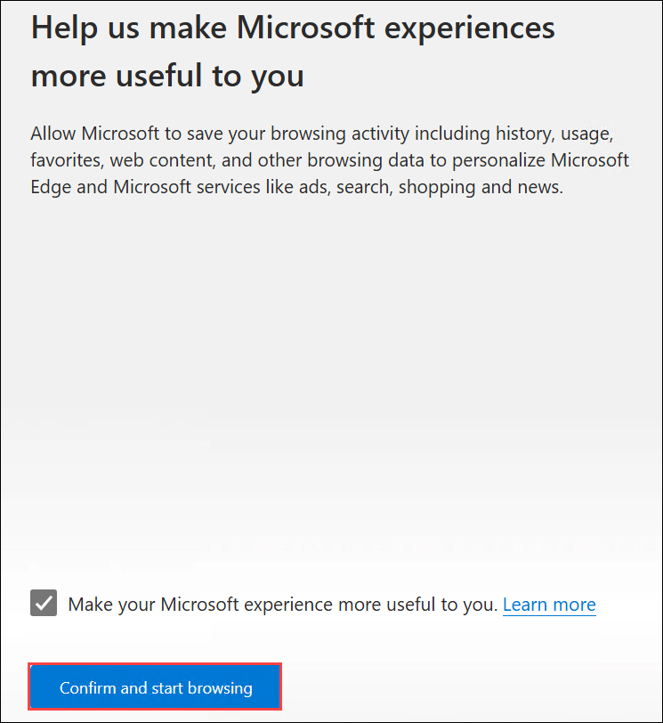    
    
1. Search for [Azure portal](https://portal.azure.com).

1. You'll see the **Sign into Microsoft Azure** tab. Here, enter your credentials:
 
    - **Email/Username:** <inject key="AzureAdUserEmail"></inject>
 
1. Next, provide your password:
 
    - **Password:** <inject key="AzureAdUserPassword"></inject>
 
1. If you see the pop-up **Stay Signed in?**, click **No**.

1. In the search bar of the Azure portal, type **Virtual Machine (1)** in the search box and select **Virtual Machines (2)** from the results.

    .png)

1. Select **WGWEB1**. 

1. On the **Overview** pagw, select **Connect (1)** drop down and then select **Connect via Bastion (2)**. 

    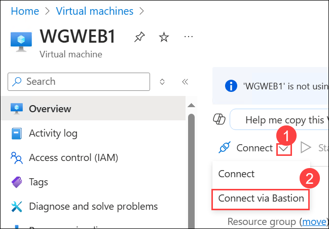

1. In **WGWEB1**,  Enter the following credentials and then click on **Connect (3)**.

     - **Username:** `demouser (1)`

     - **Password:** `demo@pass123 (2)`

       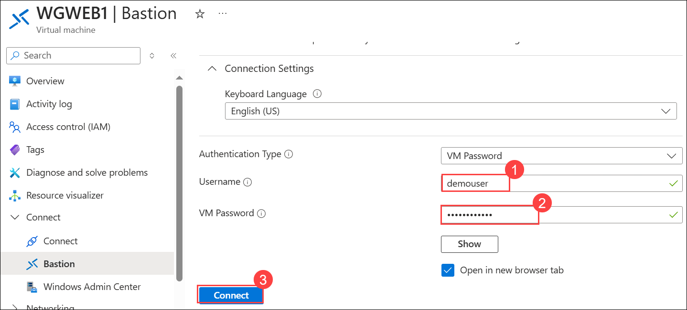

1. If you receive an error message like the one shown in the screenshot, follow these steps:

    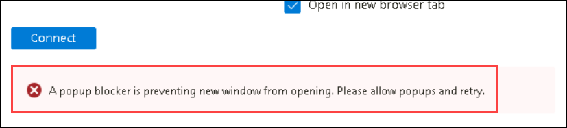

1. Click on the **pop-up (1)** icon from the browser bar, select **Always allow pop-ups and redirects from https://portal.azure.com (2)**, and then click **Done (3)**.  

    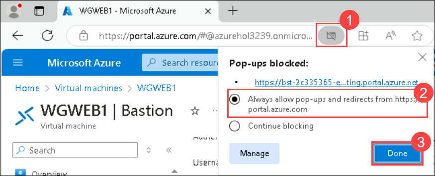

1. Now, click on **Connect** again.

    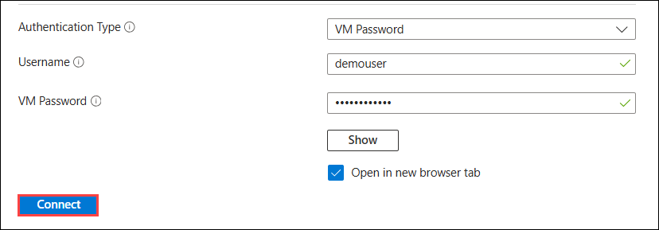     

1. Navigate to the load balancer's private ip address (**10.8.0.100**) and generate some traffic by refreshing the browser. Allow ten minutes to pass for traffic analytics to generate.

    

### Task 2: Configuring Diagnostic Logs

In this task, you will enable diagnostic logs on network resources (like NSGs) to track traffic, events, and alerts. Logs are sent to Log Analytics Workspace and storage for monitoring.

1. In the search bar of the Azure portal, type **Network watcher (1)**. From the search results, select **Network Watcher (2)**.

   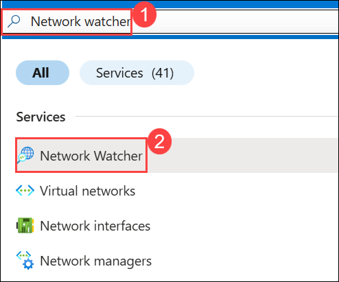

1. From the left navigation pane expand **Logs (1)**, then choose **Diagnostic Logs (2)**, and select **OnPremVM-nsg (3)**.

     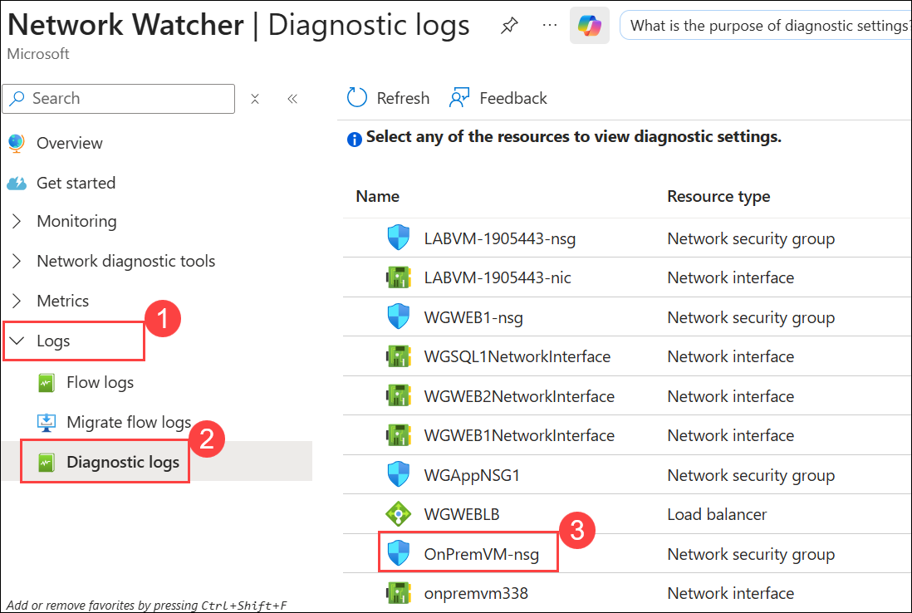

1. Click **+ Add Diagnostic Setting**.

1. Enter **OnPremDiag (1)** as the Diagnostic setting name, select **All logs (2)**, enable **Send to Log Analytics workspace (3)**, and choose the previously created workspace. 

1. Check **Archive to a storage account (4)**, select the available storage account, and click **Save (5)** to apply the settings.

     .png)

   > **Note** : Please repeat the above steps for adding diagnostics logs for **WGAppNSG1**.
   
   > **Note** : You can enable diagnostic logging for all network resources if required, following the same steps outlined above for now continue with below task.

### Task 3: Reviewing Network Traffic

In this task, you will use Traffic Analytics in Network Watcher to visualize and analyze network flow data. Review maps and details to understand traffic flow and verify connectivity.

1. In the search bar of the Azure portal, type **Network watcher (1)**. From the search results, select **Network Watcher (2)**.

   

1. On **Network watcher (1)** page, under **Monitoring (1)**, choose **Traffic Analytics (2)** then select the deafult **subscription (3)**, select **Vnet (4)** as the FlowLog type and choose the **workspace (5)**.

     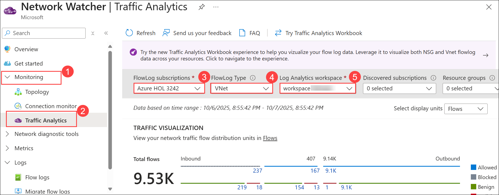
     
1. Select **View map**.

   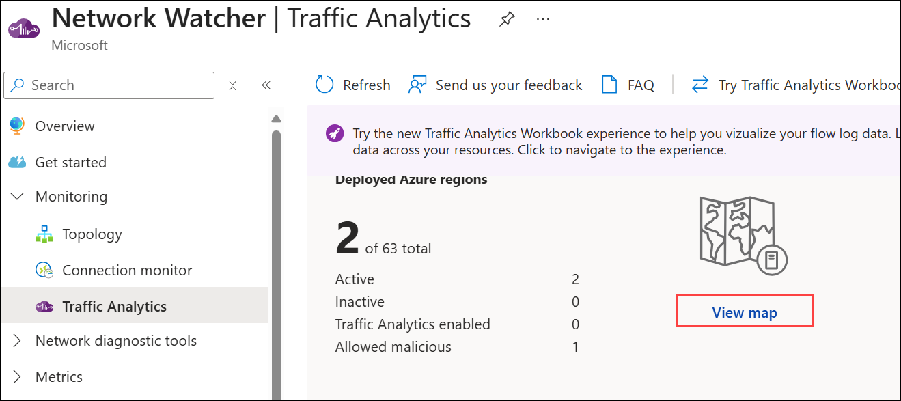

    >**Note:** It may take 30-40 minutes(may vary) to populate. 

1. Select the **green check mark** which identifies your network. Within the pop-up menu select **More Details** to propagate detailed information of the flow to and from your network.

   
 
   >**Note:** You can select the **See More** link to query the connections detail for more information.

### Task 4: Network Connection Troubleshooting

In this task, you will run connection troubleshooting tests in Network Watcher to simulate and validate connectivity between virtual machines (e.g., OnPremVM to WGWEB1). This helps identify routing issues or blocked ports.

1. In the search bar of the Azure portal, type **Network watcher (1)**. From the search results, select **Network Watcher (2)**.

   

1. Select **Connection Troubleshoot (2)** from the **Network Diagnostic tools (1)** menu.

   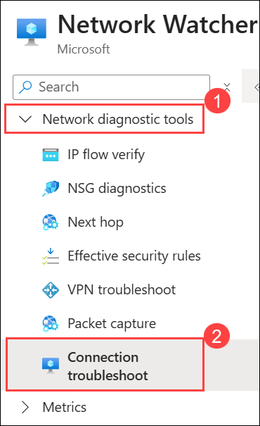

1. To troubleshoot a connection or to validate the route, enter the following information and select **Run diagnostic tests (9)**:

    | Setting | Action |
    | -- | -- |
    | Source Type | **Virtual Machine (1)** |
    | Virtual Machine | **OnPremVM (2)** |
    | Destination | **Select a virtual machine (3)** |
    | Virtual Machine | **WGWEB1 (4)** |
    | Preferred IP version | **IPV4 (5)** |
    | Protocol | **TCP (6)** |
    | Destination Port | **80 (7)** |
    | Diagnostic tests | **Next hop (8)** |

   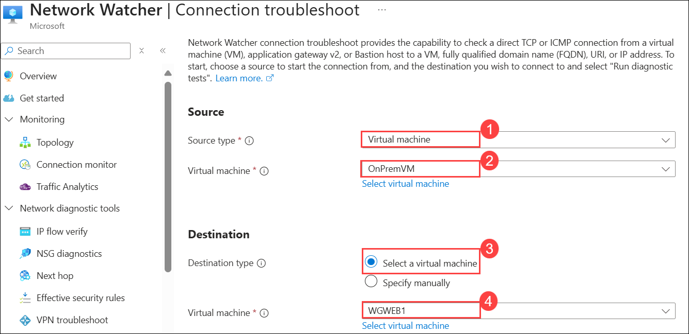
   
   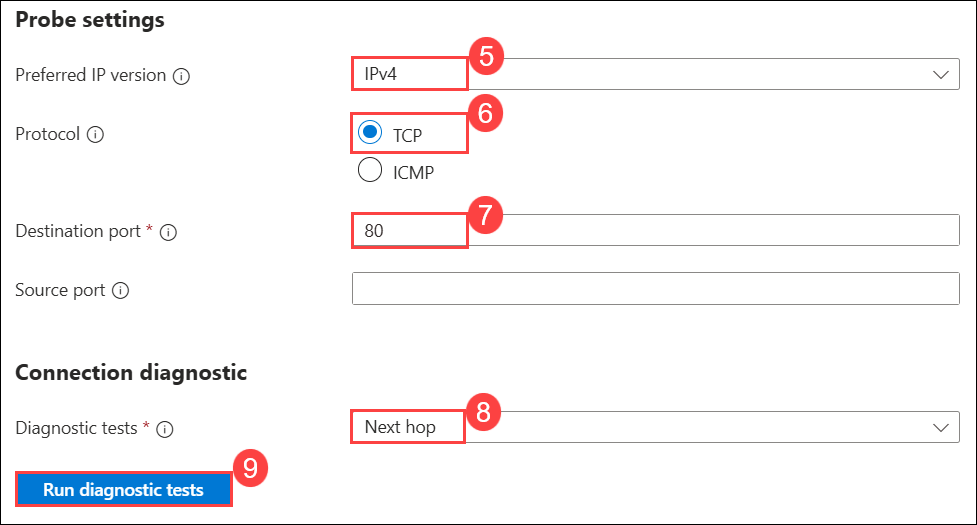

1. Once the diagnostic tests have completed, the results will be displayed.

    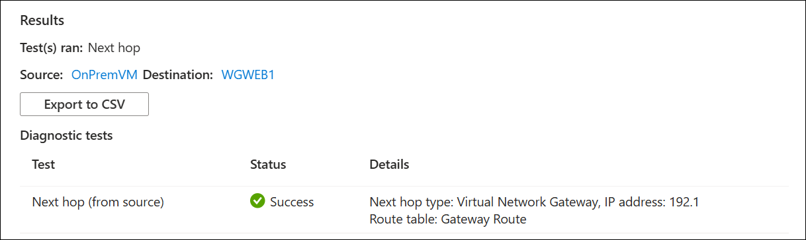

     >**Note**: Sometimes, running the diagnostic tests may take longer, so the results may not appear immediately as shown in the screenshot.

### Review

In this lab, you have completed:

- Configured the Storage Account for the NSG Flow Logs
- Configured Diagnostic Logs
- Reviewed Network Traffic
- Network Connection Troubleshooting

## Conclusion 

In this lab **Enterprise-Class Networking in Azure**, you created virtual networks, subnets, and gateways, then configured VNet peering and gateway connections to enable hybrid connectivity. To secure traffic, you set up application security groups, network security groups, route tables, and an Azure Firewall with rules. You also deployed a load balancer to distribute workloads across web servers for high availability. For monitoring and troubleshooting, you integrated Log Analytics, Network Watcher, diagnostic logs, and NSG flow logs to gain visibility into network traffic and performance. Finally, you validated connectivity using test virtual machines and verified secure communication between on premises and Azure resources, the lab provided end-to-end experience in building, securing, monitoring, and troubleshooting an enterprise class Azure networking environment.

## Congratulations! You have successfully completed this lab.
