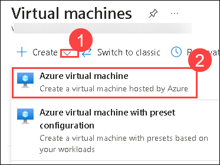
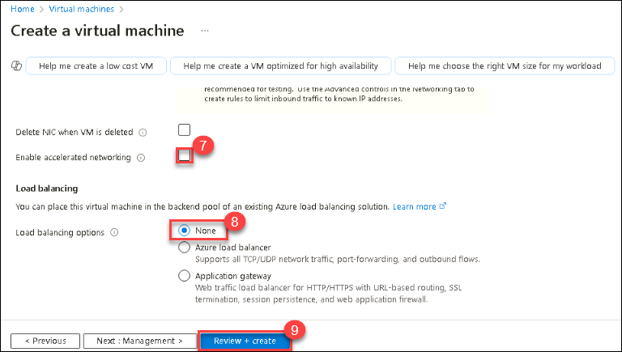
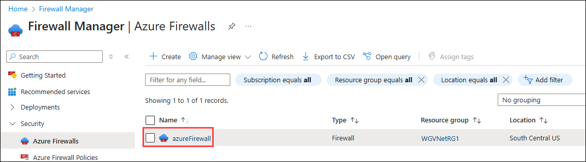
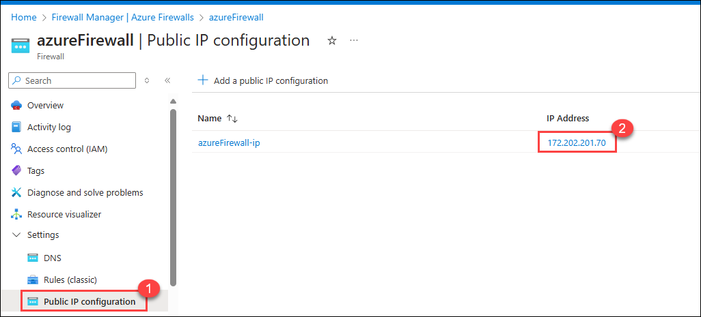
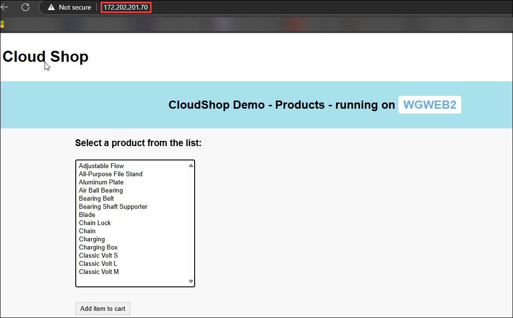
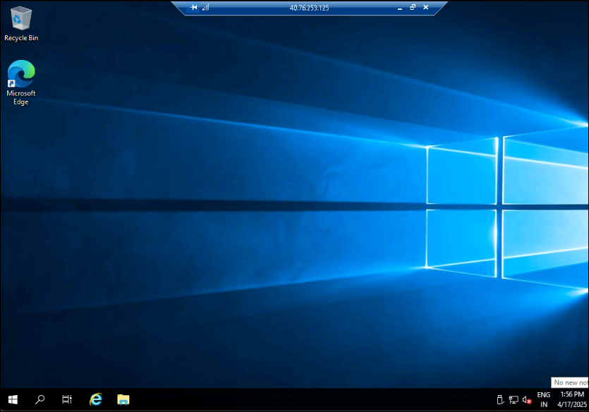
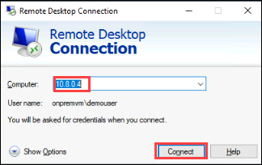
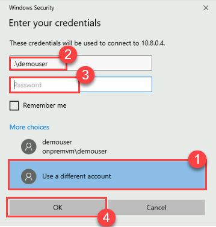
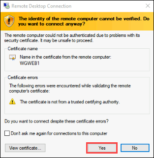
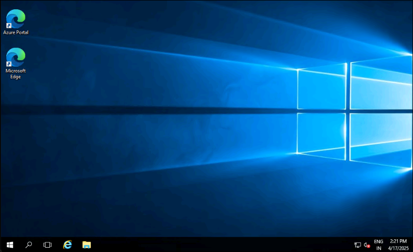

## Exercise 8: Validate connectivity from 'on-premises' to Azure

In this exercise, you will validate connectivity from your simulated on-premises environment to Azure using multiple scenarios.

## Lab objectives

In this lab, you will perform the following tasks:

- Create a virtual machine to validate connectivity
-   
## Estimated timing: 60 minutes

### Task 1: Create a virtual machine to validate connectivity

1. Create a new virtual machine in the OnPremVNet virtual network. In the Azure portal, search for **Virtual machines (1)** and select **Virtual machines (2)**.

    

1. Click on **+ Create (1)** drop down amd select **Azure Virtual Machine (2)**.

    

1. On the **Create a virtual machine** blade, on the **Basics** tab, enter the following information, and select **Next : Disks >**:

    | Setting | Action |
    | -- | -- |
    | Subscription | **Select your subscription** **(1)** |
    | Resource group | Select **OnPremVMRG** **(2)** |
    | Virtual machine name | **OnPremVM** **(3)** |
    | Region | **(US) East US** **(4)** (This must match the region in which you created the OnPremVNet virtual network.) |
    | Availability options | **No infrastructure redundancy required** **(5)** |
    | Image | **Windows Server 2019 Datacenter - Gen2** **(6)** |
    | Size | **Standard DS1 v2** **(7)** |
    | User name | **demouser** **(8)** |
    | Password/Confirm password | **demo\@pass123** **(9)** |
    | Public inbound ports | **Allow selected ports** **(10)** |
    | Select inbound ports | **RDP** **(11)** |

    

    
   
    

1. Click on **Next: Disk >**, then proceed to the networking section by clicking on **Next: Networking >**.

1. On the **Create a virtual machine** blade, on the **Networking** tab, set the following configuration:

    | Setting | Action |
    | -- | -- |
    | Virtual network | **OnPremVNet** **(1)** |
    | Subnet | **OnPremManagementSubnet (192.168.2.0/27)** **(2)**|
    | Public IP | **(new) OnPremVM-ip** **(3)** |
    | NIC network security group | **Basic** **(4)** |
    | Public inbound ports | **Allow selected ports** **(5)** |
    | Select inbound ports | **RDP** **(6)** |
    | Enable Accelerated networking | **Unchecked** **(7)** |
    | Load balancing options | **None** **(8)** |

    

1. On the **Create a virtual machine** blade, click on **Review+create (9)**.
   
    

1. Ensure the validation passes, and select **Create**. The virtual machine will take about 5 minutes to provision.

> **Congratulations** on completing the task! Now, it's time to validate it. Here are the steps:
      
   - Hit the Validate button for the corresponding task. If you receive a success message, you can proceed to the next task.
   - If not, carefully read the error message and retry the step, following the instructions in the lab guide.
   - If you need any assistance, please contact us at cloudlabs-support@spektrasystems.com. We are available 24/7 to help you out.

<validation step="1c761e87-33d3-4520-b0d8-9f9e36ffc395" />

>**Note:** At this point, you have configured your enterprise network. You should be able to test your Enterprise Class Network from one region to another. Your testing can include the following scenarios:

### Scenario 1: Initiating an RDP Session to WGWEB1 and WGSQL1 via Bastion

In this scenario, you will RDP into **WGWEB1** and **WGSQL1** using an **Azure Bastion** session. Since the traffic is routed through the **Azure Firewall**, access should be successful.

1. In the Azure portal, search for **Virtual Machines** in the search bar and select **Virtual Machines** from the results.

    .png)

2. On the **Virtual Machines** page, locate and select **WGWEB1**.

    .png)

3. Click **Connect (1)** and choose **Connect via Bastion (2)** as the connection method.

    .png)

4. Enter the following credentials and click **Connect (3)**:

   - **Username (1):** `demouser`  
   - **VM Password (2):** `demo@pass123`

    .png)

5. repeat the same steps mentioned above for initiating an RDP session to **WGSQL1** using Bastion.

### Scenario 2: Accessing the Web Application via Bastion in WGWEB1 or WGWEB2 VM

In this scenario, you will access the web application deployed in **WGVNet2** using the private IP address of the **Azure Load Balancer (10.8.0.100)**. This will be done from within **WGWEB1** or **WGWEB2** after establishing a Bastion session. Since the traffic is routed through **Azure Firewall**, access should be successful. 

1. On the Azure portal, type **Virtual Machines (1)** in the search box and select **Virtual Machines (2)** from the results.

    .png)

1. On the **Virtual Machines** page, find and select **WGWEB1**.

    .png)

1. Click **Connect (1)** and choose **Connect via Bastion (2)** as the connection method.

    .png)

1. Enter the following credentials and click **Connect (3)**:

   - **Username (1):** `demouser`

   - **VM Password (2):** `demo@pass123`

     .png)

1. On the desktop, open **Microsoft Edge**, enter **10.8.0.100** (the private IP of the Azure Load Balancer) in the address bar, and press **Enter** to load the web application.

    .png)

1. The web page should open successfully, confirming that traffic is routed correctly through **Azure Firewall**.

1. Close the RDP session.

Please follow the same steps for **WGWEB2**.

### Scenario 3: Connect to the Load Balancer (WGWEBLB) Using the Firewall Public IP

In this scenario, you will access the web application deployed in **WGVNet2** by connecting to the **Azure Load Balancer** at private IP address **10.8.0.100**. This access will be made from the **JumpBox/LabVM**, by browsing to the **Azure Firewall's Public IP address**. The connection should be successful.

1. In the Azure portal, use the search bar to search for **Firewalls**.

    

1. From the search results, select **Firewalls**, then click on the **Firewall** created in the previous exercise.

   

1. In the Firewall's overview blade, select **Public IP Configuration**, then copy the **public IP address** of the firewall.

   

1. On the **JumpBox/LabVM**, open **Microsoft Edge** and paste the copied public IP address into the browser's address bar to access the web application.

   

1. You will able to access the loadbalancer by browsing to the **Azure Firewall's** Public IP address.

### Scenario 4: Initiating an RDP Session to WGSQL1 from WGWEB1 via Bastion  

In this scenario, you will establish a **Bastion** session to **WGWEB1** and then initiate a **Remote Desktop (RDP)** connection to **WGSQL1** using its private IP address. The connection should be successful since it is allowed by **Azure Firewall**.

1. On the Azure portal, type **Virtual Machine (1)** in the search box and select **Virtual Machines (2)** from the results.

    .png)

1. On the **Virtual Machines** page, find and select **WGWEB1**.

    .png)

1. Click **Connect (1)** and choose **Connect via Bastion (2)** as the connection method.

    .png)

1. Enter the following credentials and click **Connect (3)**:  
   
   - **Username (1):** `demouser` 

   - **VM Password (2):** `demo@pass123`

     .png)

1. Within the **WGWEB1** Bastion session, search for **Remote Desktop Connection** in the Windows search bar and open the application.

    .png)

1. Enter **10.8.1.4** (the private IP of WGSQL1) in the **Computer** field and click **Connect**.

    .png)

1. Enter the following credentials and click **Connect (3)**:  

   - **Username (1):** `.\demouser` 

   - **Password (2):** `demo@pass123`

     .png)

1. If prompted with a security warning, click **Yes** to proceed.

    .png)

1. The RDP session to **WGSQL1** should be established successfully, confirming that Azure Firewall allows the connection.

This verifies that **WGWEB1** can communicate with **WGSQL1** over **RDP**, as permitted by **Azure Firewall**.

### Scenario 5: Initiating an RDP Session to **OnPremVM** from JumpBox/LabVM. 

1. On the Azure portal, type **Virtual Machines (1)** in the search box and select **Virtual Machines (2)** from the results.

    .png)

1. On the **Virtual Machines** page, find and select **OnPremVM**.

    .png)

1. Click **Connect (1)** and choose **Connect (2)** as the connection method.

    .png)

1. Under the **Native RDP** option, click **Download RDP file**.

    .png)

1. If you recieve any pop up, click on **Keep**.

    

1. Select **Open file**.

    

1. Open the downloaded RDP file and click **Connect**.

    .png)

1. Click on **More choices**.

    

1. Click on **Use a different account**.

    

1. When prompted, enter the following credentials and click **OK (3)**:  
   
   - **Username (1):** `.\demouser`  

   - **Password (2):** `demo@pass123`

     

1. Click **Yes** on the security pop-up to proceed.

   .png)

1. You will be able to do RDP successfully.

   

### Scenario 7:  

> **Note:** If you haven't already connected to **OnPremVM** via RDP, please follow the steps in **Scenario 5** to start the RDP session.

1. Inside **OnPremVM**, search for **Remote Desktop Connection (2)** in the Windows **search bar (1)** and open the **Remote Desktop Connection (3)** application. 

    .png)

1. In the **Computer** field, enter **10.8.0.4** or **10.8.0.5 (WGWEB1 VM Private IP)** and click **Connect**.

    

1. Click on **Use a different account**.

1. When prompted, enter the following credentials and click **OK (3)**:  
   
   - **Username (1):** `.\demouser`  

   - **Password (2):** `demo@pass123`

     

1. If prompted with a security warning, click **Yes** to proceed.

   

1. You will be able to RDP into WGWEB1 VM successfully.

   

### Review
In this lab, you have completed:
- Created a virtual machine to validate connectivity
- Configured routing for simulated 'on-premises' to Azure traffic

## Great job on completing this exercise! You can now proceed to the next one.
