## Exercise 1: Create a Virtual Network and provision subnets

## Lab objectives

In this lab, you will perform following tasks:

- Create a Virtual Network
- Configure subnets
  
## Estimated timing: 40 minutes

### Task 1: Create a Virtual Network

In this task, you will create a Virtual Network (VNet) in Azure, configure its address space and subnets, and enable Azure Bastion for secure remote access

1. In the search bar of the Azure portal, type **Virtual network (1)**. From the search results, select **Virtual network (2)**.

    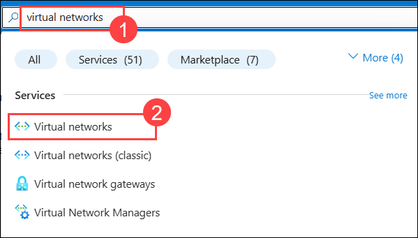

1. Click on **+ Create**.

1. On the **Create Virtual Network** blade, navigate to the **Basic** tab and enter the following information. Then, click **Next (5)** to proceed.

    | Setting | Action |
    | -- | -- |
    | **Subscription** | Keep it as default **(1)** |
    | **Resource Group** | **WGVNetRG1** **(2)** |
    | **Name** | **WGVNet1 (3)** |
    | **Location** | **South Central US (4)** |

    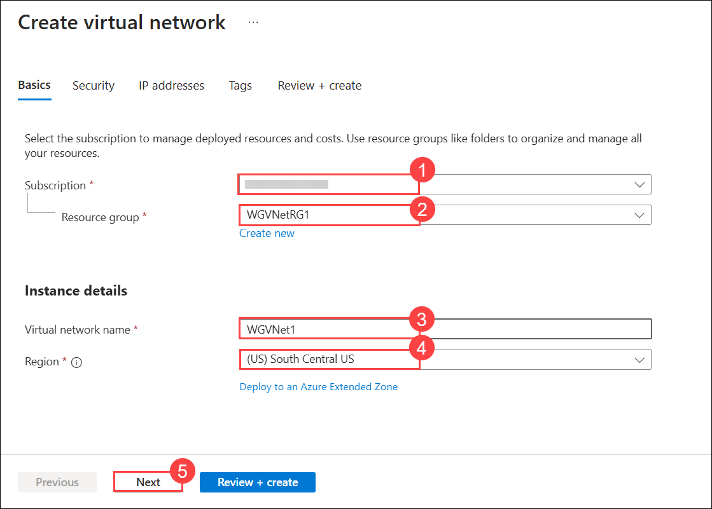

1. On the **Security** tab, check the box for **Enable Azure Bastion (1)** to enable it.

    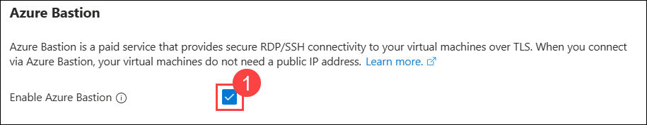

1. Provide the **Azure Bastion host name** as **WGBastion (1)**, then click on **Create a public IP address (2)**. Enter the name as **BastionPublicIP (3)** and click **OK (4)** to proceed.

    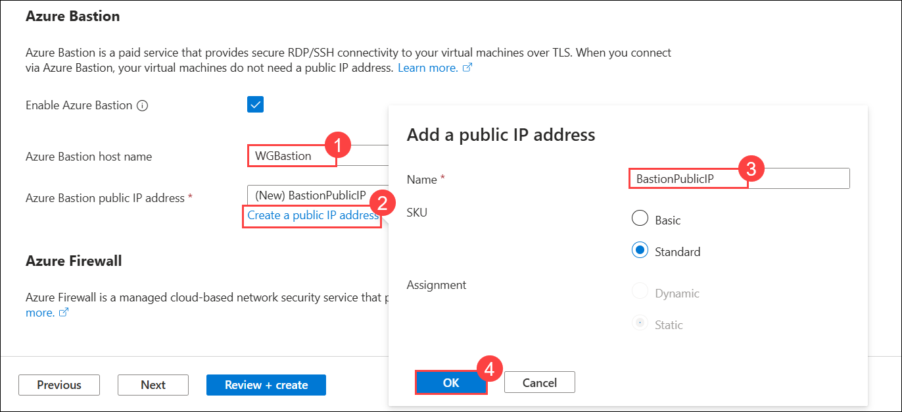
    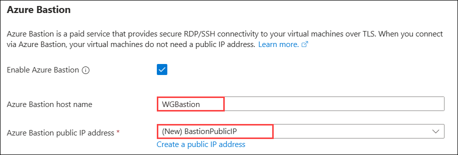

1. Now click on **Next** from the bottom

1. On the **IP Addresses** tab, change the **Address space** to **10.7.0.0 (1)** with a **/20 (2)** subnet mask.

    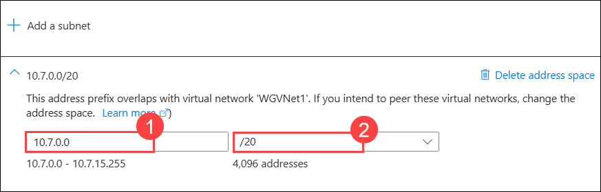

1. Click on the **default subnet**.

    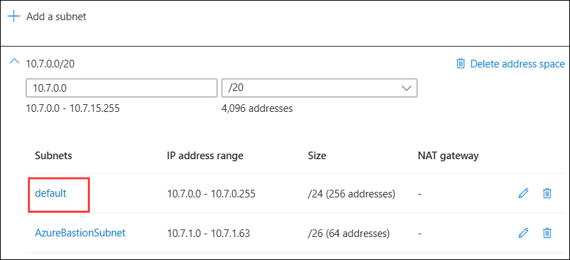

1. Enter the following information, then click **Save (4)** to apply the changes.

    | Setting | Action |
    | -- | -- |
    | **Subnet purpose** | **Virtual Network Gateway** **(1)** |
    | **Starting address** | **10.7.15.0** **(2)** |
    | **Size** | **/27 (32 addresses) (3)** |

    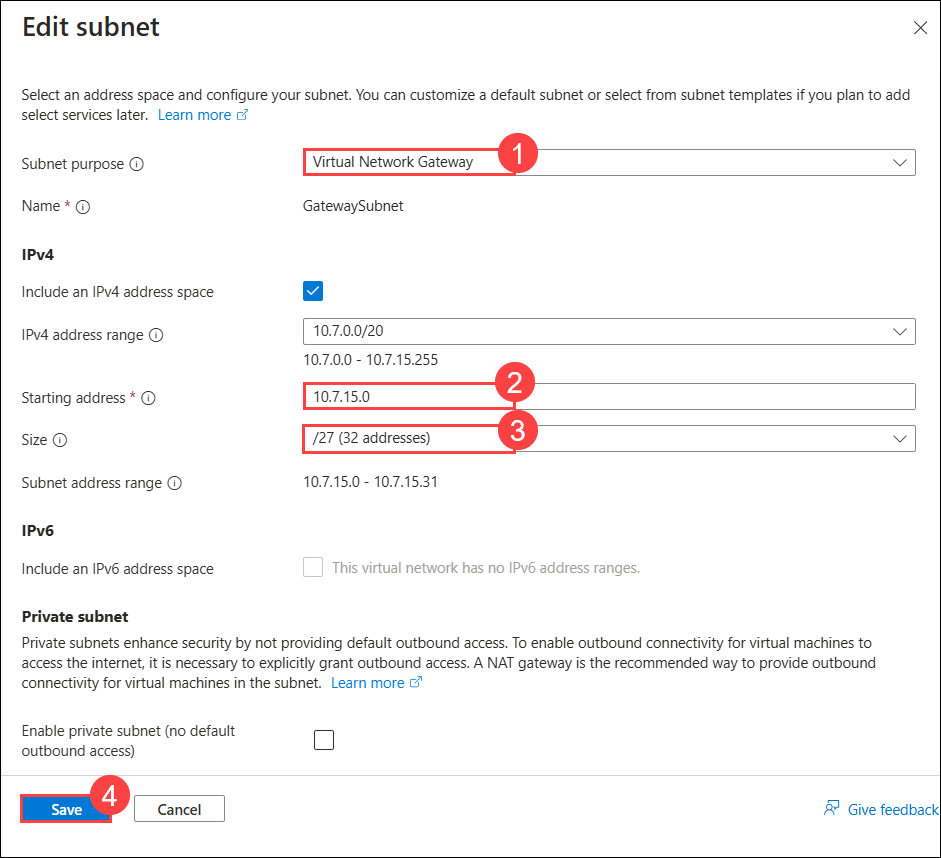

1. Click on the **AzureBastionSubnet**.

    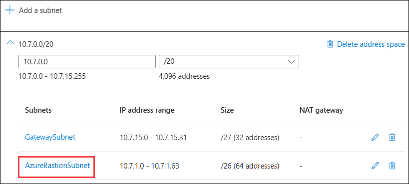

1. Enter the following information, then click **Save (4)** to apply the changes.

    | Setting | Action |
    | -- | -- |
    | **Subnet purpose** | **Azure Bastion** **(1)** |
    | **Starting address** | **10.7.5.0** **(2)** |
    | **Size** | **/24 (256 addresses) (3)** |

    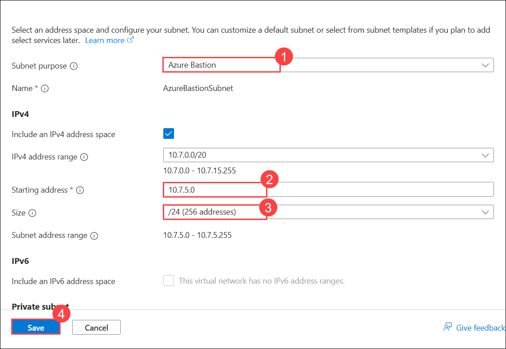

    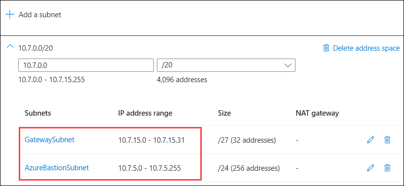

1. Select **Review + Create**.

1. Review the configuration and select **Create**.

    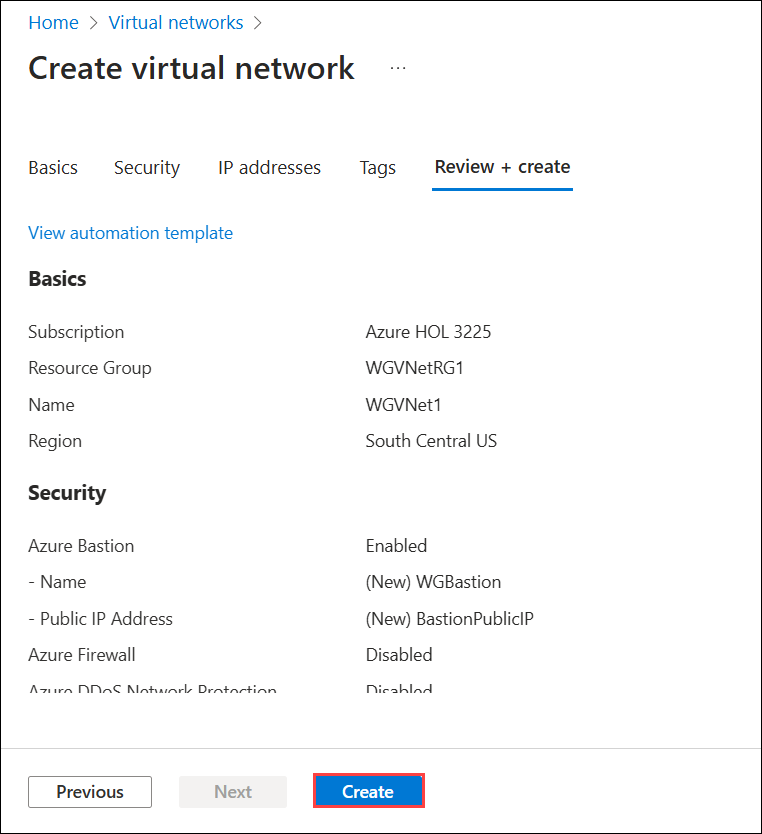

1. Monitor the deployment status by selecting **Notifications** at the top of the portal. When the deployment is complete, select **Go to Resource**.

### Task 2: Configure subnets

1. Go to the WGVNetRG1 Group, and select **WGVNet1** virtual network resource. Once you are on the WGVNet1 virtual network blade, select **Subnets** under **Settings** from the navigation on the left.

    

1. In the **Subnets** blade select **+Subnet**.

    

1. On the **Add subnet** blade, enter the following information, then select **Add (4)**.

    | Setting | Action |
    | -- | -- |
    | **Name** | **Management** **(1)** |
    | **Starting address** | **10.7.2.0** **(2)** |
    | **Size** | **/25 (128 addresses) (3)** |

    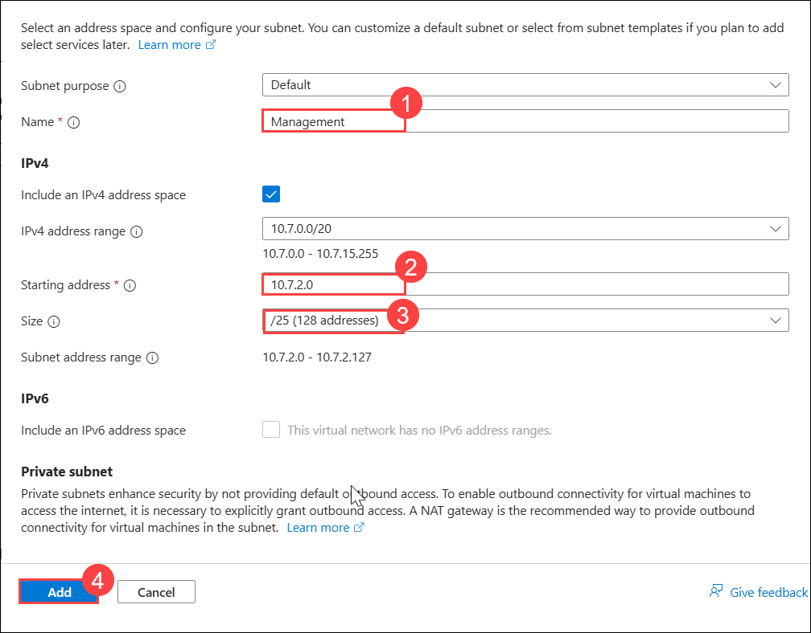

1. Repeat Step 3, enter the following information for the **Azure Firewall** which we will use to control traffic flow in and out of the Network.

    | Setting | Action |
    | -- | -- |
    | **Subnet Purpose** | **Azure Firewall** **(1)** |
    | **Starting address** | **10.7.1.0** **(2)** |

    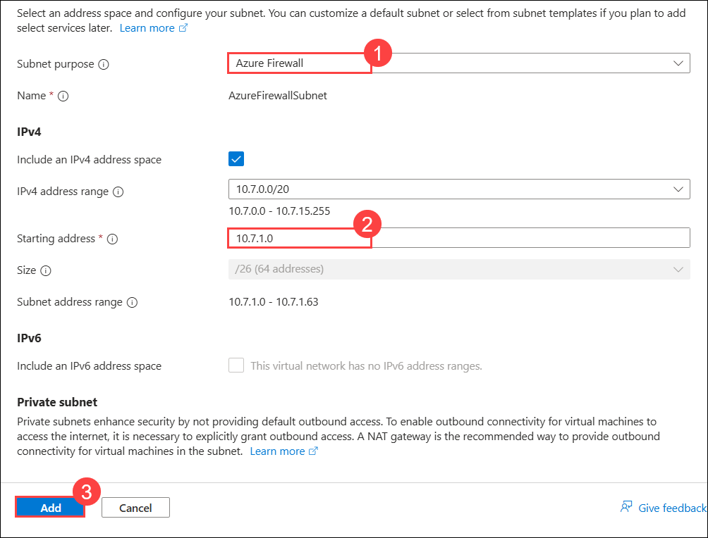

    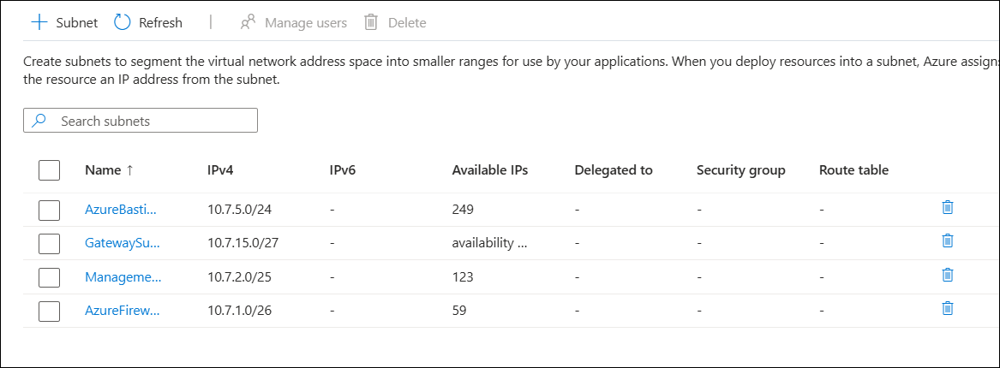

### Review
In this lab, you have completed:
- Created a Virtual Network
- Configured subnets

## Great job on completing this exercise! You can now proceed to the next one.
