## Exercise 10: Using Network Watcher to Test and Validate Connectivity

In this exercise, you will collect the flow log and perform connectivity from your simulated on-premises environment to Azure. This will be accomplished by using the Network Watcher Service in the Azure Platform.

## Lab objectives

In this lab, you will perform following tasks:

- Configuring the Storage Account for the NSG Flow Logs
- Configuring Diagnostic Logs
- Reviewing Network Traffic
- Network Connection Troubleshooting
  
## Estimated timing: 60 minutes

### Task 1: Configuring the Storage Account for the NSG Flow Logs

1. In the search bar of the Azure portal, type **Storage accounts (1)**. From the search results, select **Storage accounts (2)**.

   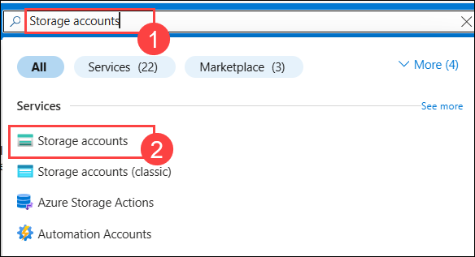

2. On the **Create a storage account** blade. Enter the following information, and select **Review + Create** then select the **Create** button:

    | Setting | Action |
    | -- | -- |
    | Subscription | **Select your subscription** |
    | Resource group | **MonitoringRG** (Use the existing resource group created earlier.) |
    | Storage Account Name | **This must be Unique and alphanumeric, lowercase, and have no special characters.** |
    | Location | **(US) South Central US** |
    | Performance | **Standard** |
    | Account Kind | **StorageV2 (general purpose v2)** |
    | Replication | **Locally-redundant storage (LRS)** |

    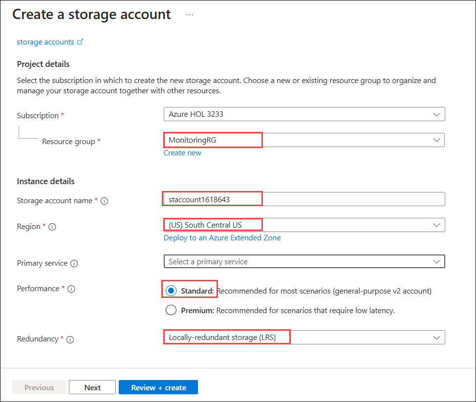

   >**Note:** Ensure the storage account is created before continuing.

3. Repeat steps 1 and 2, but select **East US** for the region and give it a different name.

4. On the Azure portal select **All services** at the left navigation. From the Categories menu select **Networking** then select **Network Watcher**.

5. From the **Network Watcher** blade under the **Logs** menu on the left, select **flow logs**. Select **+ Create**.

    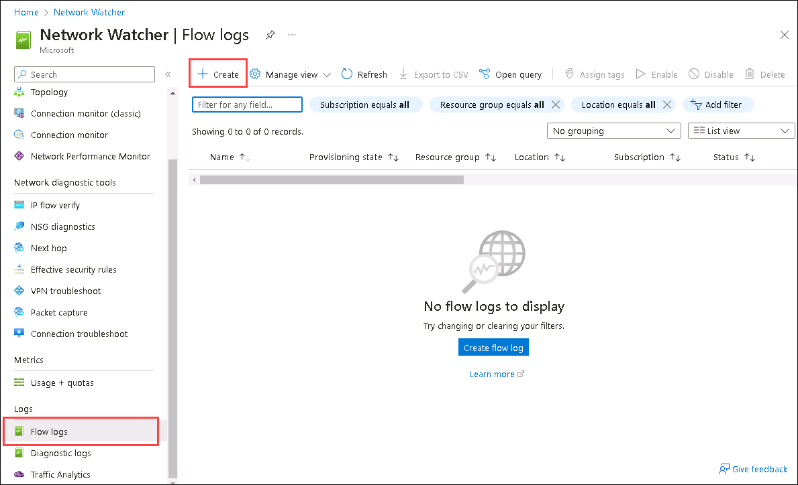

6. In the **Create a flow log** blade that appears, enter the following information then select **Next: Analytics**.

    - Subscription: **Select your subscription**.

    - Network Security Group: **WGAppNSG1**

    - Storage Accounts: **The available storage account that you created earlier**.

    - Retention (days): **0**

        

7. On the **Configuration** tab of the **Create a flow log** blade, enter the following information then select **Review + create** then **Create**.

    | Setting | Action |
    | -- | -- |
    | Flow Logs Version | **Version 2** |
    | Enable Traffic Analytics | **Checked** |
    | Traffic Analytics processing interval | **Every 10 minutes** |
    | Log Analytics Workspace | **The log analytics workspace you created earlier** |

     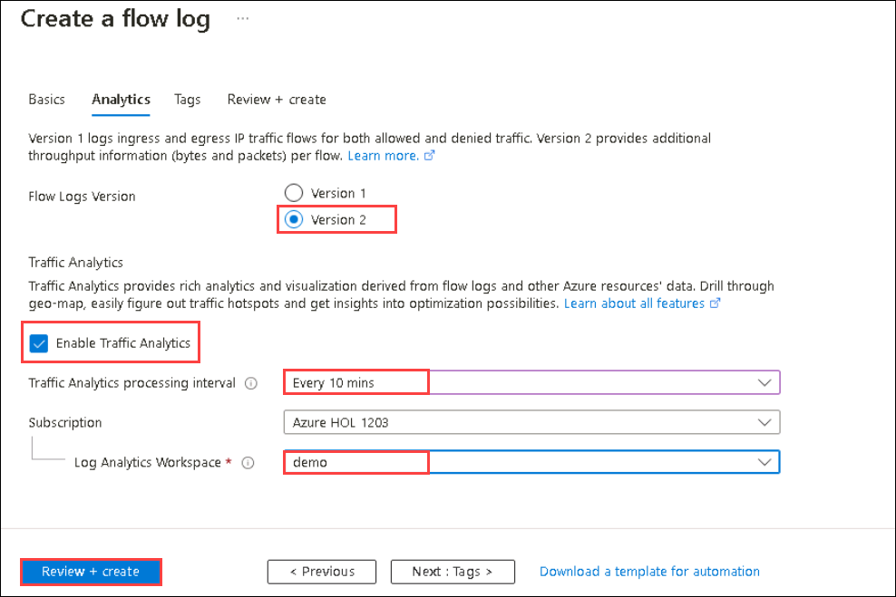

8. Repeat Steps 5 - 7 to create a flow log for the **OnPremVM-nsg** Network Security Group as well. When completed your **NSG flow logs** blade on **Network Watcher** should look like what's depicted in the below image.

     

9. Navigate back to the **OnPremVM**. Connect to it by downloading and opening the RDP file.

     - Username - **.\demouser** 
     - Password - **demo@pass123**

10. Open the **Microsoft Edge** browser from the Start menu. Navigate to portal.azure.com.  Login to the **Azure** portal.

11. In the RDP session for the **OnPremVM**, navigate to the **Azure** portal, navigate to **Virtual machines** and select the **WGWEB1**. Connect to **WGWEB1** through **Bastion**.  In **WGWEB1**,  navigate to the load balancer's private ip address (**10.8.0.100**) and generate some traffic by refreshing the browser. Allow ten minutes to pass for traffic analytics to generate.

     - Username - **.\demouser** 
     - Password - **demo@pass123**

     

### Task 2: Configuring Diagnostic Logs

1. In the search bar of the Azure portal, type **Network watcher (1)**. From the search results, select **Network Watcher (2)**.

   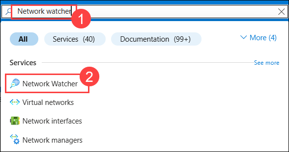

2. Select **Diagnostic Logs** from the **Logs Menu** within the blade.

3. Select **onpremvm###** then select **+Add diagnostic setting**.

     

4. Enter **OnPremDiag** as the name then select the checkbox for **Archive to a storage account**. On the **Storage accounts** drop down, select the available storage account you created earlier.

5. Select the **Send to Log Analytics workspace** checkbox. Select the workspace created earlier in the dropdown. Select the **AllMetrics** checkbox. Select the **Save** button to complete the settings.

     

6. Repeat Steps 2 - 5 for each network resource. Once completed your settings will look like the following screenshot.

     

### Task 3: Reviewing Network Traffic

1. In the search bar of the Azure portal, type **Network watcher (1)**. From the search results, select **Network Watcher (2)**.

   

1. Select **Traffic Analytics** under **Monitoring** from the **Logs** menu in the blade. At this time, the diagnostic logs from the network resources have been ingested. 

     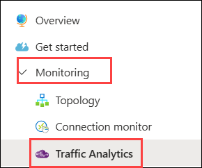

1. Select **View map**.

   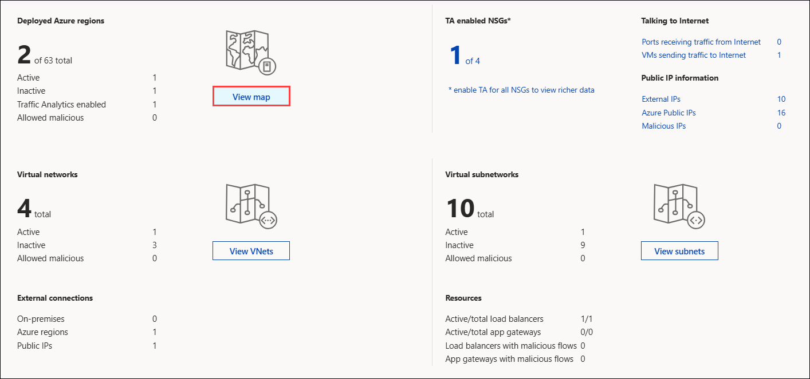

1. Select the **green check mark** which identifies your network. Within the pop-up menu select **More Details** to propagate detailed information of the flow to and from your network.

   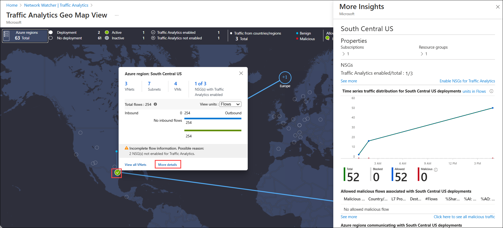
 
   >**Note:** You can select the **See More** link to query the connections detail for more information.

### Task 4: Network Connection Troubleshooting

1. In the search bar of the Azure portal, type **Network watcher (1)**. From the search results, select **Network Watcher (2)**.

   

2. Select **Connection Troubleshoot (2)** from the **Network Diagnostic tools (1)** menu.

   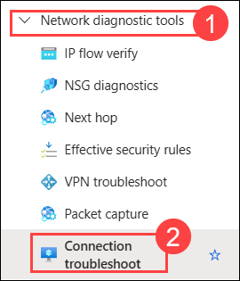

3. To troubleshoot a connection or to validate the route enter the following information and select **Run diagnostic tests**:

    | Setting | Action |
    | -- | -- |
    | Source Type | **Virtual Machine** |
    | Virtual Machine | **OnPremVM** |
    | Destination | **Select a virtual machine** |
    | Virtual Machine | **WGWEB1** |
    | Preferred IP version | **IPV4** |
    | Protocol | **TCP** |
    | Destination Port | **80** |
    | Diagnostic tests | **Next hop** |

   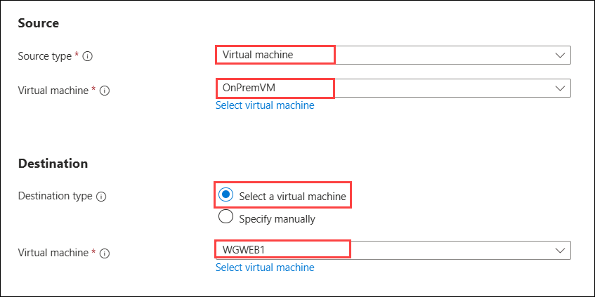
   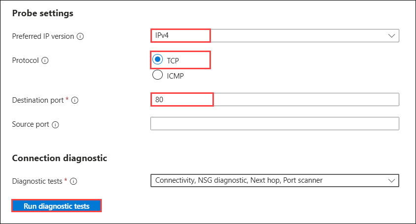

4. Once the Run diagnostic tests is complete you will get the result.

    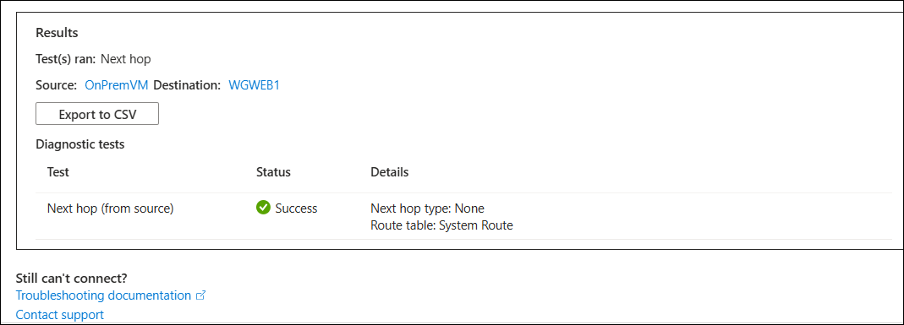

### Review

In this lab, you have completed:

- Configured the Storage Account for the NSG Flow Logs
- Configured Diagnostic Logs
- Reviewed Network Traffic
- Network Connection Troubleshooting