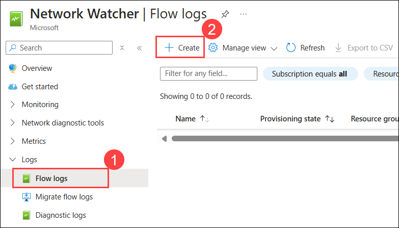
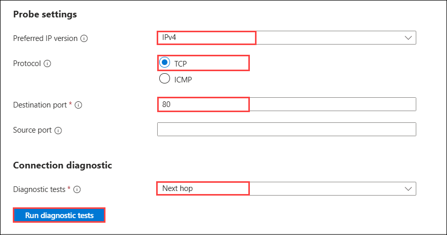

## Exercise 10: Using Network Watcher to Test and Validate Connectivity

In this exercise, you will collect the flow log and perform connectivity from your simulated on-premises environment to Azure. This will be accomplished by using the Network Watcher Service in the Azure Platform.

## Lab objectives

In this lab, you will perform following tasks:

- Configuring the Storage Account for the NSG Flow Logs
- Configuring Diagnostic Logs
- Reviewing Network Traffic
- Network Connection Troubleshooting
  
## Estimated timing: 60 minutes

### Task 1: Configuring the Storage Account for the NSG Flow Logs

1. In the search bar of the Azure portal, type **Storage accounts (1)**. From the search results, select **Storage accounts (2)**.

   

2. On the Storage account page, select **+ Create**.

3. On the **Create a storage account** blade. Enter the following information, and select **Review + Create (7)** then select the **Create** button:

    | Setting | Action |
    | -- | -- |
    | Subscription | **Select your subscription (1)** |
    | Resource group | **MonitoringRG (2)** (Use the existing resource group created earlier.) |
    | Storage Account Name | **This must be Unique and alphanumeric, lowercase, and have no special characters (3)** |
    | Region | **(US) South Central US (4)** |
    | Primary service | **Leave as Default** |
    | Performance | **Standard (5)** |
    | Replication | **Locally-redundant storage (LRS) (6)** |

    .png)

   >**Note:** Ensure the storage account is created before continuing.

4. Repeat steps 1 and 2, but select **East US** for the region and give it a different name.

5. In the search bar of the Azure portal, type **Network Watcher (1)**. From the search results, select **Network Watcher (2)**.

6. In the **Network Watcher** blade, select **Flow Logs (1)** under **Logs** menu and click **+ Create (2)**.

   

7. In the **Create a flow log** blade that appears, enter the following information then select **Next: Analytics > (7)**.

   - Subscription: **Select your subscription (1)**

   - Flow log type: **Network Security Group (2)**

   - Click **+ Select target resource (3)** and choose **Network security group (4)**.

     .png)

   - On the **Select network security group** page, choose **WGAppNSG1 (1)** and click **Confirm selection (2)**.

      .png)

    - Storage Accounts: **The available storage account that you created earlier (5)**

    - Retention (days): **0 (6)**

      .png)

8. On the **Configuration** tab of the **Create a flow log** blade, enter the following information then select **Review + create (5)**.

    | Setting | Action |
    | -- | -- |
    | Flow Logs Version | **Version 2 (1)** |
    | Enable traffic analytics | **Checked (2)** |
    | Traffic analytics processing interval | **Every 10 minutes (3)** |
    | Log Analytics Workspace | **The log analytics workspace you created earlier (4)** |

     .png)

9. Review the configuration and click **Create**.

     .png)

10. Repeat Steps 6 - 9 to create a flow log for the **OnPremVM-nsg** Network Security Group as well. When completed your **NSG flow logs** blade on **Network Watcher** should look like what's depicted in the below image.

     

11. In the search bar of the Azure portal, type **Virtual Machines (1)** in the search box and select **Virtual Machines (2)** from the results.

    .png)

12. On the **Virtual Machines** page, find and select **OnPremVM**.

    .png)

13. Click **Connect (1)** and choose **Connect (2)** as the connection method.

    .png)

14. Under the **Native RDP** option, click **Download RDP file**.

    .png)

15. Open the downloaded RDP file and click **Connect**.

    .png)

16. When prompted, enter the following credentials and click **OK (3)**:  

> **Note** : Please ensure to avoid spaces while copying the values from the labguide.
   
   - **Username (1):** `.\demouser`  

   - **Password (2):** `demo@pass123`

     .png)

17. Click **Yes** on the security pop-up to proceed.

    .png)

18. On your desktop, click the **Microsoft Edge** icon and go to the [Azure portal](https://portal.azure.com).
 
19. You'll see the **Sign into Microsoft Azure** tab. Here, enter your credentials:
 
    - **Email/Username:** <inject key="AzureAdUserEmail"></inject>
 
20. Next, provide your password:
 
    - **Password:** <inject key="AzureAdUserPassword"></inject>
 
21. If you see the pop-up **Stay Signed in?**, click **No**.

22. In the search bar of the Azure portal, type **Virtual Machine (1)** in the search box and select **Virtual Machines (2)** from the results.

    .png)

23. Select **WGWEB1**. Connect to **WGWEB1** through **Bastion**.  In **WGWEB1**,  navigate to the load balancer's private ip address (**10.8.0.100**) and generate some traffic by refreshing the browser. Allow ten minutes to pass for traffic analytics to generate.

     - **Username:** `demouser`

     - **Password:** `demo@pass123`

       

> **Congratulations** on completing the task! Now, it's time to validate it. Here are the steps:
      
   - Hit the Validate button for the corresponding task.
   - If not, carefully read the error message and retry the step, following the instructions in the lab guide.
   - If you need any assistance, please contact us at cloudlabs-support@spektrasystems.com. We are available 24/7 to help you out.

<validation step="f569a0cd-297e-4e32-956f-84d6d031a41d" />

### Task 2: Configuring Diagnostic Logs

1. In the search bar of the Azure portal, type **Network watcher (1)**. From the search results, select **Network Watcher (2)**.

   

2. Go to **Logs Menu**, select **Diagnostic Logs (1)**, and choose **OnPremVM-nsg (2)**.

     .png)

3. Click **+ Add Diagnostic Setting**.

4. Enter **OnPremDiag (1)** as the Diagnostic setting name, select **Alllogs (2)**, enable **Send to Log Analytics workspace (3)**, and choose the previously created workspace. 

5. Check **Archive to a storage account (4)**, select the available storage account, and click **Save (5)** to apply the settings.

     .png)

6. Repeat Steps 2 - 5 for each network resource. Once completed your settings will look like the following screenshot.

     

### Task 3: Reviewing Network Traffic

1. In the search bar of the Azure portal, type **Network watcher (1)**. From the search results, select **Network Watcher (2)**.

   

1. Select **Traffic Analytics** under **Monitoring** from the **Logs** menu in the blade. At this time, the diagnostic logs from the network resources have been ingested. 

     

1. Select **View map**.

   

1. Select the **green check mark** which identifies your network. Within the pop-up menu select **More Details** to propagate detailed information of the flow to and from your network.

   
 
   >**Note:** You can select the **See More** link to query the connections detail for more information.

### Task 4: Network Connection Troubleshooting

1. In the search bar of the Azure portal, type **Network watcher (1)**. From the search results, select **Network Watcher (2)**.

   

2. Select **Connection Troubleshoot (2)** from the **Network Diagnostic tools (1)** menu.

   

3. To troubleshoot a connection or to validate the route enter the following information and select **Run diagnostic tests**:

    | Setting | Action |
    | -- | -- |
    | Source Type | **Virtual Machine** |
    | Virtual Machine | **OnPremVM** |
    | Destination | **Select a virtual machine** |
    | Virtual Machine | **WGWEB1** |
    | Preferred IP version | **IPV4** |
    | Protocol | **TCP** |
    | Destination Port | **80** |
    | Diagnostic tests | **Next hop** |

   
   
   

4. Once the Run diagnostic tests is complete you will get the result.

    

### Review

In this lab, you have completed:

- Configured the Storage Account for the NSG Flow Logs
- Configured Diagnostic Logs
- Reviewed Network Traffic
- Network Connection Troubleshooting

## Great job on completing the lab!
