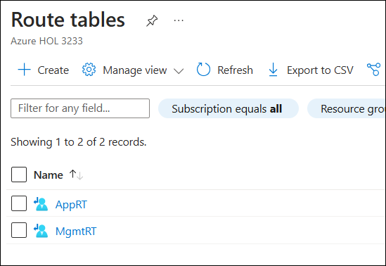
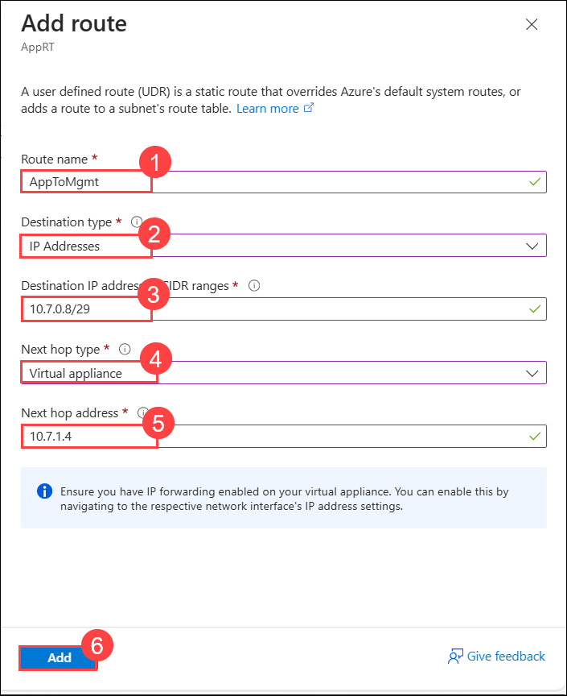
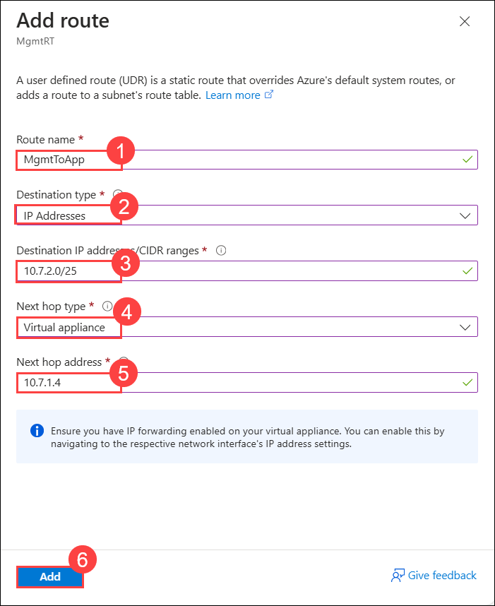

## Exercise 4: Create route tables with required routes

Route Tables are containers for User Defined Routes (UDRs). The route table is created and associated with a subnet. UDRs allow you to direct traffic in ways other than normal system routes would. In this case, UDRs will direct outbound traffic via the Azure firewall.

### Task 1: Create route tables

1. In the search bar of the Azure portal, type **Route tables (1)**. From the search results, select **Route tables (2)**.

    

1. Click on **Create**.

1. On the **Create a Route table** blade enter the following information:

    | Setting | Action |
    | -- | -- |
    | **Subscription** | Select your subscription **(1)** |
    | **Resource group** | **WGVNetRG1** **(2)** |
    | **Region** | **South Central US (3)** |
    | **Name** | **WebTier** **(4)** |
    | **Propagate gateway routes** | **Yes** **(5)** |

    

1. Select **Review + Create** then **Create**.

1. Repeat steps 1 and 2 to create the **AppRT** route table:

    | Setting | Action |
    | -- | -- |
    | **Subscription** | Select your subscription **(1)** |
    | **Resource group** | **WGVNetRG2** **(2)** |
    | **Region** | **South Central US (3)** |
    | **Name** | **AppRT** **(4)** |
    | **Propagate gateway routes** | **Yes** **(5)** |

    

1. Once route tables are created, your **Route tables** blade should look like the following screenshot:

    

### Task 2: Add routes to each route table

1. Select the **AppRT** route table, and select **Routes** under **Settings** on the left.

    

2. On the **Routes** blade, select **+ Add**. Enter the following information, and select **Add (6)**:

    | Setting | Action |
    | -- | -- |
    | Route name | **AppToInternet** **(1)** |
    | Address prefix destination | **IP Addresses** **(2)** |
    | Address prefix | **0.0.0.0/0** **(3)** |
    | Next hop type | **Virtual appliance** **(4)** |
    | Next hop address | **10.7.1.4** **(5)** (This is the private IP of Azure Firewall.) |

    

3. Repeat this procedure to add the **AppToMgmt** route using the following information:

    | Setting | Action |
    | -- | -- |
    | Route name | **AppToMgmt** **(1)** |
    | Address prefix destination | **IP Addresses** **(2)** |
    | Address prefix | **10.7.0.8/29** **(3)** |
    | Next hop type | **Virtual appliance** **(4)** |
    | Next hop address | **10.7.1.4** **(5)** (This is the private IP of Azure Firewall.) |

    

4. Upon completion, your routes in the **AppRT** route table should look like the following screenshot:

    

5. In the Azure Portal, go to All Services and type **route** in the search box and select **Route tables**.

6. Select **MgmtRT**, and select **Routes** under **Settings** on the left.

    

7. On the **Routes** blade, select **+Add**. Enter the following information, and select **Add**:

    | Setting | Action |
    | -- | -- |
    | Route name | **MgmtToOnPremises** **(1)** |
    | Address prefix destination | **IP Addresses** **(2)** |
    | Address prefix | **192.168.0.0/16** **(3)** |
    | Next hop type | **Virtual network gateway** **(4)** |
    | Next hop address | **Leave blank** |

    

8. Add the **MgmtToApp** route using the following information:

    | Setting | Action |
    | -- | -- |
    | Route name | **MgmtToApp** **(1)** |
    | Address prefix destination | **IP Addresses** **(2)** |
    | Address prefix | **10.7.2.0/25** **(3)** |
    | Next hop type | **Virtual network gateway** **(4)** |
    | Next hop address | **10.7.1.4** **(5)** (This is the private IP of Azure Firewall.) |

    

9. Upon completion, your routes in the **MgmtRT** route table should look like the following screenshot:

    

    >**Note:** The route tables and routes you have just created are not associated with any subnets yet, so they are not impacting any traffic flow yet. This will be accomplished later in the lab.