## Exercise 4: Create route tables with required routes

Route Tables are containers for User Defined Routes (UDRs). The route table is created and associated with a subnet. UDRs allow you to direct traffic in ways other than normal system routes would. In this case, UDRs will direct outbound traffic via the Azure firewall.

## Lab objectives

In this lab, you will perform following tasks:

- Create route tables
- Add routes to each route table
- Associate route tables to subnets
  
## Estimated timing: 40 minutes

### Task 1: Create route tables

1. In the search bar of the Azure portal, type **Route tables (1)**. From the search results, select **Route tables (2)**.

    

1. Click on **Create**.

1. On the **Create a Route table** blade enter the following information:

    | Setting | Action |
    | -- | -- |
    | **Subscription** | Select your subscription **(1)** |
    | **Resource group** | **WGVNetRG1** **(2)** |
    | **Region** | **South Central US (3)** |
    | **Name** | **MgmtRT** **(4)** |
    | **Propagate gateway routes** | **Yes** **(5)** |

    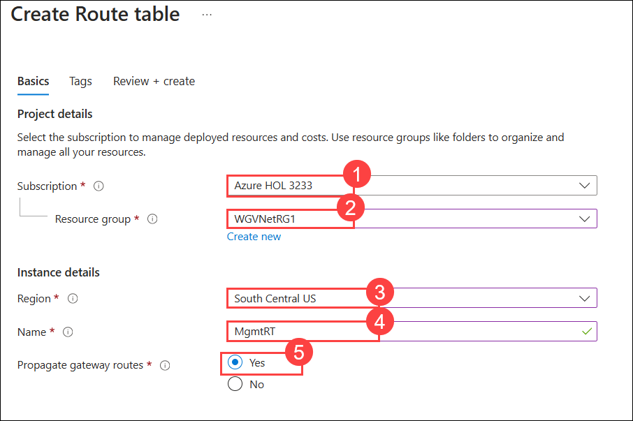

1. Select **Review + Create** then **Create**.

1. Repeat steps 1 and 2 to create the **AppRT** route table:

    | Setting | Action |
    | -- | -- |
    | **Subscription** | Select your subscription **(1)** |
    | **Resource group** | **WGVNetRG2** **(2)** |
    | **Region** | **South Central US (3)** |
    | **Name** | **AppRT** **(4)** |
    | **Propagate gateway routes** | **Yes** **(5)** |

    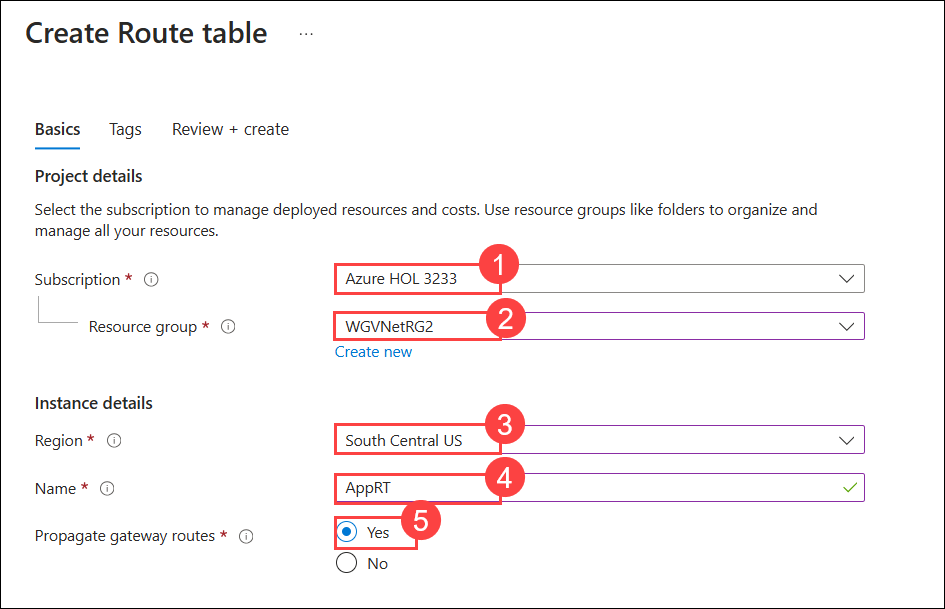

1. Select **Review + Create** then **Create**.    

1. Once route tables are created, your **Route tables** blade should look like the following screenshot:

    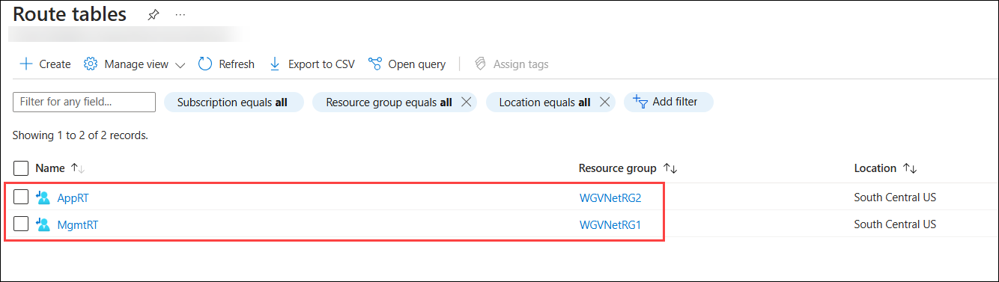

### Task 2: Add routes to each route table

1. Select the **AppRT** route table, and select **Routes** under **Settings** on the left.

    

2. On the **Routes** blade, select **+ Add**. Enter the following information, and select **Add (6)**:

    | Setting | Action |
    | -- | -- |
    | Route name | **AppToInternet** **(1)** |
    | Destination type | **IP Addresses** **(2)** |
    | Destination IP addresses/CIDR ranges | **0.0.0.0/0** **(3)** |
    | Next hop type | **Virtual appliance** **(4)** |
    | Next hop address | **10.7.1.4** **(5)** (This is the private IP of Azure Firewall.) |

    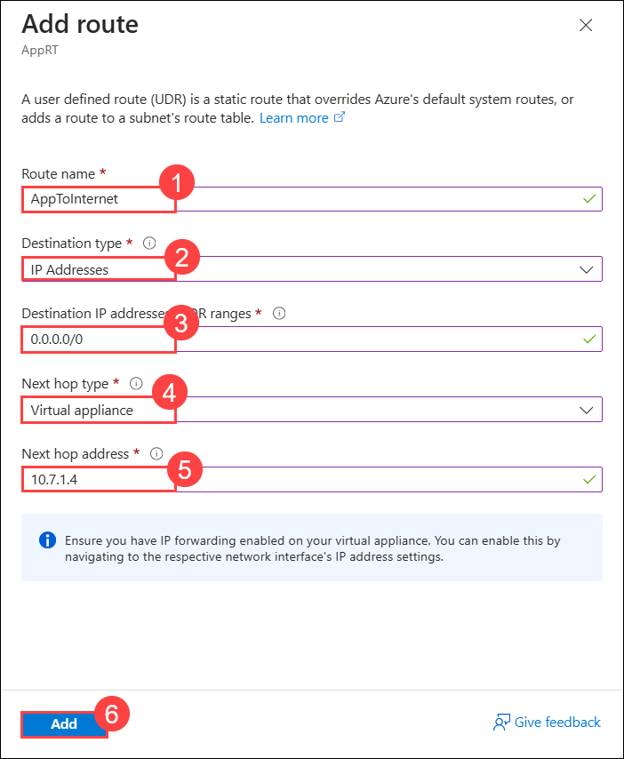

3. Repeat this procedure to add the **AppToMgmt** route using the following information:

    | Setting | Action |
    | -- | -- |
    | Route name | **AppToMgmt** **(1)** |
    | Destination type | **IP Addresses** **(2)** |
    | Destination IP addresses/CIDR ranges | **10.7.2.0/25** **(3)** |
    | Next hop type | **Virtual appliance** **(4)** |
    | Next hop address | **10.7.1.4** **(5)** (This is the private IP of Azure Firewall.) |

    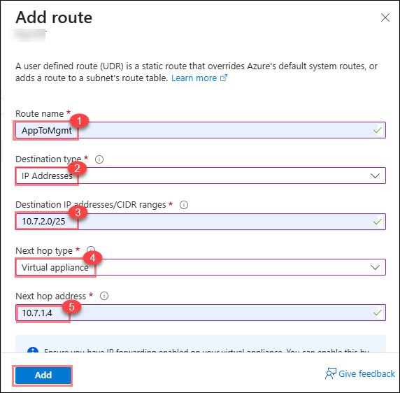

4. Upon completion, your routes in the **AppRT** route table should look like the following screenshot:

    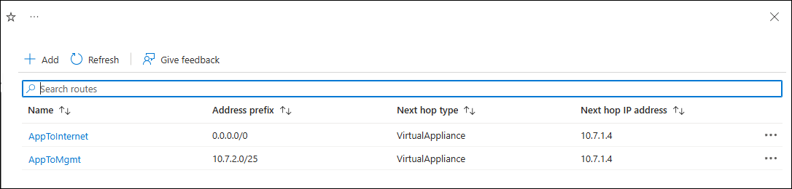

5. In the Azure Portal, search for **Route tables** in the search box and select **Route tables**.

6. Select **MgmtRT**, and select **Routes** under **Settings** on the left.

    

7. On the **Routes** blade, select **+Add**. Enter the following information, and select **Add (5)**:

    | Setting | Action |
    | -- | -- |
    | Route name | **MgmtToOnPremises** **(1)** |
    | Destination type | **IP Addresses** **(2)** |
    | Destination IP addresses/CIDR ranges | **192.168.0.0/16** **(3)** |
    | Next hop type | **Virtual network gateway** **(4)** |
    | Next hop address | **Leave blank** |

    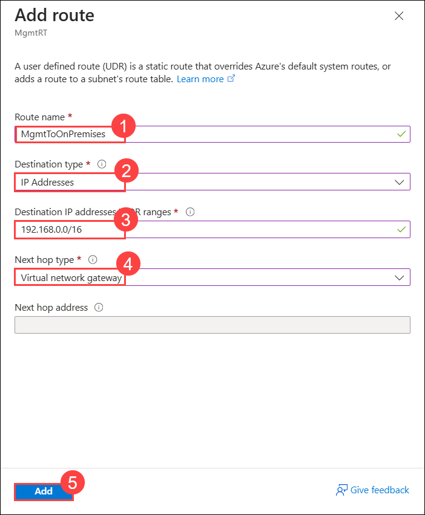

8. Add the **MgmtToApp** route using the following information and select **Add (6)**:

    | Setting | Action |
    | -- | -- |
    | Route name | **MgmtToApp** **(1)** |
    | Destination type | **IP Addresses** **(2)** |
    | Destination IP addresses/CIDR ranges | **10.8.0.0/25** **(3)** |
    | Next hop type | **Virtual appliance** **(4)** |
    | Next hop address | **10.7.1.4** **(5)** (This is the private IP of Azure Firewall.) |

    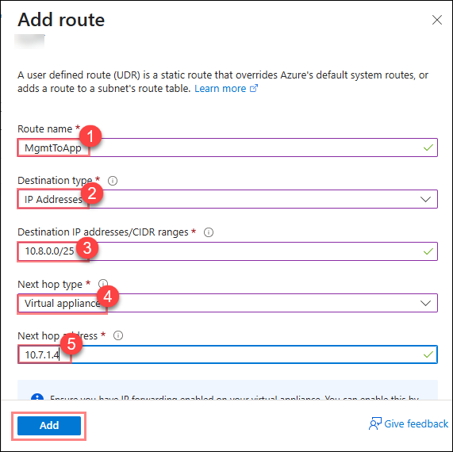

9. Upon completion, your routes in the **MgmtRT** route table should look like the following screenshot:

    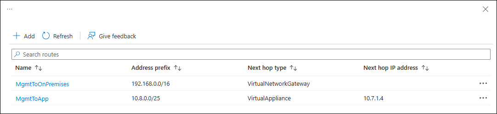

    >**Note:** The route tables and routes you have just created are not associated with any subnets yet, so they are not impacting any traffic flow yet. This will be accomplished later in the lab.

> **Congratulations** on completing the task! Now, it's time to validate it. Here are the steps:
      
   - Hit the Validate button for the corresponding task. If you receive a success message, you can proceed to the next task.
   - If not, carefully read the error message and retry the step, following the instructions in the lab guide.
   - If you need any assistance, please contact us at cloudlabs-support@spektrasystems.com. We are available 24/7 to help you out.

<validation step="a285d069-db50-49bb-a027-8b6962249c52" />

### Task 3: Associate route tables to subnets

1. In the Azure portal, navigate to the blade of the **WGVNetRG2** resource group.

1. Select **AppRT**, followed by **Subnets** and then select **+ Associate**.

    

1. On the **Associate subnet** blade, select **WGVNet2 (1)** on the **Virtual network** drop down. Select **AppSubnet (2)** on the **Subnet** dropdown and then select **OK (3)** at the bottom of the **Associate subnet** blade.

    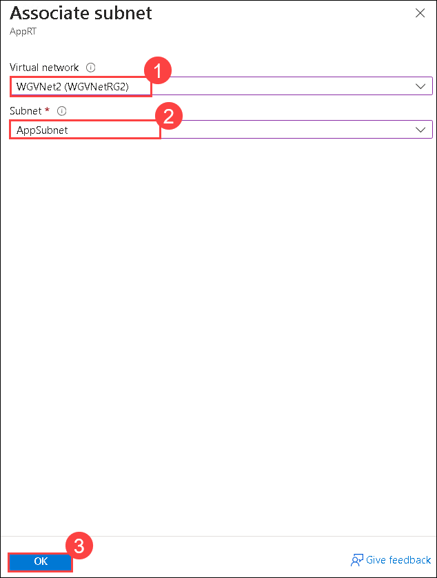

1. Navigate to the blade of the **WGVNetRG1** resource group, and select **MgmtRT**, then **Subnets**.

1. Select **+ Associate**.

1. On the **Associate subnet** blade, select **WGVNet1 (1)** on the **Virtual network** drop down. Select **Management (2)** on the **Subnet** dropdown and then select **OK (3)** at the bottom of the **Associate subnet** blade.

    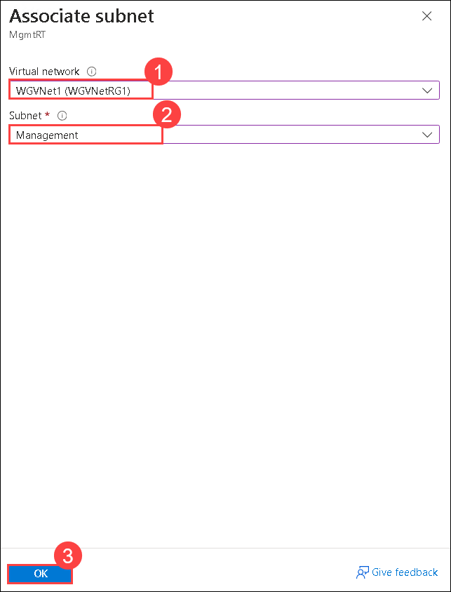

### Review
In this lab, you have completed:
- Created route tables
- Added routes to each route table
- Associated route tables to subnets

## Great job on completing this exercise! You can now proceed to the next one.
