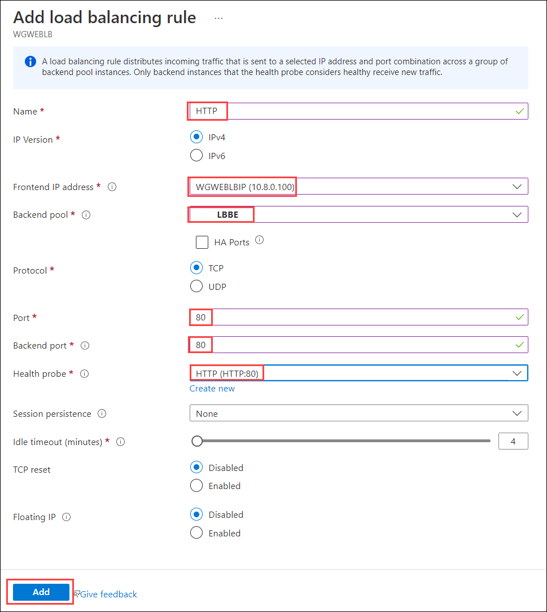

## Exercise 5: Configure n-tier application and validate functionality

In this exercise, you will create and configure a load balancer to distribute the load between the web servers.

### Task 1: Create a load balancer to distribute the load between the web servers

1. In the Azure portal, from the home page navigation, select **Load balancers**, then select **+ Create**.

    

2. On the **Create load balancer** blade, on the **Basics** tab, enter the following values:

    - Subscription: **Select your subscription**.

    - Resource group: **WGVNetRG2**

    - Name: **WGWEBLB**

    - Region: **South Central US**

    - SKU: **Standard**

    - Type: **Internal**

    - Tier: **Regional**

    Ensure your **Create load balancer** dialog looks like the following, and select **Next: Frontend IP configuration** then select **Create**.

    

3. On the **Frontend IP configuration** tile, select **+ Add a frontend IP configuration** and enter the following values:

    - Name: **WGWEBLBIP**

    - Virtual network: **WGVNet2**

    - Subnet: **AppSubnet (10.8.0.0/25)**

    - Assignment: **Static**

    - IP address: **10.8.0.100**

    - Availability zone: **1**

    Ensure your **Create load balancer - Frontend IP configuration** dialog looks like the following, and select **Add**.

    

4. Select **Review + create**, and then select **Create**.

    >**Note**: **Backend pools** can now be configured within the **Create Load balancer** wizard.  For this exercise, we will complete this in the next task to show where to find it on the resource.

### Task 2: Configure the load balancer

1. Open the **WGWEBLB** load balancer in the Azure portal.

2. Select **Backend pools**, and select **+Add** at the beginning.

    

3. Enter **LBBE** for the pool name. Select **NIC** for **Backend Pool Configuration**. Under **IP Configurations**, select **+ Add**.

    

4. Under **Virtual machine**, select **+ Add** and choose the **WGWEB1** and **WGWEB2** virtual machines and select **Add**.

    

    >**Note**: If you do not see WGWEB1 in the Virtual Machine selection list, the public IP address was not created as a Standard SKU.  Locate **webip** and in the **Overview** tile, select the **Upgrade to Standard SKU** banner to change the SKU.  You will need to change the IP to **Static** in the **Configuration** and temporarily **Disassociate** it from **WGWEB1NetworkInterface**. Once upgraded, **Associate** webip with the **Network Interface** for WGWEB1.

    

5. Select **Save** at the bottom of the **Add backend pool** blade to add the backend pool.

6. Wait to proceed until the Backend pool configuration is finished updating. When the backends are added, they should look like the following image.

    

7. Next, under **Settings** on the WGWEBLB Load Balancer blade, select **Health Probes**. Select **+ Add**, and use the following information to create a health probe.

    - Name: **HTTP**

    - Protocol: **HTTP**

        

        

8. Select **Add**.

9. After the Health probe has been added, select **Load balancing rules** from the left navigation. Select **+ Add** and complete the configuration as shown below followed by selecting **Add**.

    - Name: **HTTP**

    - Frontend IP address: Select the load balancer IP entry with **10.8.0.100**.

    - Backend pool: **LBBE**

    - Port: **80**

    - Backend port: **80**

    - Health probe: **HTTP**

        

10. Navigate to WGWEB1 in the Azure portal. Connect to WGWEB1 via Bastion. Within WGWEB1, open Microsoft Edge from the Start menu and navigate to <http://10.8.0.100>. Ensure that you successfully connect to either one of the two Web servers.

    

    

11. Using the portal, disassociate the public IP from the NIC of **WGWEB1** VM. Do this by navigating to the VM and selecting **Networking** under **Settings** on the left. Select the **NIC Public IP** then choose **Dissociate**. Select **Yes** when prompted.

    

12. Next, return to the **WGWEB1 - Networking** blade and select the **Network Interface**.

13. Select **IP configurations** under **Settings** on the left.

    

14. Next, select **ipconfig1** shown above.

15. Select and make sure that the **Public IP address settings** is shown as **Dissociate**, and select **Save** if necessary. This should remove the public IP address from the network interface of the VM.

    
