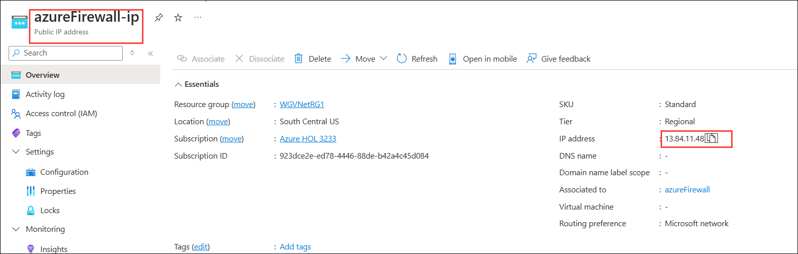
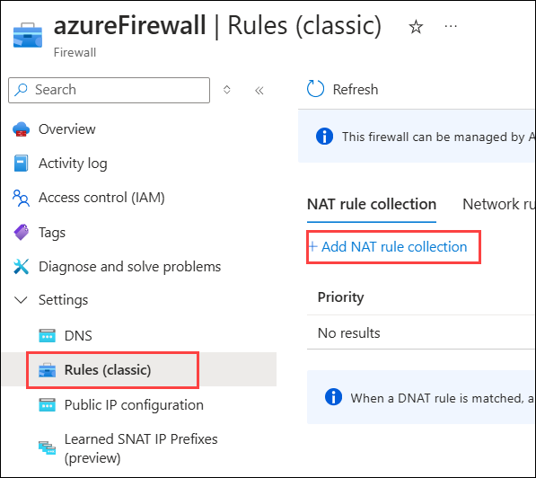
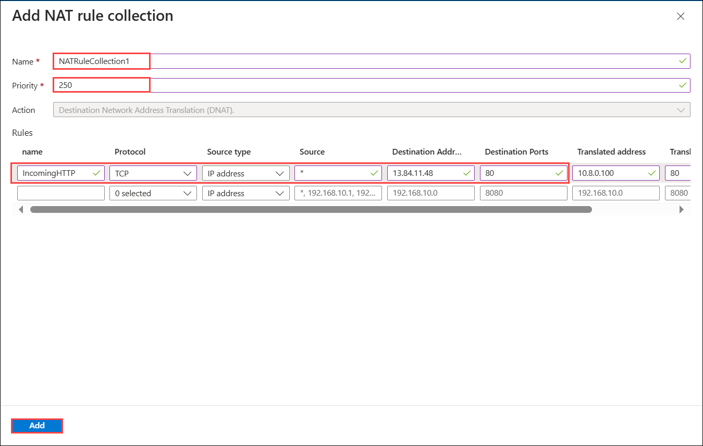
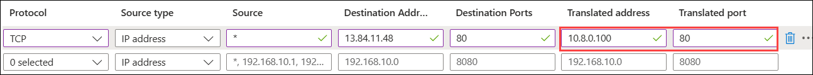
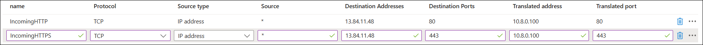

## Exercise 6: Provision and configure Azure firewall solution

In this exercise, you will provision and configure an Azure firewall in your network.

## Lab objectives

In this lab, you will perform following tasks:

- Provision the Azure firewall
- Create Firewall Rules
- Associate route tables to subnets
  
## Estimated timing: 60 minutes

### Task 1: Provision the Azure firewall

1. In the search bar of the Azure portal, type **Firewall (1)**. From the search results, select **Firewalls (2)**.

    

1. On the **Create a firewall** blade, on the **Basics** tab, enter the following information:

    | Setting | Action |
    | -- | -- |
    | Subscription | Select your subscription **(1)** |
    | Resource group | **WGVNetRG1** **(2)** |
    | Name | **azureFirewall** **(3)** |
    | Region | **South Central US** **(4)**|
    | Firewall SKU | **Standard** **(5)** |
    | Firewall management | **Use Firewall rules (classic) to manage this Firewall** **(6)** |
    | Choose a Virtual network | **Use existing** **(7)** |

    

1. Select **Virtual Network** as **WGVNet1 (1)**, click **Add new (2)** for **Public IP address**, name it **azureFirewall-ip (3)**, and click **OK (4)**.

    

    >**Note:** If you receive the message **"Force Tunneling requires this virtual network to have a subnet named AzureFirewallManagementSubnet"**, it will disappear once you uncheck the **Enable Firewall Management NIC**.

    

1. Uncheck the box for the **Enable Firewall Management NIC**.

    

1. Select **Review + create** and then select **Create** to provision the Azure Firewall.

    >**Note**: It will take **5-7 minutes** to be created.

> **Congratulations** on completing the task! Now, it's time to validate it. Here are the steps:
      
   - If you receive a success message, you can proceed to the next task.
   - If not, carefully read the error message and retry the step, following the instructions in the lab guide.
   - If you need any assistance, please contact us at cloudlabs-support@spektrasystems.com. We are available 24/7 to help you out.

<validation step="7fb0feba-84e2-4b2f-a525-8804ed2e92f1" />

### Task 2: Create Firewall Rules

We will create firewall rules to allow the inbound and outbound traffic.

1. On the main Azure menu, select **Resource groups**.

2. Select the **WGVNetRG1** resource group. This resource group contains the azure firewall and its public IP address resources.

3. Navigate to the **azureFirewall-ip** blade and note the value of its public IP address. You will need it later in this task.

    

4. Navigate to the **azureFirewall** blade, and, on the **Overview** page, select **Rules (classic)** under **Settings** on the left.

    

5. Select **+ Add NAT Rule collection** and enter the following information to create an inbound NAT Rule (a collection is a list of rules that share the same priority and action).

    | Setting | Action |
    | -- | -- |
    | Name | **NATRuleCollection1** |
    | Priority | **250** |
    | Rules name | **IncomingHTTP** |
    | Protocol | **TCP** |
    | Source type | **IP Address** |
    | Source| **\*** |
    | Destination Address | Type the public IP address assigned to the firewall you identified earlier in this task|
    | Destination ports | **80** (to allow HTTP traffic) |
    | Translated Address | **10.8.0.100** (Private IP of the Azure Load Balancer you deployed earlier in this lab.) |
    | Translated Port | Translated Port: **80** |

    
    

6. Add another rule for HTTPS, as illustrated in the following screenshot. The rules should look like the image below.

    | Setting | Action |
    | -- | -- |
    | Rules name | **IncomingHTTPS** |
    | Protocol | **TCP** |
    | Source type | **IP Address** |
    | Source | **\*** |
    | Destination Address | Type the public IP address assigned to the firewall you identified earlier in this task. |
    | Destination ports | **443** |
    | Translated Address | **10.8.0.100** |
    | Translated Port | **443** |
  
    

    

7. Select **Add** and wait until the update completes.

8. Back on the Azure Firewall **Rules (classic)** page, select **Network rule collection**. Then Select **+ Add Network Rule collection** and enter the following information to create a Network Rule for inbound traffic. This rule allows HTTP connectivity from any directly connected network targeting the frontend IP address of the load balancer.

    | Setting | Action |
    | -- | -- |
    | Name | **NetworkRuleCollectionAllow1** |
    | Priority | **100** |
    | Action | **Allow** |
    | Rules name (IP Addresses) | **IncomingWeb** |
    | Protocol | **TCP** |
    | Source| **\*** |
    | Destination Address | **10.8.0.100** |
    | Destination ports | **80,443** |

    

    

9. Create another rule for Remote Desktop sessions from the Management subnet on WGVNet1. The IP Addresses rules should look like the image below.

    | Setting | Action |
    | -- | -- |
    | Rules name (IP Addresses) | **IncomingMgmtRDP** |
    | Protocol | **TCP** |
    | Source| **10.7.2.0/25** |
    | Destination Address | **10.8.0.0/25** |
    | Destination ports | **3389** |

    

10. Select **Add** and wait for 5-7 minutes until the update completes.

> **Congratulations** on completing the task! Now, it's time to validate it. Here are the steps:
      
   - If you receive a success message, you can proceed to the next task.
   - If not, carefully read the error message and retry the step, following the instructions in the lab guide.
   - If you need any assistance, please contact us at cloudlabs-support@spektrasystems.com. We are available 24/7 to help you out.

<validation step="460b4d7d-dd41-4dcc-822b-d7978c970f3f" />

### Task 3: Associate route tables to subnets

1. In the Azure portal, navigate to the blade of the **WGVNetRG2** resource group.

2. Select **AppRT**, followed by **Subnets** and then select **+ Associate**.

    

3. On the **Associate subnet** blade, select **WGVNet2** on the **Virtual network** drop down. Select **AppSubnet** on the **Subnet** dropdown.

    

4. Select **OK** at the bottom of the **Associate subnet** blade.

5. Navigate to the blade of the **WGVNetRG1** resource group, and select **MgmtRT**, then **Subnets**.

6. Select **+ Associate**.

7. On the **Associate subnet** blade, select **WGVNet1** on the **Virtual network** drop down. Select **Management** on the **Subnet** dropdown.

    

8. Select **OK** at the bottom of the **Associate subnet** blade.

### Review
In this lab, you have completed:
- Provisioned the Azure firewall
- Created Firewall Rules
- Associated route tables to subnets

## Great job on completing this exercise! You can now proceed to the next one.
