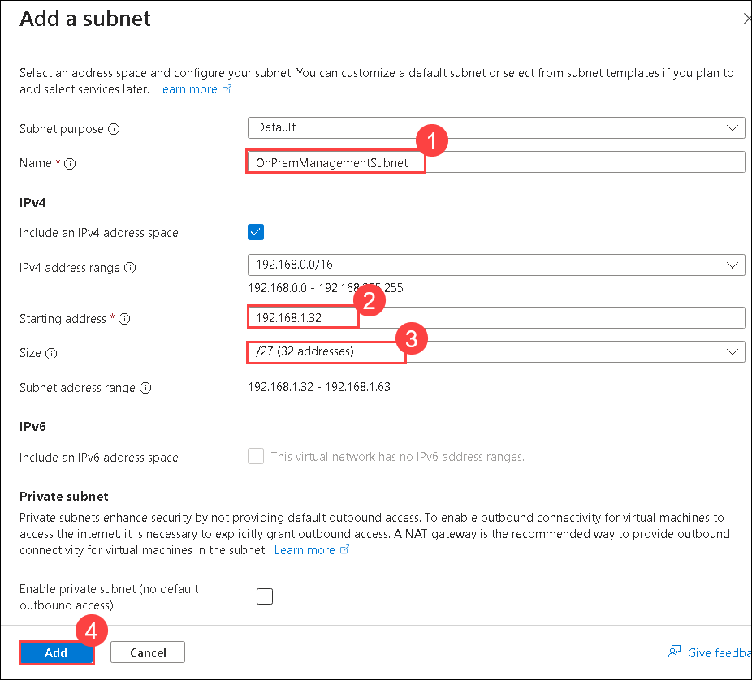
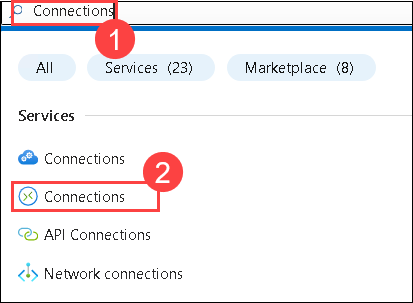
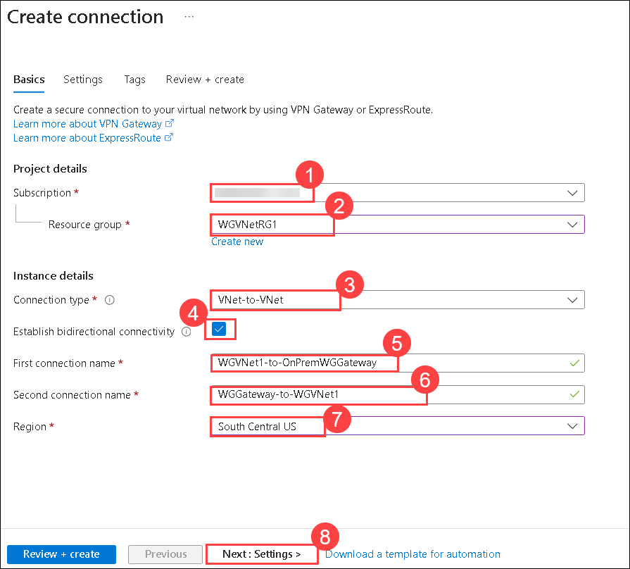
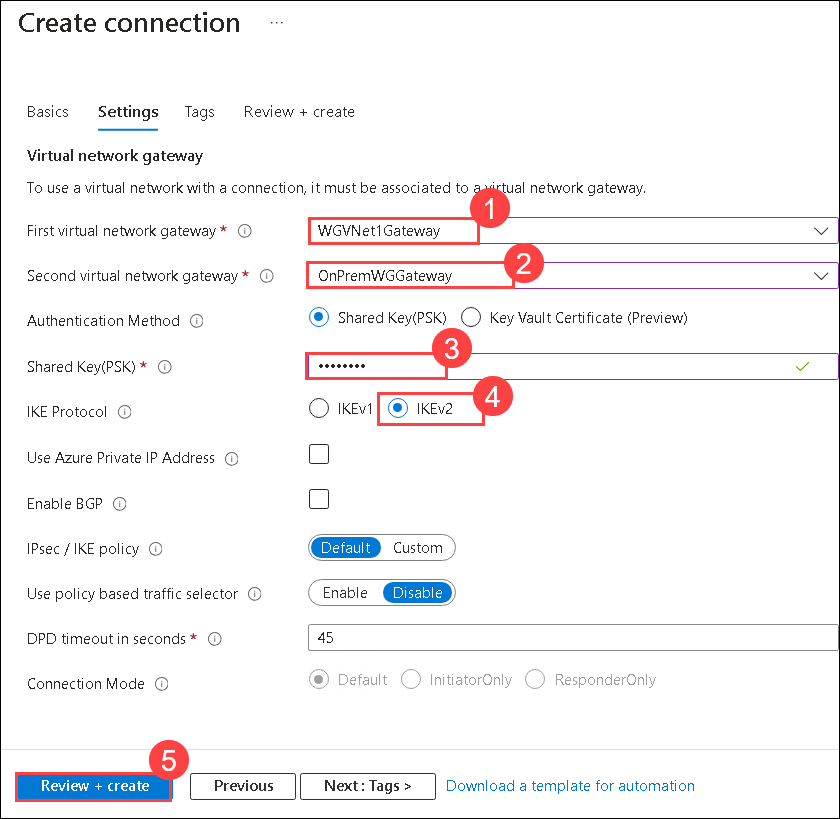
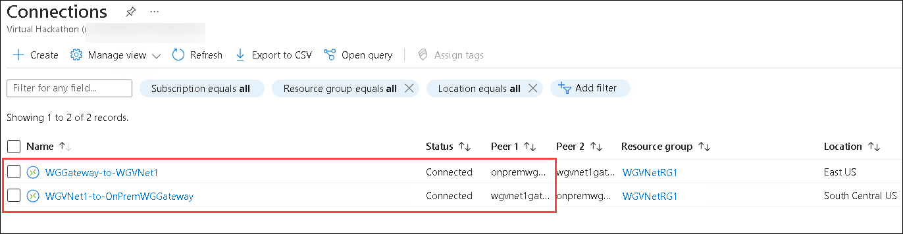

## Exercise 7: Configure Site-to-Site connectivity

In this exercise, we will simulate an on-premises connection to the internal web application. To do this, we will first set up another Virtual Network in a separate Azure region followed by the Site-to-Site connection of the 2 Virtual Networks Finally, we will set up a virtual machine in the new Virtual Network to simulate on-premises connectivity to the internal load-balancer.

## Lab objectives

In this lab, you will perform following tasks:

- Create OnPrem Virtual Network
- Configure gateway subnets for on premise Virtual Network
- Create the first gateway
- Create the second gateway
- Connect the gateways
  
## Estimated timing: 60 minutes

### Task 1: Create OnPrem Virtual Network

1. In the search bar of the Azure portal, type **Virtual network (1)**. From the search results, select **Virtual network (2)**.

    

1. Click on **Create**.

2. On the **Create virtual network** blade, enter the following information and then click on **IP addresses (5)** tab.

    | Setting | Action |
    | -- | -- |
    | Subscription | Select your subscription **(1)** |
    | Resource group | Select **OnPremVNetRG (2)** |
    | Name | **OnPremVNet (3)** |
    | Region | **East US (4)** (Make sure this is **NOT** the same location you have specified in the previous exercises.) |

    

3. Now click on the **IP addresses** tab of the **Create virtual network blade**, enter the following information.

4. Edit the IP address space as **192.168.0.0  (1)** and the subnetting with **/16  (2)**.

    

4. Select **Review + create (3)** then **Create**.

5. Click on **Go to resources.**

### Task 2: Configure gateway subnets for on premise Virtual Network

1. On the **OnPremVNet** blade and select **Subnets** and then select **+ Subnet**.

    

1. Specify the following configuration for the subnet, and select **Add (4)**:

    | Setting | Action |
    | -- | -- |
    | Subnet Purpose | **Virtual Network Gateway (1)** |
    | Starting address | **192.168.1.0 (2)** |
    | Size | **/27 (32 addresses) (3)** |

    

1. Next, select **+ Subnet** and add the **OnPremManagementSubnet** subnet to the **OnPremVNet**, as shown below in the screenshot:

    - Name: **OnPremManagementSubnet (1)**

    - Starting address: **192.168.2.0 (2)**

    - Size: **/27 (32 addresses) (3)**

    - Leave the rest of the values as their defaults. Select **Add (4)**.

        

> **Congratulations** on completing the task! Now, it's time to validate it. Here are the steps:
      
   - Hit the Validate button for the corresponding task. If you receive a success message, you can proceed to the next task.
   - If not, carefully read the error message and retry the step, following the instructions in the lab guide.
   - If you need any assistance, please contact us at cloudlabs-support@spektrasystems.com. We are available 24/7 to help you out.

<validation step="e84eca2b-bc7c-4fa9-ac22-eeccd0d75de2" />

### Task 3: Create the first gateway

1. In the search bar of the Azure portal, type **Virtual network gateway (1)**. From the search results, select **Virtual network gateway (2)**.

    

1. Click on **+Create**.    

1. On the **Create virtual network gateway** blade,  enter the following information and select **Review + create (13)**:

    | Setting | Action |
    | -- | -- |
    | Subscription | **Select your subscription (1)** |
    | Name | **OnPremWGGateway (2)** |
    | Region | **East US (3)** (This must match the location in which you created the **OnPremVNet** virtual network.) |
    | Gateway type | **VPN (4)** |
    | SKU | **VpnGw1 (5)** |
    | Generation | **Generation1 (6)** |
    | Virtual network | **OnPremVNet (7)** |
    | Public IP address | **Create new (8)** |
    | Public IP address name | **onpremgatewayIP1 (9)** |
    | Enable active-active mode | **Enabled (10)** |
    | Second Public IP address name | **onpremgatewayIP2 (11)** |
    | Configure BGP | **Disabled (12)** |

    
    

1. Validate your settings then select **Create**.

    >**Note:** The gateway will take 30-45 minutes to provision. Rather than waiting, continue to the next task.

### Task 4: Create the second gateway

1. In the search bar of the Azure portal, type **Virtual network gateway (1)**. From the search results, select **Virtual network gateway (2)**.

    

1. Click on **+ Create**.    

1. On the **Create virtual network gateway** blade,  enter the following information and select **Review + create (13)**:

    | Setting | Action |
    | -- | -- |
    | Subscription | **Select your subscription (1)** |
    | Name | **WGVNet1Gateway (2)** |
    | Region | **South Central US (3)** (This must match the location in which you created the **WGVNet1** virtual network.) |
    | Gateway type | **VPN (4)** |
    | SKU | **VpnGw1 (5)** |
    | Generation | **Generation1 (6)** |
    | Virtual network | **WGVNet1 (7)** |
    | Public IP address | **Create new (8)** |
    | Public IP address name | **vnet1gatewayIP1 (9)** |
    | Enable active-active mode | **Enabled (10)** |
    | Second Public IP address name | **vnet1gatewayIP2 (11)** |
    | Configure BGP | **Disabled (12)** |

    
    

1. Validate your settings and then **Create**.

    >**Note:** The gateway will take 30-45 minutes to provision. You will need to wait until both gateways are provisioned before proceeding to the next section.

1. The Azure portal will display a notification when the deployments have completed.

> **Congratulations** on completing the task! Now, it's time to validate it. Here are the steps:
      
   - Hit the Validate button for the corresponding task. If you receive a success message, you can proceed to the next task.
   - If not, carefully read the error message and retry the step, following the instructions in the lab guide.
   - If you need any assistance, please contact us at cloudlabs-support@spektrasystems.com. We are available 24/7 to help you out.

<validation step="f6220584-0bee-4752-9cde-a4f42292dc10" />

### Task 5: Connect the gateways

1. In the Azure portal, in the 'Search resources, services, and docs' search box, type **Connections (1)** in the search text box. Select **Connections (2)**.

    

     >**Note**: Make sure to refer the above screenshot while selecting the **Connections.**

1. On the **Connection** blade, select **Create**.

1. On the **Basics** blade, enter the following information and select **Next: Settings (8)**:

    - Subscription: Leave default **(1)**
    - Resource group: Select the existing **WGVNetRG1 (2)**
    - **Connection type** set to **VNet-to-VNet (3)**
    - Establish bidirectional connectivity - checked **(4)**
    - First connection name - **WGVNet1-to-OnPremWGGateway (5)**
    - Second connection name - **WGGateway-to-WGVNet1 (6)**
    - Region - **South Central US (7)**

        

1. On the Settings step, 

    - Select **WGVNet1Gateway (1)** as the first virtual network gateway 
    - **OnPremWGGateway (2)** as the second virtual network gateway
    - Enter a shared key, such as **A1B2C3D4 (3)**.
    - Ensure **IKEv2 (4)** is selected
    - Select **Review + create (5)**.

      

1. Select **Create** on the **Summary** page to create the connection.

1. In the Azure portal, in the 'Search resources, services, and docs' search box, type **Connections (1)** in the search text box. Select **Connections (2)**.

    

1. Watch the progress of the connection status, and use the **Refresh** icon until the status changes for both connections from **Unknown** to **Connected**. This may take 5-10 minutes or more. You might need to refresh the page to see the change in status.

    

### Review

In this lab, you have completed:
- Created OnPrem Virtual Network
- Configured gateway subnets for on premise Virtual Network
- Created the first gateway
- Created the second gateway
- Connected the gateways

## Great job on completing this exercise! You can now proceed to the next one.
