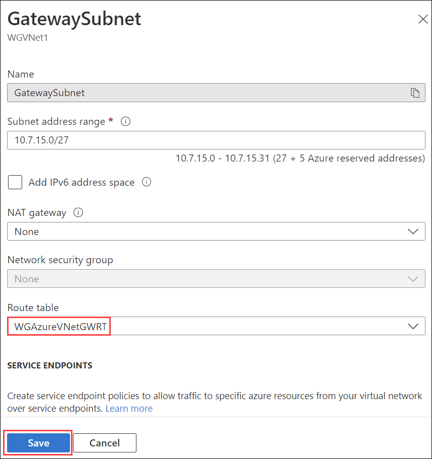

## Exercise 8: Validate connectivity from 'on-premises' to Azure

In this exercise, you will validate connectivity from your simulated on-premises environment to Azure.

## Lab objectives

In this lab, you will perform following tasks:

- Create a virtual machine to validate connectivity
- Configure routing for simulated 'on-premises' to Azure traffic
  
## Estimated timing: 80 minutes

### Task 1: Create a virtual machine to validate connectivity

1. Create a new virtual machine in the OnPremVNet virtual network. In the Azure portal, select **+ Create a resource** and select **Virtual machine**.

2. On the **Create a virtual machine** blade, on the **Basics** tab, enter the following information, and select **Next : Disks >**:

    - Subscription: **Select your subscription**.

    - Resource group: Select **OnPremVMRG**.

    - Virtual machine name: **OnPremVM**

    - Region: **(US) East US** (This must match the region in which you created the OnPremVNet virtual network.)

    - Availability options: **No infrastructure redundancy required**

    - Image: **Windows Server 2019 Datacenter - Gen2**

    - Size: **Standard DS1 v2**

    - User name: **demouser**

    - Password/Confirm password: **demo\@pass123**

    - Public inbound ports: **Allow selected ports**

    - Select inbound ports: **RDP**

3. On the **Create a virtual machine** blade, on the **Disks** tab, set the following configuration and select **Next : Networking >**:

    - OS disk type: **Premium SSD**

4. On the **Create a virtual machine** blade, on the **Networking** tab, set the following configuration and select **Next : Management >**:

    - Virtual network: **OnPremVNet**

    - Subnet: **OnPremManagementSubnet (192.168.2.0/27)**

    - Public IP: **(new)OnPremVM-ip**

    - NIC network security group: **Basic**

    - Public inbound ports: **Allow selected ports**

    - Select inbound ports: **RDP**

    - Accelerated networking: **Unchecked**

    - Load balancing options: **None**

5. On the **Create a virtual machine** blade, on the **Management** tab, set the following configuration and select **Review + create**:

    - System assigned managed identity: **Unchecked**

    - Login with Azure AD: **Unchecked**

    - Enable auto-shutdown: **Unchecked**

    - Enable backup: **Unchecked**

    - Enable OS guest diagnostics: **Unchecked**

6. On the **Create a virtual machine** blade, on the **Review + Create** tab, ensure the validation passes, and select **Create**. The virtual machine will take about 5 minutes to provision.

### Task 2: Configure routing for simulated 'on-premises' to Azure traffic

When packets arrive from the simulated 'on-premises' Virtual Network (OnPremVNet) to the 'Azure-side' (WGVNet1), they arrive at the gateway WGVNet1Gateway. This gateway is in a gateway subnet (10.7.15.0/27). For packets to be directed to the Azure firewall, we need another route table and route to be associated with the gateway subnet on the 'Azure-side'.

1. On the Azure portal select **All services** at the left navigation. Enter **Route** in the search box, and select **Route tables**.

2. On the **Route tables** blade, select **+ Create**.

3. On the **Create route table** blade, enter the following information:

    - Subscription: **Select your subscription**.

    - Resource group: Select the drop-down menu, and select **WGVNetRG1**.

    - Region: **South Central US** (This must match the location in which you created the **WGVNet1** virtual network.)
      > **Note**: Ensure this is created in the **WGVNet1** virtual network.

    - Name: **WGAzureVNetGWRT**

    - Propagate gateway routes: **Yes**

        

4. Select **Review + create** then **Create**.

5. Select **Go to resource** to go to the **WGAzureVNetGWRT** route table.

6. Select **Routes** under **Settings** on the left.

7. On the **Routes** blade, select the **+ Add** button. Enter the following information, and select **Add**:

    - Route name: **OnPremToAppSubnet**

    - Address prefix destination: **IP Addresses**

    - Address prefix: **10.8.0.0/25**

    - Next hop type: **Virtual appliance**

    - Next hop address: **10.7.1.4**

        

8. Navigate to the **WGVNet1** virtual network in the Azure portal.

9. Under the **Settings** section, select **Subnets**. On the **Subnets** blade, select **Gateway Subnet**.

10. On the **GatewaySubnet** dialog, under the **Route table** drop down, select **WGAzureVNetGWRT**. Then select **Save**.

    

    >**Note:** At this point, you have configured your enterprise network. You should be able to test your Enterprise Class Network from one region to another. Your testing can include the following scenarios:

    - On the 'on-premises' virtual machine (OnPremVM), attempt to initiate a Remote Desktop session to any virtual machine on the AppSubnet (10.8.0.0/25). Note that this should fail since it is blocked by Azure Firewall.

    - In the Azure portal, navigate to and browse to the web application deployed to the WGVNet2 via the private IP address of the Azure Load Balancer(10.8.0.100). Note that this traffic is routed (and allowed) via Azure Firewall.

    - In the Azure portal, navigate to the WGWEB1 VM and initiate a Bastion connection session to the WGWEB1 virtual machine by selecting **Connect** and **Bastion**. This should be successful since it is allowed by Azure Firewall and Azure Bastion Host.

    - In the Azure portal, navigate to the WGWEB2 VM and initiate a Bastion connection session to the WGWEB2 virtual machine by selecting **Connect** and **Bastion**. This should be successful since it is allowed by Azure Firewall and Azure Bastion Host.

    - From within the WGWEB1 VM Bastion connection session, initiate a Remote Desktop session to the WGSQL1 via its private IP address (10.8.1.4). This should be successful since it is allowed by Azure Firewall.

### Review
In this lab, you have completed:
- Created a virtual machine to validate connectivity
- Configured routing for simulated 'on-premises' to Azure traffic

## Great job on completing this exercise! You can now proceed to the next one.
