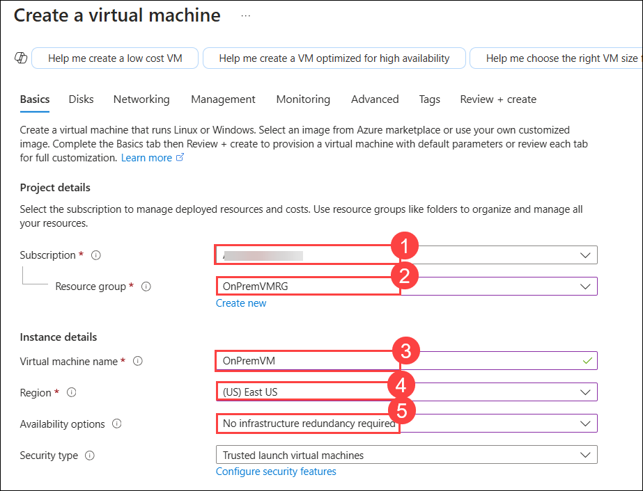
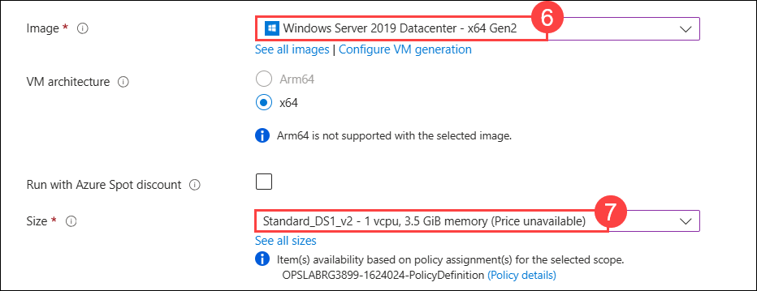
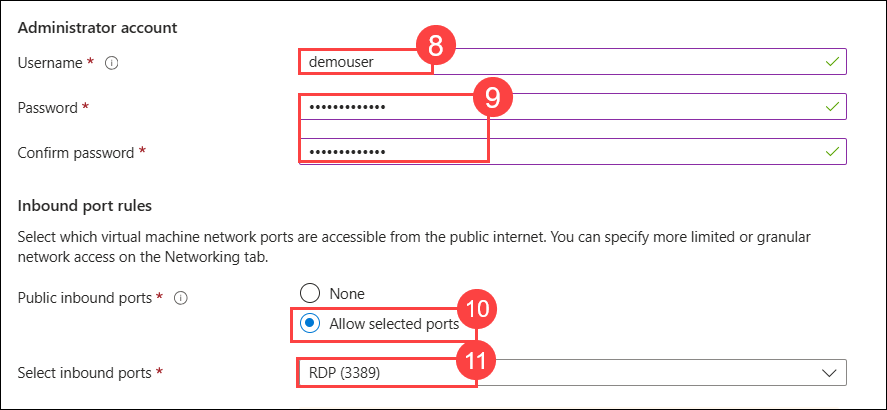
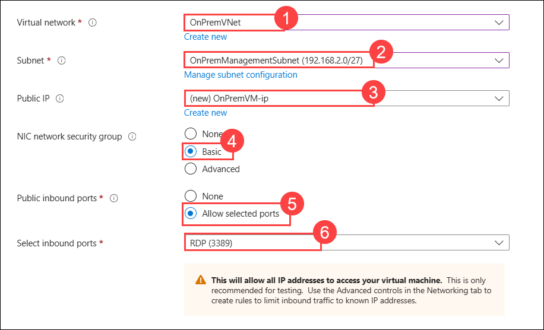
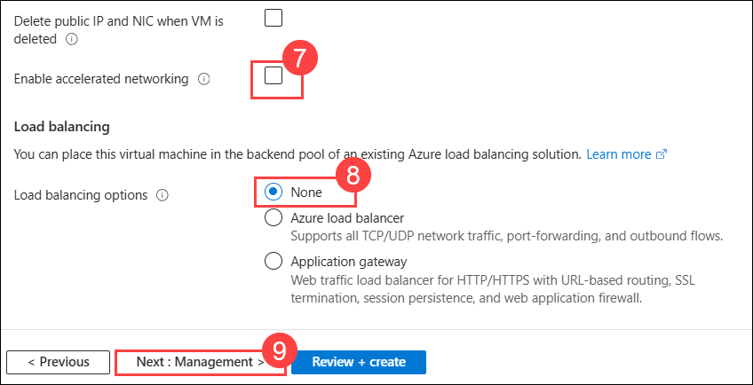
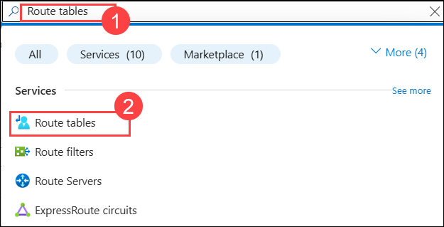
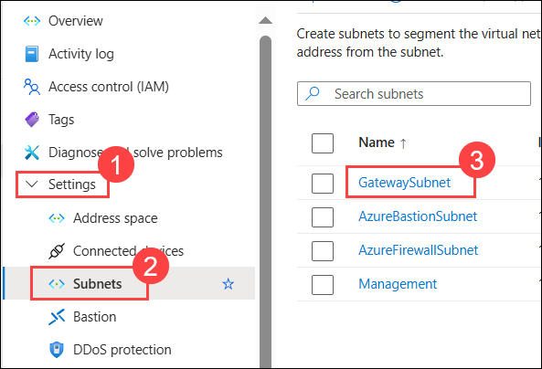
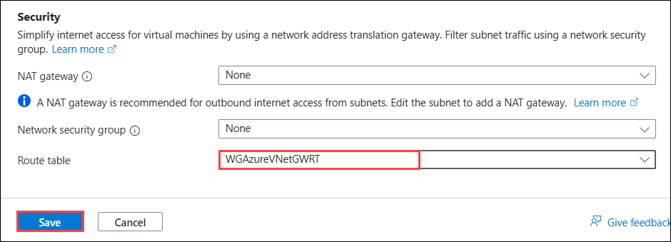

## Exercise 8: Validate connectivity from 'on-premises' to Azure

In this exercise, you will validate connectivity from your simulated on-premises environment to Azure.

## Lab objectives

In this lab, you will perform the following tasks:

- Create a virtual machine to validate connectivity
- Configure routing for simulated 'on-premises' to Azure traffic
  
## Estimated timing: 40 minutes

### Task 1: Create a virtual machine to validate connectivity

1. Create a new virtual machine in the OnPremVNet virtual network. In the Azure portal, select **+ Create a resource** and select **Virtual machine**.

1. On the **Create a virtual machine** blade, on the **Basics** tab, enter the following information, and select **Next : Disks >**:

    | Setting | Action |
    | -- | -- |
    | Subscription | **Select your subscription** **(1)** |
    | Resource group | Select **OnPremVMRG** **(2)** |
    | Virtual machine name | **OnPremVM** **(3)** |
    | Region | **(US) East US** **(4)** (This must match the region in which you created the OnPremVNet virtual network.) |
    | Availability options | **No infrastructure redundancy required** **(5)** |
    | Image | **Windows Server 2019 Datacenter - Gen2** **(6)** |
    | Size | **Standard DS1 v2** **(7)** |
    | User name | **demouser** **(8)** |
    | Password/Confirm password | **demo\@pass123** **(9)** |
    | Public inbound ports | **Allow selected ports** **(10)** |
    | Select inbound ports | **RDP** **(11)** |

    

    
   
    

1. Click on **Next: Disk >**, then proceed to the networking section by clicking on **Next: Networking >**.

1. On the **Create a virtual machine** blade, on the **Networking** tab, set the following configuration and select **Next : Management > (9)**:

    | Setting | Action |
    | -- | -- |
    | Virtual network | **OnPremVNet** **(1)** |
    | Subnet | **OnPremManagementSubnet (192.168.2.0/27)** **(2)**|
    | Public IP | **(new) OnPremVM-ip** **(3)** |
    | NIC network security group | **Basic** **(4)** |
    | Public inbound ports | **Allow selected ports** **(5)** |
    | Select inbound ports | **RDP** **(6)** |
    | Accelerated networking | **Unchecked** **(7)** |
    | Load balancing options | **None** **(8)** |

    
   
    

1. On the **Create a virtual machine** blade, on the **Review + Create** tab, ensure the validation passes, and select **Create**. The virtual machine will take about 5 minutes to provision.

### Task 2: Configure routing for simulated 'on-premises' to Azure traffic

When packets arrive from the simulated 'on-premises' Virtual Network (OnPremVNet) to the 'Azure-side' (WGVNet1), they arrive at the gateway WGVNet1Gateway. This gateway is in a gateway subnet (10.7.15.0/27). For packets to be directed to the Azure firewall, we need another route table and route to be associated with the gateway subnet on the 'Azure-side'.

1. In the search bar of the Azure portal, type **Route tables (1)**. From the search results, select **Route tables (2)**.

    

2. On the **Route tables** blade, select **+ Create**.

3. On the **Create route table** blade, enter the following information:

    - Subscription: **Select your subscription**.

    - Resource group: Select the drop-down menu, and select **WGVNetRG1**.

    - Region: **South Central US** (This must match the location in which you created the **WGVNet1** virtual network.)

      > **Note**: Ensure this is created in the **WGVNet1** virtual network.

    - Name: **WGAzureVNetGWRT**

    - Propagate gateway routes: **Yes**

        

4. Select **Review + create** then **Create**.

5. Select **Go to resource** to go to the **WGAzureVNetGWRT** route table.

6. Select **Routes** under **Settings** on the left.

7. On the **Routes** blade, select the **+ Add** button. Enter the following information, and select **Add**:

    | Setting | Action |
    | -- | -- |
    | Route name | **OnPremToAppSubnet** |
    | Address prefix destination | **IP Addresses** |
    | Address prefix | **10.8.0.0/25** |
    | Next hop type | **Virtual appliance** |
    | Next hop address | **10.7.1.4** |

    

1. In the search bar of the Azure portal, type **Virtual network (1)**. From the search results, select **Virtual network (2)**.

   

1. Select the **WGVNet1** virtual network.

1. Under the **Settings (1)** section, select **Subnets (2)**. On the **Subnets** blade, select **Gateway Subnet (3)**.

   

10. On the **GatewaySubnet** dialog, under the **Route table** drop down, select **WGAzureVNetGWRT**. Then select **Save**.

    

    >**Note:** At this point, you have configured your enterprise network. You should be able to test your Enterprise Class Network from one region to another. Your testing can include the following scenarios:

### Scenario 1: Verifying RDP Access Restriction by Azure Firewall

In this scenario, you will initiate a Remote Desktop (RDP) session from the **OnPremVM** virtual machine to a virtual machine in the **AppSubnet (10.8.0.0/25)**. However, the connection should fail due to Azure Firewall restrictions. Please follow the below steps:

1. On the Azure portal, type **Virtual Machines (1)** in the search box and select **Virtual Machines (2)** from the results.

    .png)

3. On the **Virtual Machines** page, find and select **OnPremVM**.

    .png)

4. Click **Connect (1)** and choose **Connect (2)** as the connection method.

    .png)

5. Under the **Native RDP** option, click **Download RDP file**.

    .png)

6. Open the downloaded RDP file and click **Connect**.

    .png)

7. When prompted, enter the following credentials and click **OK (3)**:  
   
   - **Username (1):** `.\demouser`  

   - **Password (2):** `demo@pass123`

     .png)

8. Click **Yes** on the security pop-up to proceed.

    .png)

9. Inside **OnPremVM**, search for **Remote Desktop Connection** in the Windows search bar and open the application. 

    .png)

10. In the **Computer** field, enter **10.8.0.5** and click **Connect**.

    .png)

11. The connection attempt should fail, displaying the error message: **Remote desktop can't be connected to the remote computer**.

12. Click **OK** to close the error message.

    .png)

This confirms that RDP access to the AppSubnet is blocked by Azure Firewall.

### Scenario 2: Accessing the Web Application via Bastion in WGWEB1 or WGWEB2 VM

In this scenario, you will access the web application deployed in **WGVNet2** using the private IP address of the **Azure Load Balancer (10.8.0.100)**. This will be done from within **WGWEB1** or **WGWEB2** after establishing a Bastion session. Since the traffic is routed through **Azure Firewall**, access should be successful. 

1. On the Azure portal, type **Virtual Machines (1)** in the search box and select **Virtual Machines (2)** from the results.

    .png)

3. On the **Virtual Machines** page, find and select **WGWEB1**.

    .png)

4. Click **Connect (1)** and choose **Connect via Bastion (2)** as the connection method.

    .png)

7. Enter the following credentials and click **Connect (3)**:

   - **Username (1):** `demouser`

   - **VM Password (2):** `demo@pass123`

     .png)

1. On the desktop, open **Microsoft Edge**, enter **10.8.0.100** (the private IP of the Azure Load Balancer) in the address bar, and press **Enter** to load the web application.

    .png)

1. The web page should open successfully, confirming that traffic is routed correctly through **Azure Firewall**.

1. Close the RDP session.

Please follow the same steps for **WGWEB2**.

### Scenario 3: Initiating an RDP Session to WGSQL1 from WGWEB1 via Bastion  

In this scenario, you will establish a **Bastion** session to **WGWEB1** and then initiate a **Remote Desktop (RDP)** connection to **WGSQL1** using its private IP address. The connection should be successful since it is allowed by **Azure Firewall**.

1. On the Azure portal, type **Virtual Machine (1)** in the search box and select **Virtual Machines (2)** from the results.

    .png)

1. On the **Virtual Machines** page, find and select **WGWEB1**.

    .png)

1. Click **Connect (1)** and choose **Connect via Bastion (2)** as the connection method.

    .png)

1. Enter the following credentials and click **Connect (3)**:  
   
   - **Username (1):** `demouser` 

   - **VM Password (2):** `demo@pass123`

     .png)

1. Within the **WGWEB1** Bastion session, search for **Remote Desktop Connection** in the Windows search bar and open the application.

    .png)

1. Enter **10.8.1.4** (the private IP of WGSQL1) in the **Computer** field and click **Connect**.

    .png)

1. Enter the following credentials and click **Connect (3)**:  

   - **Username (1):** `.\demouser` 

   - **Password (2):** `demo@pass123`

     .png)

1. If prompted with a security warning, click **Yes** to proceed.

    .png)

1. The RDP session to **WGSQL1** should be established successfully, confirming that Azure Firewall allows the connection.

This verifies that **WGWEB1** can communicate with **WGSQL1** over **RDP**, as permitted by **Azure Firewall**.

### Review
In this lab, you have completed:
- Created a virtual machine to validate connectivity
- Configured routing for simulated 'on-premises' to Azure traffic

## Great job on completing this exercise! You can now proceed to the next one.
